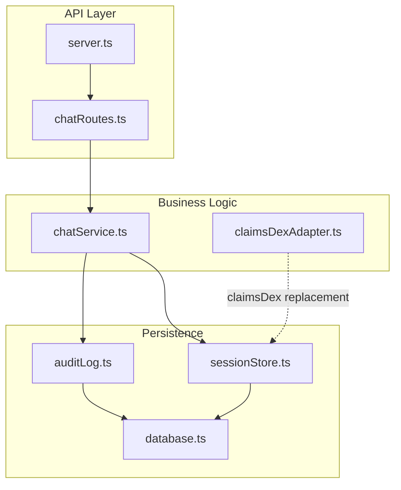
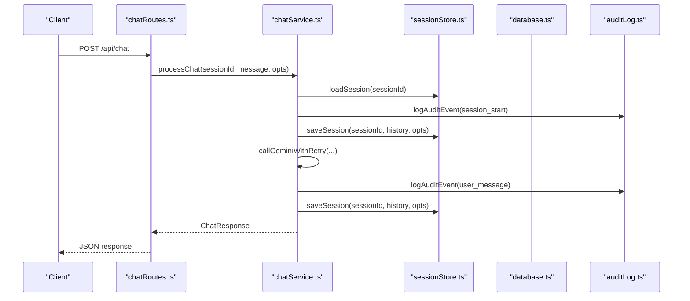
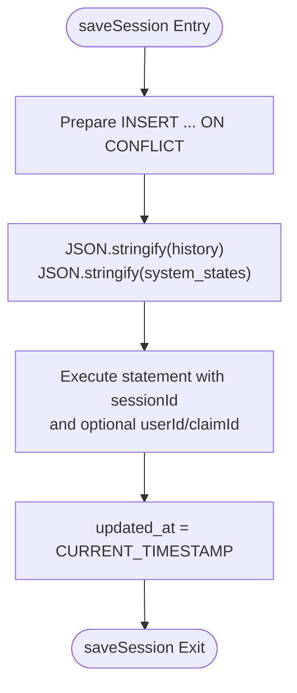
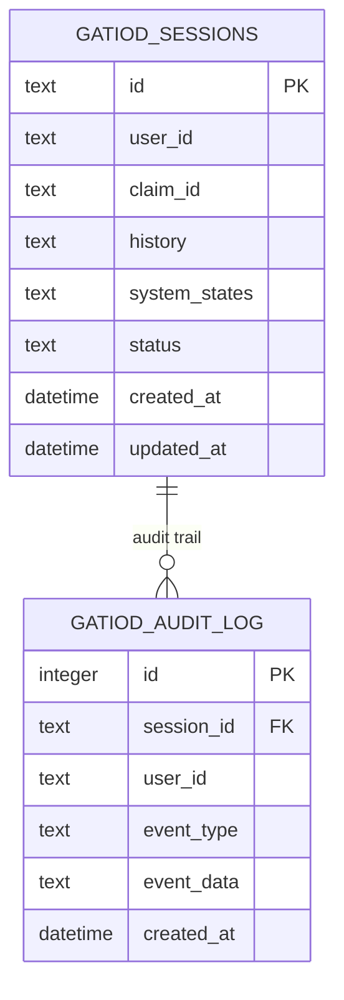
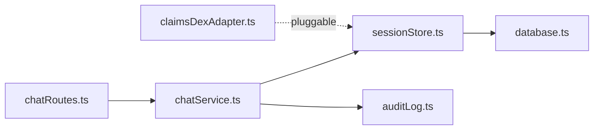

# Session Management

<cite>
**Referenced Files in This Document**
- [sessionStore.ts](file://src/db/sessionStore.ts)
- [database.ts](file://src/db/database.ts)
- [auditLog.ts](file://src/db/auditLog.ts)
- [claimsDexAdapter.ts](file://src/integration/claimsDexAdapter.ts)
- [chatService.ts](file://src/chat/chatService.ts)
- [chatRoutes.ts](file://src/api/chatRoutes.ts)
- [server.ts](file://src/server.ts)
- [README.md](file://README.md)
- [package.json](file://package.json)
</cite>

## Table of Contents
1. [Introduction](#introduction)
2. [Project Structure](#project-structure)
3. [Core Components](#core-components)
4. [Architecture Overview](#architecture-overview)
5. [Detailed Component Analysis](#detailed-component-analysis)
6. [Dependency Analysis](#dependency-analysis)
7. [Performance Considerations](#performance-considerations)
8. [Troubleshooting Guide](#troubleshooting-guide)
9. [Conclusion](#conclusion)
10. [Appendices](#appendices)

## Introduction
This document explains the session management integration with a focus on persistent storage and retrieval mechanisms. It covers the SessionDbAdapter interface, save/load/delete operations, and data serialization requirements. It documents the transition from a standalone SQLite database to claimsDex’s shared database implementations, and provides both conceptual overviews for database administrators and technical details for developers. Terminology aligns with healthcare data management standards, emphasizing traceability, auditability, and secure persistence.

## Project Structure
The session management system spans several modules:
- Database layer: SQLite-backed schema initialization and connection management
- Session store: CRUD operations for chat sessions and system states
- Audit logging: comprehensive event logging for medico-legal traceability
- Integration adapter: standardized interface for claimsDex integration
- Chat service and routes: orchestration of session lifecycle and API exposure

**Diagram sources**
- [server.ts:1-68](file://src/server.ts#L1-L68)
- [chatRoutes.ts:1-91](file://src/api/chatRoutes.ts#L1-L91)
- [chatService.ts:1-183](file://src/chat/chatService.ts#L1-L183)
- [claimsDexAdapter.ts:1-105](file://src/integration/claimsDexAdapter.ts#L1-L105)
- [database.ts:1-57](file://src/db/database.ts#L1-L57)
- [sessionStore.ts:1-110](file://src/db/sessionStore.ts#L1-L110)
- [auditLog.ts:1-91](file://src/db/auditLog.ts#L1-L91)

**Section sources**
- [README.md:1-77](file://README.md#L1-L77)
- [package.json:1-45](file://package.json#L1-L45)

## Core Components
- SessionDbAdapter: A clean interface for session persistence, enabling pluggable adapters for standalone SQLite versus claimsDex shared databases.
- Session store: Provides save, load, delete, and listing operations for sessions and system states, with JSON serialization for complex fields.
- Database layer: Initializes SQLite schema, sets journal mode and timeouts, and exposes a singleton connection.
- Audit logging: Records every assessment event for traceability and compliance.

Key responsibilities:
- Persist chat history and system states across LLM calls and tool executions
- Support session lifecycle: create, update, complete, abandon, and list
- Enable claimsDex integration via a standardized adapter contract

**Section sources**
- [claimsDexAdapter.ts:33-37](file://src/integration/claimsDexAdapter.ts#L33-L37)
- [sessionStore.ts:21-110](file://src/db/sessionStore.ts#L21-L110)
- [database.ts:11-49](file://src/db/database.ts#L11-L49)
- [auditLog.ts:58-90](file://src/db/auditLog.ts#L58-L90)

## Architecture Overview
The session lifecycle integrates with the chat orchestration and audit logging. The following sequence illustrates a typical chat flow with session persistence:

**Diagram sources**
- [chatRoutes.ts:14-41](file://src/api/chatRoutes.ts#L14-L41)
- [chatService.ts:38-154](file://src/chat/chatService.ts#L38-L154)
- [sessionStore.ts:21-84](file://src/db/sessionStore.ts#L21-L84)
- [auditLog.ts:58-73](file://src/db/auditLog.ts#L58-L73)

## Detailed Component Analysis

### SessionDbAdapter Interface
The SessionDbAdapter defines a minimal contract for session persistence:
- save(sessionId, data): asynchronous write of session data
- load(sessionId): asynchronous read of session data or null
- delete(sessionId): asynchronous deletion of a session

Integration pattern:
- Standalone mode: the local SQLite implementation resides in sessionStore.ts
- claimsDex mode: replace the adapter with a shared database implementation that uses the platform’s db.ts connection and prepared statements

Benefits:
- Clean separation of concerns
- Enables migration without changing higher-level orchestration logic
- Supports both SQLite and PostgreSQL-compatible schemas

**Section sources**
- [claimsDexAdapter.ts:33-37](file://src/integration/claimsDexAdapter.ts#L33-L37)
- [claimsDexAdapter.ts:39-40](file://src/integration/claimsDexAdapter.ts#L39-L40)

### Session Persistence Operations
The session store provides:
- saveSession(sessionId, history, opts): inserts or updates a session row with JSON-serialized history and system states; maintains user_id and claim_id
- saveSessionSystemStates(sessionId, systemStates, opts): updates only system states and metadata
- loadSession(sessionId): retrieves a persisted session and deserializes JSON fields
- deleteSession(sessionId): marks a session as abandoned
- completeSession(sessionId): marks a session as completed
- listSessionsForUser(userId): lists recent sessions for a user

Data serialization:
- history: JSON array of Content
- system_states: JSON object keyed by system identifiers
- Metadata: timestamps and status flags

Concurrency and durability:
- SQLite WAL mode improves concurrent reads/writes
- ON CONFLICT handling ensures idempotent updates

**Diagram sources**
- [sessionStore.ts:21-44](file://src/db/sessionStore.ts#L21-L44)

**Section sources**
- [sessionStore.ts:21-110](file://src/db/sessionStore.ts#L21-L110)

### Database Schema and Initialization
The database layer initializes:
- gatiod_sessions table with JSON columns for history and system_states
- gatiod_audit_log table for event logging
- Indexes on user_id, claim_id, status, and audit log fields

SQLite configuration:
- Journal mode set to WAL for concurrency
- Busy timeout configured for robustness

**Diagram sources**
- [database.ts:20-46](file://src/db/database.ts#L20-L46)

**Section sources**
- [database.ts:11-49](file://src/db/database.ts#L11-L49)

### Audit Logging for Traceability
Audit logging captures every significant event during a session:
- Types include session lifecycle, tool calls, confirmations, calculations, and policy decisions
- Events are stored as JSON for flexibility and completeness
- Non-fatal errors in auditing do not disrupt the main flow

Use cases:
- Medico-legal traceability
- Compliance reporting
- Post-incident investigation

**Section sources**
- [auditLog.ts:8-49](file://src/db/auditLog.ts#L8-L49)
- [auditLog.ts:58-90](file://src/db/auditLog.ts#L58-L90)

### Transition from Standalone SQLite to claimsDex Shared Database
Transition steps:
- Replace SessionDbAdapter.save/load/delete with claimsDex’s shared database implementation
- Align data model with claimsDex schema expectations (JSON columns, indexes)
- Migrate environment configuration and connection pooling to platform settings
- Validate audit logging continues to function under the shared database

Operational considerations:
- Maintain backward compatibility during phased rollout
- Use feature flags to control adapter selection
- Monitor latency and throughput differences between SQLite and shared database

**Section sources**
- [claimsDexAdapter.ts:30-40](file://src/integration/claimsDexAdapter.ts#L30-L40)
- [database.ts:14-17](file://src/db/database.ts#L14-L17)

### API Exposure and Session Lifecycle
Endpoints:
- POST /api/chat: submit a message; creates or resumes a session
- POST /api/chat/reset: clear a session
- GET /api/chat/audit/:sessionId: retrieve audit trail
- GET /api/chat/sessions/:userId: list recent sessions for a user

Session lifecycle:
- Creation: first message triggers session creation
- Updates: each LLM call and tool execution persists incremental state
- Completion: explicit completion or abandonment markers
- Listing: user-centric session discovery

**Section sources**
- [chatRoutes.ts:14-91](file://src/api/chatRoutes.ts#L14-L91)
- [chatService.ts:52-65](file://src/chat/chatService.ts#L52-L65)
- [chatService.ts:179-182](file://src/chat/chatService.ts#L179-L182)

## Dependency Analysis
The session management stack exhibits low coupling and clear boundaries:
- chatService depends on sessionStore and auditLog
- sessionStore depends on database
- claimsDexAdapter provides a pluggable abstraction for persistence
- chatRoutes exposes session operations to clients

**Diagram sources**
- [chatRoutes.ts:1-91](file://src/api/chatRoutes.ts#L1-L91)
- [chatService.ts:1-183](file://src/chat/chatService.ts#L1-L183)
- [sessionStore.ts:1-110](file://src/db/sessionStore.ts#L1-L110)
- [auditLog.ts:1-91](file://src/db/auditLog.ts#L1-L91)
- [database.ts:1-57](file://src/db/database.ts#L1-L57)
- [claimsDexAdapter.ts:1-105](file://src/integration/claimsDexAdapter.ts#L1-L105)

**Section sources**
- [chatRoutes.ts:14-91](file://src/api/chatRoutes.ts#L14-L91)
- [chatService.ts:16-17](file://src/chat/chatService.ts#L16-L17)
- [sessionStore.ts:8-8](file://src/db/sessionStore.ts#L8-L8)

## Performance Considerations
- Database tuning:
  - WAL mode reduces writer contention and improves read performance
  - Busy timeout prevents premature failures under load
- Serialization overhead:
  - JSON serialization of history and system states adds CPU cost; consider batching updates and minimizing frequency
- Indexing:
  - Ensure appropriate indexes exist for user_id, claim_id, and status filters
- Concurrency:
  - Prefer single writer patterns for session updates; batch writes when possible
- Audit logging:
  - Keep audit writes non-blocking; errors are caught and logged separately

[No sources needed since this section provides general guidance]

## Troubleshooting Guide
Common issues and resolutions:
- Missing GEMINI_API_KEY:
  - Symptom: chat requests fail early
  - Resolution: set environment variable before starting the server
- Database connectivity:
  - Symptom: initialization errors or timeouts
  - Resolution: verify GATIOD_DB_PATH and permissions; ensure WAL mode is supported
- Session not persisting:
  - Symptom: session lost after retries or errors
  - Resolution: confirm saveSession is called before external API calls; verify JSON serialization
- Audit logging failures:
  - Symptom: exceptions thrown during audit writes
  - Resolution: audit logging is wrapped to avoid crashing the main flow; inspect logs for failures

**Section sources**
- [server.ts:52-54](file://src/server.ts#L52-L54)
- [database.ts:14-17](file://src/db/database.ts#L14-L17)
- [chatService.ts:82-96](file://src/chat/chatService.ts#L82-L96)
- [auditLog.ts:69-72](file://src/db/auditLog.ts#L69-L72)

## Conclusion
The session management integration provides a robust, auditable, and portable foundation for chat-assisted assessments. By standardizing persistence through SessionDbAdapter and leveraging JSON-based storage for flexible session states, the system supports both standalone SQLite deployments and claimsDex’s shared database infrastructure. Developers can integrate seamlessly, while database administrators benefit from clear schema definitions, indexing strategies, and comprehensive audit trails aligned with healthcare data management standards.

[No sources needed since this section summarizes without analyzing specific files]

## Appendices

### Practical Examples

- Session configuration
  - Environment variables:
    - GEMINI_API_KEY: required for LLM calls
    - GATIOD_DB_PATH: path to SQLite database file
    - GATIOD_CHAT_ENABLED: feature flag to enable/disable chat
  - Startup behavior:
    - Server initializes database and validates system registry before serving requests

- Data migration patterns
  - From SQLite to claimsDex:
    - Replace SessionDbAdapter with claimsDex implementation
    - Validate schema alignment and indexes
    - Test audit logging continuity

- Integration patterns
  - claimsDex adapter contract:
    - Implement save/load/delete using shared database connections
    - Preserve JSON serialization semantics for history and system states

**Section sources**
- [server.ts:5-14](file://src/server.ts#L5-L14)
- [claimsDexAdapter.ts:33-37](file://src/integration/claimsDexAdapter.ts#L33-L37)
- [database.ts:14-17](file://src/db/database.ts#L14-L17)