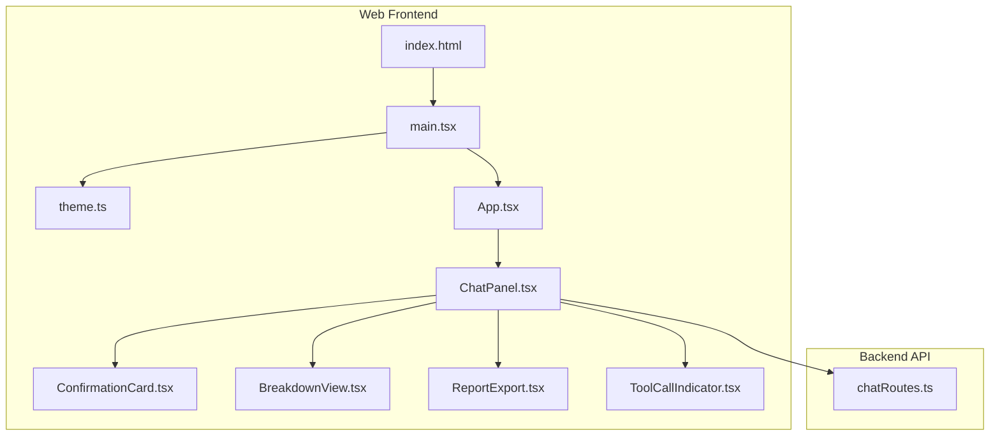
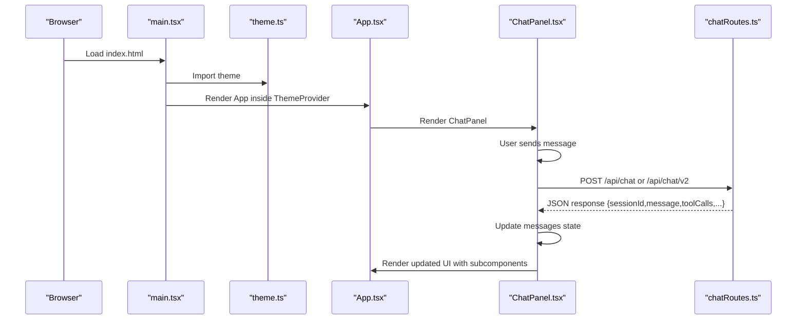
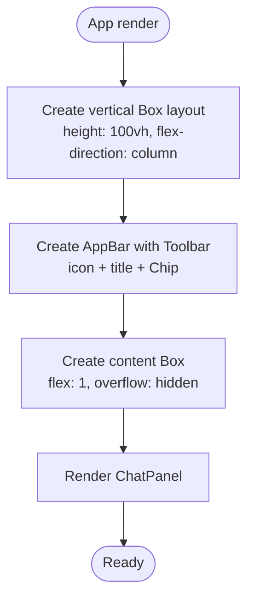
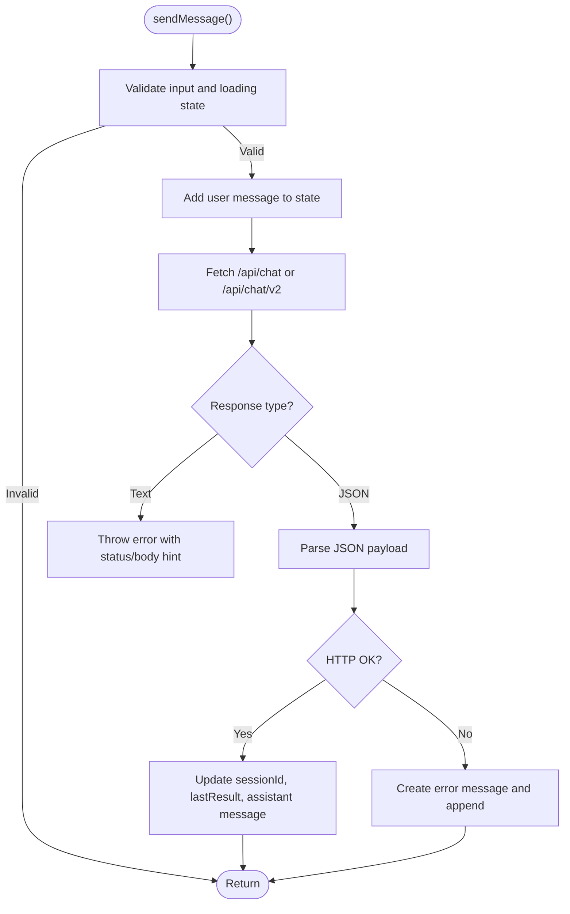
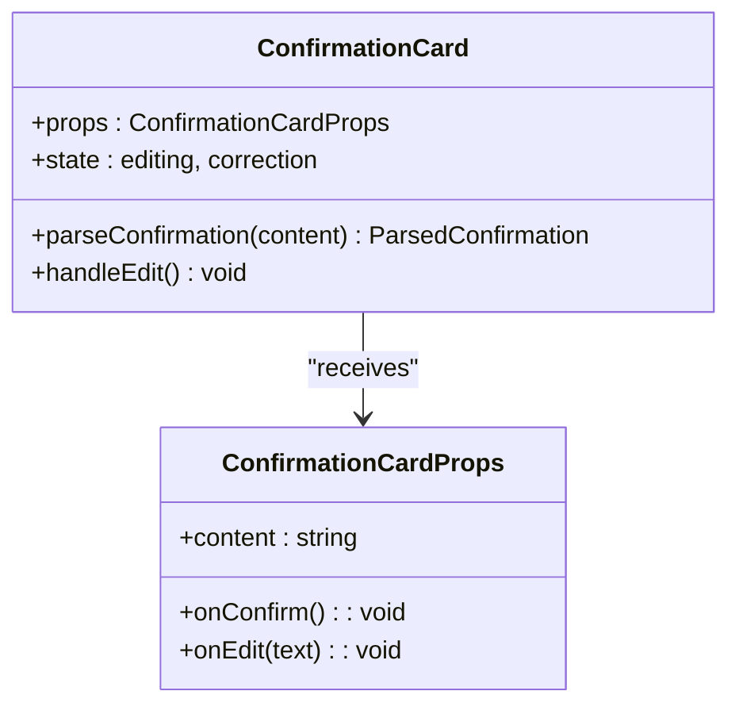
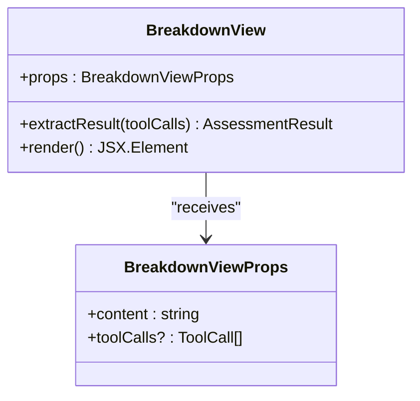
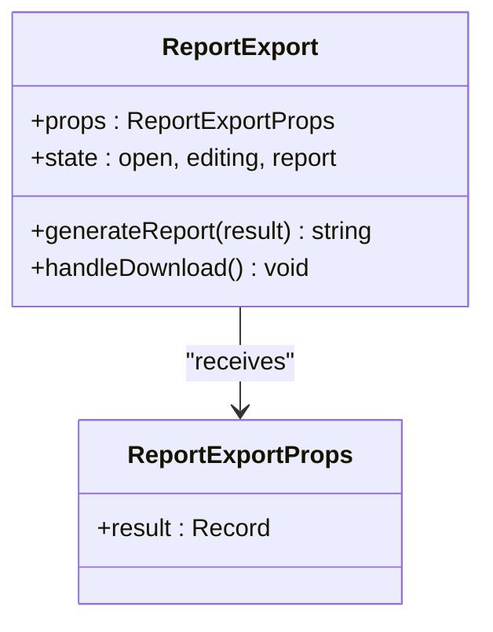
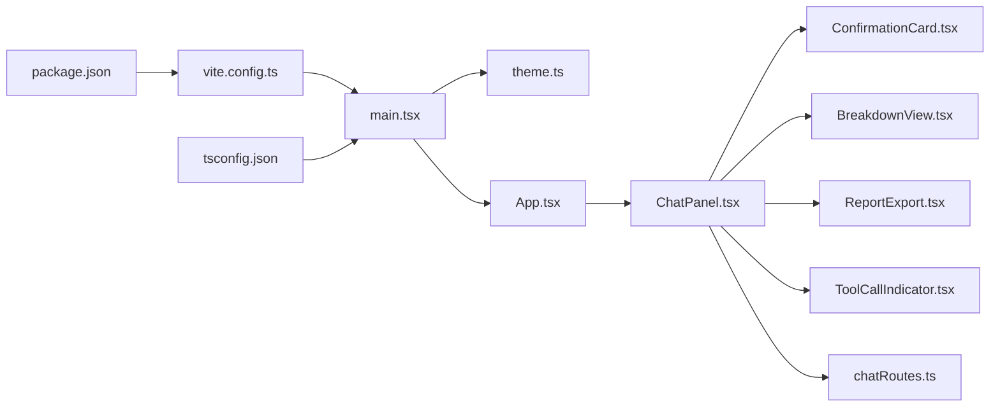

# Application Structure

<cite>
**Referenced Files in This Document**
- [web/src/App.tsx](file://web/src/App.tsx)
- [web/src/main.tsx](file://web/src/main.tsx)
- [web/src/theme.ts](file://web/src/theme.ts)
- [web/index.html](file://web/index.html)
- [web/src/components/ChatPanel.tsx](file://web/src/components/ChatPanel.tsx)
- [web/src/components/ConfirmationCard.tsx](file://web/src/components/ConfirmationCard.tsx)
- [web/src/components/BreakdownView.tsx](file://web/src/components/BreakdownView.tsx)
- [web/src/components/ReportExport.tsx](file://web/src/components/ReportExport.tsx)
- [web/src/components/ToolCallIndicator.tsx](file://web/src/components/ToolCallIndicator.tsx)
- [web/vite.config.ts](file://web/vite.config.ts)
- [web/package.json](file://web/package.json)
- [web/tsconfig.json](file://web/tsconfig.json)
- [src/api/chatRoutes.ts](file://src/api/chatRoutes.ts)
</cite>

## Table of Contents
1. [Introduction](#introduction)
2. [Project Structure](#project-structure)
3. [Core Components](#core-components)
4. [Architecture Overview](#architecture-overview)
5. [Detailed Component Analysis](#detailed-component-analysis)
6. [Dependency Analysis](#dependency-analysis)
7. [Performance Considerations](#performance-considerations)
8. [Troubleshooting Guide](#troubleshooting-guide)
9. [Conclusion](#conclusion)

## Introduction
This document describes the React application structure and main entry points for the GATIOD Assessment Assistant. It explains the overall application layout, component hierarchy, and routing architecture. It documents the main App component structure including AppBar, toolbar configuration, and layout containers. It also covers the application initialization process, root rendering, and global styling setup. The document includes component composition patterns, layout management, and responsive design principles, along with the integration between Material-UI components and custom application logic. Finally, it provides examples of how the main application container orchestrates child components and manages global state.

## Project Structure
The frontend is a Vite-powered React application located under the web directory. The application follows a straightforward structure:
- Entry point: main.tsx initializes the React app and applies global theming.
- Root component: App.tsx defines the top-level layout with AppBar and a central content area.
- Components: A set of specialized UI components under web/src/components handle chat interactions, assessments, and reporting.
- Theming: theme.ts defines Material-UI theme customization.
- Build and dev server: vite.config.ts configures development server and API proxy; package.json and tsconfig.json define dependencies and TypeScript settings.
- Backend integration: src/api/chatRoutes.ts exposes REST endpoints consumed by the frontend.



**Diagram sources**
- [web/index.html:1-16](file://web/index.html#L1-L16)
- [web/src/main.tsx:1-15](file://web/src/main.tsx#L1-L15)
- [web/src/theme.ts:1-36](file://web/src/theme.ts#L1-L36)
- [web/src/App.tsx:1-23](file://web/src/App.tsx#L1-L23)
- [web/src/components/ChatPanel.tsx:1-362](file://web/src/components/ChatPanel.tsx#L1-L362)
- [web/src/components/ConfirmationCard.tsx:1-141](file://web/src/components/ConfirmationCard.tsx#L1-L141)
- [web/src/components/BreakdownView.tsx:1-182](file://web/src/components/BreakdownView.tsx#L1-L182)
- [web/src/components/ReportExport.tsx:1-143](file://web/src/components/ReportExport.tsx#L1-L143)
- [web/src/components/ToolCallIndicator.tsx:1-65](file://web/src/components/ToolCallIndicator.tsx#L1-L65)
- [src/api/chatRoutes.ts:1-91](file://src/api/chatRoutes.ts#L1-L91)

**Section sources**
- [web/index.html:1-16](file://web/index.html#L1-L16)
- [web/src/main.tsx:1-15](file://web/src/main.tsx#L1-L15)
- [web/src/theme.ts:1-36](file://web/src/theme.ts#L1-L36)
- [web/src/App.tsx:1-23](file://web/src/App.tsx#L1-L23)

## Core Components
This section focuses on the main application container and its orchestration of child components.

- App component
  - Purpose: Provides the global page layout with a fixed AppBar at the top and a scrollable content area below.
  - Layout: Uses a vertical Box with height 100vh and flex direction column. The AppBar uses a static position with a bottom border and primary.dark background. The content area is a Box with flex: 1 and overflow hidden, hosting the ChatPanel.
  - AppBar configuration: Contains a toolbar with a hospital icon, a title, and a small Chip indicating the assessment type.
  - Integration: Renders ChatPanel as the primary content area.

- ChatPanel component
  - Purpose: Manages the chat interface, message lifecycle, API modes, and rendering of different message types.
  - State management: Tracks messages, input text, loading state, API mode selection, session ID, and last assessment result.
  - API integration: Sends messages to either legacy or v2 endpoints based on selected mode, handles JSON vs text responses, and resets sessions.
  - Rendering logic: Detects message types (text, confirmation, breakdown) and renders appropriate subcomponents. Displays loading indicators and contextual suggestion chips.
  - Child components: ConfirmationCard, BreakdownView, ToolCallIndicator, ReportExport.
  - Responsiveness: Uses flex layouts, constrained widths, and scrollable areas to adapt to various screen sizes.

- ConfirmationCard component
  - Purpose: Presents structured confirmation content with editable corrections and actions.
  - Parsing: Extracts system, side, and sections from confirmation text.
  - Actions: Supports confirm and edit modes with inline editing controls.

- BreakdownView component
  - Purpose: Visualizes assessment results with category sections, conflict resolution, and CVC combination details.
  - Data model: Consumes structured assessment data and renders collapsible category sections with percentages and notes.

- ReportExport component
  - Purpose: Generates and allows downloading a Markdown report of the latest assessment result.
  - Features: Collapsible editor, download button, and reset functionality.

- ToolCallIndicator component
  - Purpose: Summarizes tool calls used during processing with expandable details.

**Section sources**
- [web/src/App.tsx:5-22](file://web/src/App.tsx#L5-L22)
- [web/src/components/ChatPanel.tsx:49-354](file://web/src/components/ChatPanel.tsx#L49-L354)
- [web/src/components/ConfirmationCard.tsx:47-140](file://web/src/components/ConfirmationCard.tsx#L47-L140)
- [web/src/components/BreakdownView.tsx:94-181](file://web/src/components/BreakdownView.tsx#L94-L181)
- [web/src/components/ReportExport.tsx:64-142](file://web/src/components/ReportExport.tsx#L64-L142)
- [web/src/components/ToolCallIndicator.tsx:28-64](file://web/src/components/ToolCallIndicator.tsx#L28-L64)

## Architecture Overview
The application follows a unidirectional data flow:
- The App component sets up the global theme and layout.
- The ChatPanel component manages state and orchestrates API communication.
- Subcomponents render specialized UI for different message types and results.
- The backend exposes REST endpoints that the frontend consumes via fetch.



**Diagram sources**
- [web/src/main.tsx:7-14](file://web/src/main.tsx#L7-L14)
- [web/src/theme.ts:3-35](file://web/src/theme.ts#L3-L35)
- [web/src/App.tsx:5-22](file://web/src/App.tsx#L5-L22)
- [web/src/components/ChatPanel.tsx:69-142](file://web/src/components/ChatPanel.tsx#L69-L142)
- [src/api/chatRoutes.ts:14-66](file://src/api/chatRoutes.ts#L14-L66)

## Detailed Component Analysis

### App Component Analysis
The App component serves as the root layout container:
- Layout: Full viewport height with a vertical flex layout.
- AppBar: Static position with primary.dark background and a divider border. The toolbar includes an icon, title, and a small Chip.
- Content area: Flex: 1 container holding the ChatPanel.



**Diagram sources**
- [web/src/App.tsx:5-22](file://web/src/App.tsx#L5-L22)

**Section sources**
- [web/src/App.tsx:5-22](file://web/src/App.tsx#L5-L22)

### ChatPanel Component Analysis
The ChatPanel component is the core of the application:
- State: messages, input, loading, apiMode, sessionId, lastResult.
- API modes: Legacy and v2 toggled via ToggleButtonGroup; persisted in localStorage.
- Message detection: Determines whether a message is text, confirmation, or breakdown based on content and tool calls.
- Rendering: 
  - Text messages: Rendered in Paper with distinct styles for user and assistant.
  - Confirmation: Renders ConfirmationCard with confirm/edit actions.
  - Breakdown: Renders BreakdownView with category sections and optional conflict/CVC details.
  - ToolCallIndicator: Shows used tools with success/failure indication.
  - ReportExport: Conditionally rendered when lastResult is present.
- Input area: TextField with multiline support, Send and Reset actions.
- Error handling: Catches and displays errors as assistant messages.



**Diagram sources**
- [web/src/components/ChatPanel.tsx:69-142](file://web/src/components/ChatPanel.tsx#L69-L142)
- [src/api/chatRoutes.ts:14-66](file://src/api/chatRoutes.ts#L14-L66)

**Section sources**
- [web/src/components/ChatPanel.tsx:49-354](file://web/src/components/ChatPanel.tsx#L49-L354)

### ConfirmationCard Component Analysis
The ConfirmationCard component parses and renders structured confirmation content:
- Parsing: Extracts system, side, and sections from confirmation text.
- Rendering: Displays sections with labels and values, including bullet points.
- Actions: Supports Confirm and Edit modes with inline editing controls.



**Diagram sources**
- [web/src/components/ConfirmationCard.tsx:47-140](file://web/src/components/ConfirmationCard.tsx#L47-L140)

**Section sources**
- [web/src/components/ConfirmationCard.tsx:19-58](file://web/src/components/ConfirmationCard.tsx#L19-L58)

### BreakdownView Component Analysis
The BreakdownView component visualizes assessment results:
- Data extraction: Identifies the first successful assessment tool call and extracts structured data.
- Rendering: Displays a header with final percentage, collapsible category sections, conflict resolution, and CVC combination.
- Interactivity: Category sections can be expanded/collapsed.



**Diagram sources**
- [web/src/components/BreakdownView.tsx:94-181](file://web/src/components/BreakdownView.tsx#L94-L181)

**Section sources**
- [web/src/components/BreakdownView.tsx:52-105](file://web/src/components/BreakdownView.tsx#L52-L105)

### ReportExport Component Analysis
The ReportExport component generates and downloads a Markdown report:
- Generation: Creates a formatted Markdown string from assessment data.
- Rendering: Collapsible editor with download and reset actions.
- Interactivity: Allows editing the generated report before download.



**Diagram sources**
- [web/src/components/ReportExport.tsx:64-142](file://web/src/components/ReportExport.tsx#L64-L142)

**Section sources**
- [web/src/components/ReportExport.tsx:13-78](file://web/src/components/ReportExport.tsx#L13-L78)

### ToolCallIndicator Component Analysis
The ToolCallIndicator component summarizes tool usage:
- Rendering: Displays a count of used tools with expandable chip list.
- Styling: Uses success/failure colors based on tool call results.

```mermaid
classDiagram
class ToolCallIndicator {
+props : { toolCalls : ToolCall[] }
+state : open
}
class ToolCall {
+name : string
+result : { success : boolean; data? : Record<string, unknown> }
}
ToolCallIndicator --> ToolCall : "renders chips for"
```

**Diagram sources**
- [web/src/components/ToolCallIndicator.tsx:28-64](file://web/src/components/ToolCallIndicator.tsx#L28-L64)

**Section sources**
- [web/src/components/ToolCallIndicator.tsx:28-64](file://web/src/components/ToolCallIndicator.tsx#L28-L64)

## Dependency Analysis
The application uses Material-UI for UI primitives and emotion for styling. The build system is Vite with React plugin. The development server proxies API requests to a local backend.



**Diagram sources**
- [web/src/main.tsx:1-15](file://web/src/main.tsx#L1-L15)
- [web/src/theme.ts:1-36](file://web/src/theme.ts#L1-L36)
- [web/src/App.tsx:1-23](file://web/src/App.tsx#L1-L23)
- [web/src/components/ChatPanel.tsx:1-362](file://web/src/components/ChatPanel.tsx#L1-L362)
- [web/src/components/ConfirmationCard.tsx:1-141](file://web/src/components/ConfirmationCard.tsx#L1-L141)
- [web/src/components/BreakdownView.tsx:1-182](file://web/src/components/BreakdownView.tsx#L1-L182)
- [web/src/components/ReportExport.tsx:1-143](file://web/src/components/ReportExport.tsx#L1-L143)
- [web/src/components/ToolCallIndicator.tsx:1-65](file://web/src/components/ToolCallIndicator.tsx#L1-L65)
- [web/vite.config.ts:1-16](file://web/vite.config.ts#L1-L16)
- [web/package.json:1-27](file://web/package.json#L1-L27)
- [web/tsconfig.json:1-22](file://web/tsconfig.json#L1-L22)
- [src/api/chatRoutes.ts:1-91](file://src/api/chatRoutes.ts#L1-L91)

**Section sources**
- [web/package.json:11-25](file://web/package.json#L11-L25)
- [web/vite.config.ts:4-15](file://web/vite.config.ts#L4-L15)
- [web/tsconfig.json:2-19](file://web/tsconfig.json#L2-L19)

## Performance Considerations
- Rendering optimization: ChatPanel uses memoization for report generation and efficient conditional rendering for message types and subcomponents.
- State updates: Updates are batched via React state setters; avoid unnecessary re-renders by keeping payloads minimal.
- API calls: Debounce or guard repeated submissions; the component prevents sending while loading.
- Memory: Large message histories can increase memory usage; consider pagination or truncation for long sessions.
- Network: The proxy configuration assumes a local backend; ensure low latency for optimal UX.

## Troubleshooting Guide
Common issues and resolutions:
- API connectivity
  - Symptom: Non-JSON responses or network errors.
  - Cause: Backend endpoint unavailable or misconfigured.
  - Action: Verify backend is running and reachable; check proxy settings in vite.config.ts; inspect browser network tab for 4xx/5xx responses.
- Session reset
  - Symptom: Stale state persists after reset.
  - Cause: Session ID mismatch or backend reset failure.
  - Action: Ensure sessionId is passed to reset endpoint; confirm backend clears session state.
- API mode switching
  - Symptom: Switching modes does not clear history.
  - Cause: State not reset on mode change.
  - Action: Confirm ChatPanel resets messages, sessionId, and lastResult on mode change.
- Styling issues
  - Symptom: Fonts or theme not applied.
  - Cause: Missing font links or theme provider not mounted.
  - Action: Verify index.html font links and that ThemeProvider wraps App in main.tsx.

**Section sources**
- [web/src/components/ChatPanel.tsx:144-181](file://web/src/components/ChatPanel.tsx#L144-L181)
- [web/vite.config.ts:8-13](file://web/vite.config.ts#L8-L13)
- [web/index.html:7-9](file://web/index.html#L7-L9)
- [web/src/main.tsx:7-14](file://web/src/main.tsx#L7-L14)

## Conclusion
The GATIOD Assessment Assistant employs a clean, modular React architecture with Material-UI for consistent UI and theming. The App component establishes a robust layout, while ChatPanel orchestrates complex interactions with the backend, rendering specialized subcomponents for confirmations, breakdowns, and reports. Global theming and responsive design principles ensure a cohesive user experience. The Vite build setup and proxy configuration streamline development and integration with the backend API.