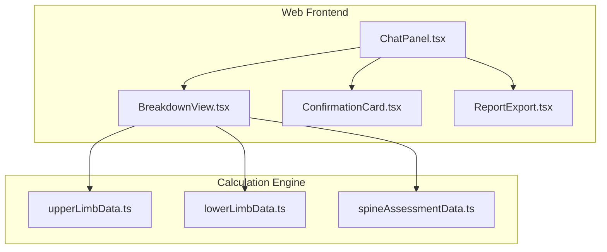
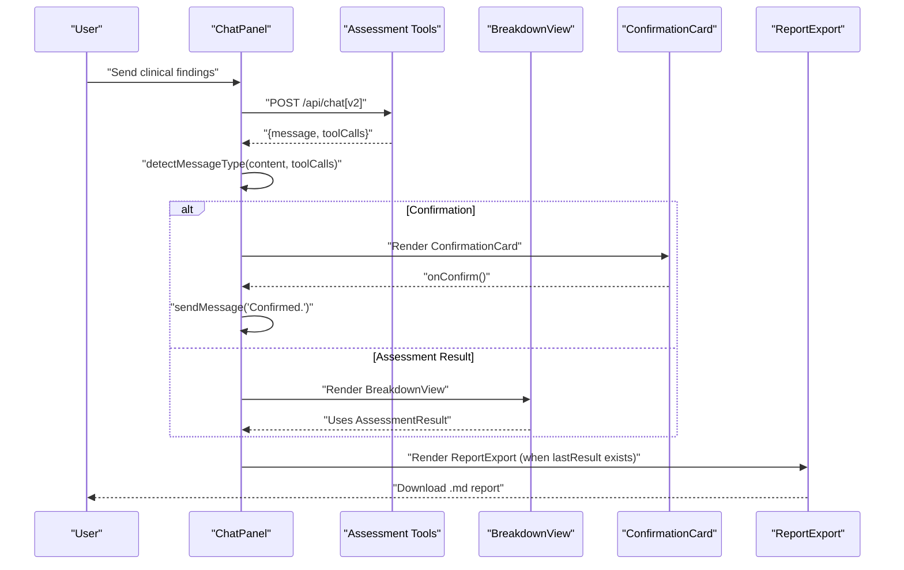
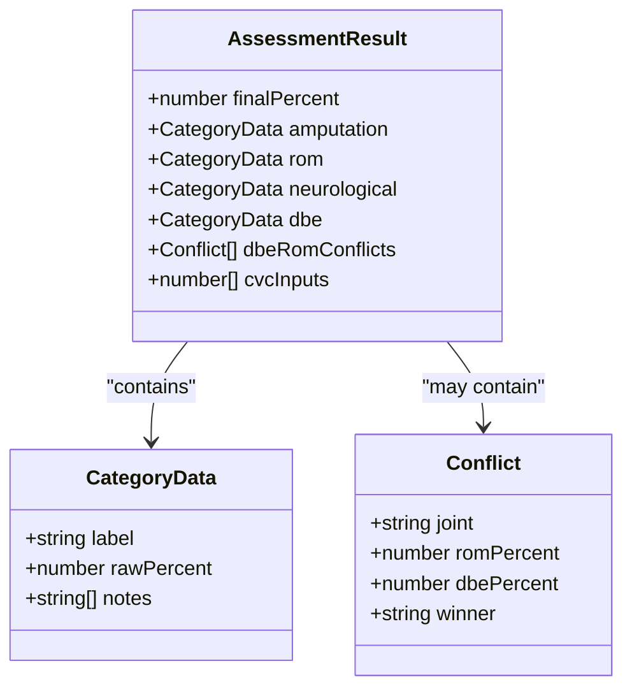
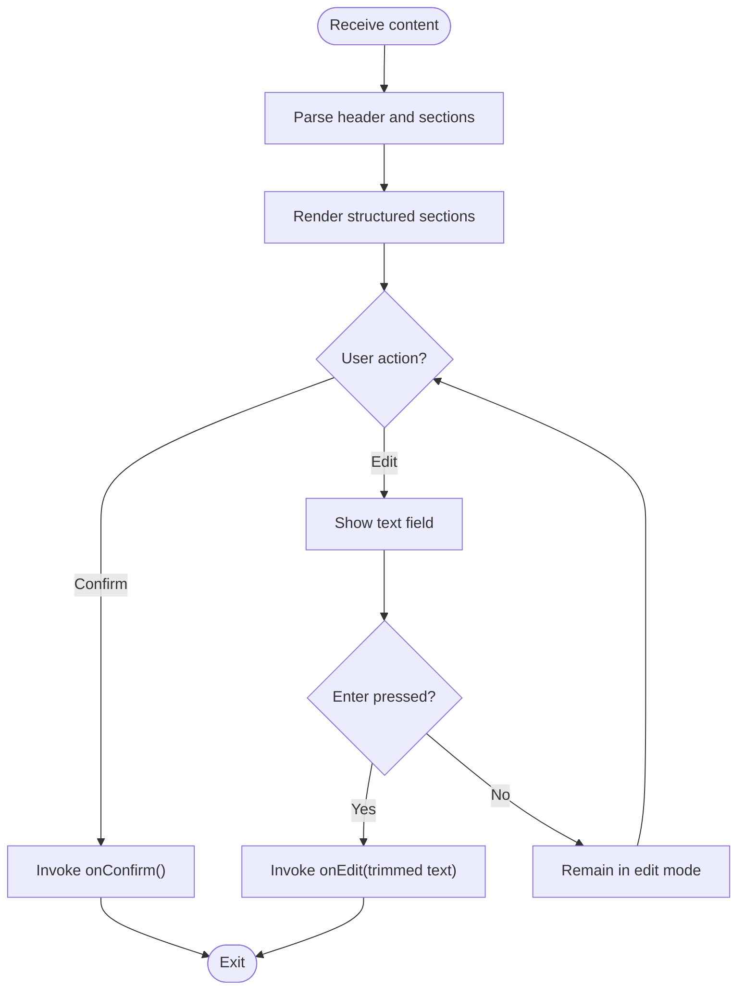
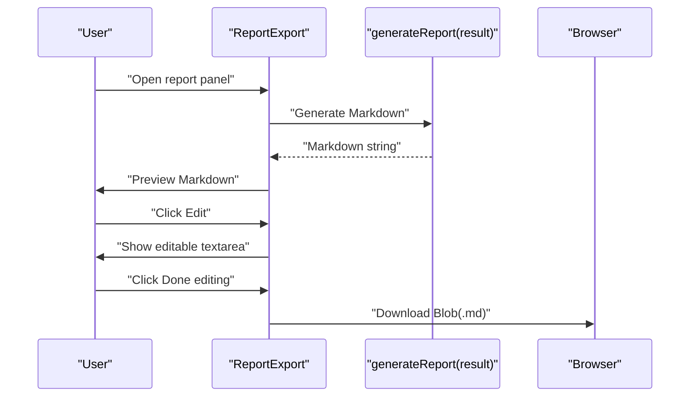
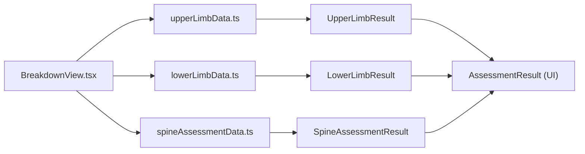

# Assessment Components

<cite>
**Referenced Files in This Document**
- [BreakdownView.tsx](file://web/src/components/BreakdownView.tsx)
- [ConfirmationCard.tsx](file://web/src/components/ConfirmationCard.tsx)
- [ReportExport.tsx](file://web/src/components/ReportExport.tsx)
- [ChatPanel.tsx](file://web/src/components/ChatPanel.tsx)
- [upperLimbData.ts](file://src/engine/upperLimbData.ts)
- [lowerLimbData.ts](file://src/engine/lowerLimbData.ts)
- [spineAssessmentData.ts](file://src/engine/spineAssessmentData.ts)
</cite>

## Table of Contents
1. [Introduction](#introduction)
2. [Project Structure](#project-structure)
3. [Core Components](#core-components)
4. [Architecture Overview](#architecture-overview)
5. [Detailed Component Analysis](#detailed-component-analysis)
6. [Dependency Analysis](#dependency-analysis)
7. [Performance Considerations](#performance-considerations)
8. [Troubleshooting Guide](#troubleshooting-guide)
9. [Conclusion](#conclusion)

## Introduction
This document provides comprehensive technical and practical documentation for the assessment interface components used in the GATIOD Chat Assessment Assistant. It focuses on three UI components that present structured medical assessment results and support user-driven validation and report generation:
- BreakdownView: Displays detailed calculation results and assessment breakdowns for a chosen system.
- ConfirmationCard: Provides structured data confirmation and allows users to propose corrections.
- ReportExport: Generates and manages downloadable Markdown reports of the assessment.

These components integrate tightly with the chat-based workflow, interpreting tool execution results and rendering them in accessible, actionable formats. They emphasize clarity for complex medical data, robust state management, and seamless export functionality.

## Project Structure
The assessment components reside in the web frontend and are orchestrated by the ChatPanel. They consume structured assessment results produced by the calculation engine and present them to the user.

**Diagram sources**
- [ChatPanel.tsx:1-362](file://web/src/components/ChatPanel.tsx#L1-L362)
- [BreakdownView.tsx:1-182](file://web/src/components/BreakdownView.tsx#L1-L182)
- [upperLimbData.ts:168-186](file://src/engine/upperLimbData.ts#L168-L186)
- [lowerLimbData.ts:164-181](file://src/engine/lowerLimbData.ts#L164-L181)
- [spineAssessmentData.ts:351-359](file://src/engine/spineAssessmentData.ts#L351-L359)

**Section sources**
- [ChatPanel.tsx:1-362](file://web/src/components/ChatPanel.tsx#L1-L362)

## Core Components
This section documents the props, data binding, user interactions, and result visualization for each component.

### BreakdownView
Purpose: Render a system-specific assessment result with category breakdowns, conflict resolution, and CVC combination details.

Props:
- content: string — fallback content to display when no structured assessment result is available.
- toolCalls?: ToolCall[] — array of tool execution results returned by the backend.

Key behaviors:
- Extracts the first successful assessment tool call (excluding global CVC) and maps it to a human-readable system label.
- Renders category sections (amputation, ROM, neurological, DBE) with expandable notes and percentage badges.
- Displays conflict resolution entries when present.
- Shows CVC combination steps when multiple inputs are used.

Data binding:
- Uses AssessmentResult interface derived from engine outputs (e.g., UpperLimbResult, LowerLimbResult, SpineAssessmentResult).
- Binds percentages and notes to Material UI components for visual emphasis.

User interactions:
- Clicking category headers toggles visibility of detailed notes.
- Final PI is prominently displayed in the header.

Accessibility and presentation:
- Uses color-coded category bars and collapsible sections to improve scanning.
- Ensures readable typography and spacing for dense medical content.

**Section sources**
- [BreakdownView.tsx:35-61](file://web/src/components/BreakdownView.tsx#L35-L61)
- [upperLimbData.ts:168-186](file://src/engine/upperLimbData.ts#L168-L186)
- [lowerLimbData.ts:164-181](file://src/engine/lowerLimbData.ts#L164-L181)
- [spineAssessmentData.ts:351-359](file://src/engine/spineAssessmentData.ts#L351-L359)

### ConfirmationCard
Purpose: Allow users to review structured assessment data and either confirm it or propose edits.

Props:
- content: string — structured confirmation text containing system, side, and sections.
- onConfirm: () => void — callback invoked when the user confirms the assessment.
- onEdit: (correction: string) => void — callback invoked with the user’s proposed correction text.

Parsing logic:
- Extracts system and side from the header.
- Parses labeled sections and supports multi-line bullet points appended to the previous section.

User interactions:
- Confirm & Calculate button triggers onConfirm.
- Edit values opens an inline text field; pressing Enter sends the correction via onEdit.

Accessibility and presentation:
- Clear header with “Review required” indicator.
- Monospace font for structured values to aid readability.

**Section sources**
- [ConfirmationCard.tsx:7-45](file://web/src/components/ConfirmationCard.tsx#L7-L45)

### ReportExport
Purpose: Generate, preview, and download a Markdown report summarizing the assessment.

Props:
- result: Record<string, unknown> — the latest assessment result object.

Behavior:
- Generates a Markdown-formatted report including categories, conflicts, and CVC combination.
- Allows in-place editing of the generated report before download.
- Supports resetting to the auto-generated version.

User interactions:
- Clicking the header toggles the preview/edit panel.
- Download button creates a Blob and initiates a browser download with a date-stamped filename.
- Edit mode enables free-text modification of the report content.

**Section sources**
- [ReportExport.tsx:9-62](file://web/src/components/ReportExport.tsx#L9-L62)

## Architecture Overview
The components participate in a chat-driven workflow where the backend returns tool execution results alongside natural language messages. The ChatPanel detects message types and renders the appropriate component.

**Diagram sources**
- [ChatPanel.tsx:40-47](file://web/src/components/ChatPanel.tsx#L40-L47)
- [ChatPanel.tsx:253-269](file://web/src/components/ChatPanel.tsx#L253-L269)
- [BreakdownView.tsx:94-103](file://web/src/components/BreakdownView.tsx#L94-L103)
- [ConfirmationCard.tsx:47-58](file://web/src/components/ConfirmationCard.tsx#L47-L58)
- [ReportExport.tsx:64-68](file://web/src/components/ReportExport.tsx#L64-L68)

## Detailed Component Analysis

### BreakdownView Analysis
BreakdownView transforms raw assessment tool results into a structured, interactive summary.

**Diagram sources**
- [BreakdownView.tsx:25-33](file://web/src/components/BreakdownView.tsx#L25-L33)
- [upperLimbData.ts:168-186](file://src/engine/upperLimbData.ts#L168-L186)
- [lowerLimbData.ts:164-181](file://src/engine/lowerLimbData.ts#L164-L181)
- [spineAssessmentData.ts:351-359](file://src/engine/spineAssessmentData.ts#L351-L359)

Processing logic highlights:
- Extraction of the first successful assessment tool call excluding global CVC.
- Conditional rendering of conflict resolution and CVC combination blocks.
- Expandable category sections with percentage badges and collapsible notes.

User interaction flow:
- Clicking a category header toggles the notes panel.
- Final PI is emphasized in the header for quick scanning.

**Section sources**
- [BreakdownView.tsx:52-61](file://web/src/components/BreakdownView.tsx#L52-L61)
- [BreakdownView.tsx:63-92](file://web/src/components/BreakdownView.tsx#L63-L92)
- [BreakdownView.tsx:94-181](file://web/src/components/BreakdownView.tsx#L94-L181)

### ConfirmationCard Analysis
ConfirmationCard parses structured confirmation content and offers a controlled validation loop.

**Diagram sources**
- [ConfirmationCard.tsx:19-45](file://web/src/components/ConfirmationCard.tsx#L19-L45)
- [ConfirmationCard.tsx:47-58](file://web/src/components/ConfirmationCard.tsx#L47-L58)

User interaction pattern:
- Confirmation triggers a follow-up message to the backend to proceed with calculation.
- Editing allows concise, focused corrections that preserve context.

**Section sources**
- [ConfirmationCard.tsx:19-45](file://web/src/components/ConfirmationCard.tsx#L19-L45)
- [ConfirmationCard.tsx:47-141](file://web/src/components/ConfirmationCard.tsx#L47-L141)

### ReportExport Analysis
ReportExport generates a Markdown report and supports in-place editing before download.

**Diagram sources**
- [ReportExport.tsx:13-62](file://web/src/components/ReportExport.tsx#L13-L62)
- [ReportExport.tsx:64-78](file://web/src/components/ReportExport.tsx#L64-L78)
- [ReportExport.tsx:97-141](file://web/src/components/ReportExport.tsx#L97-L141)

Data formatting and export:
- Uses a date-stamped filename and MIME type text/markdown.
- Preserves monospace formatting for structured readability.

**Section sources**
- [ReportExport.tsx:13-62](file://web/src/components/ReportExport.tsx#L13-L62)
- [ReportExport.tsx:64-78](file://web/src/components/ReportExport.tsx#L64-L78)
- [ReportExport.tsx:97-141](file://web/src/components/ReportExport.tsx#L97-L141)

## Dependency Analysis
The components depend on shared assessment result schemas from the engine to maintain type safety and consistent data structures across systems.

**Diagram sources**
- [BreakdownView.tsx:25-33](file://web/src/components/BreakdownView.tsx#L25-L33)
- [upperLimbData.ts:168-186](file://src/engine/upperLimbData.ts#L168-L186)
- [lowerLimbData.ts:164-181](file://src/engine/lowerLimbData.ts#L164-L181)
- [spineAssessmentData.ts:351-359](file://src/engine/spineAssessmentData.ts#L351-L359)

**Section sources**
- [upperLimbData.ts:168-186](file://src/engine/upperLimbData.ts#L168-L186)
- [lowerLimbData.ts:164-181](file://src/engine/lowerLimbData.ts#L164-L181)
- [spineAssessmentData.ts:351-359](file://src/engine/spineAssessmentData.ts#L351-L359)

## Performance Considerations
- Rendering optimization: BreakdownView uses React state to toggle category panels, minimizing re-renders of hidden content.
- Memoization: ReportExport memoizes the initial report generation to avoid recomputation on every render.
- Lightweight parsing: ConfirmationCard’s parsing is linear in the number of lines and bullet points, suitable for typical confirmation lengths.
- Export efficiency: ReportExport uses a Blob and client-side download to avoid server round-trips for downloads.

## Troubleshooting Guide
Common issues and resolutions:
- No structured result displayed: Ensure the backend returns a successful assessment tool call with a result object. BreakdownView falls back to displaying raw content when no assessment result is detected.
- Confirmation not recognized: Verify the message content matches the expected confirmation pattern; otherwise, ChatPanel treats it as text.
- Report appears empty: Confirm that lastResult is populated in ChatPanel before ReportExport renders.
- Download fails: Check browser permissions for downloads and ensure the result object contains the expected keys (finalPercent, amputation, rom, neurological, dbe, dbeRomConflicts, cvcInputs).

**Section sources**
- [ChatPanel.tsx:114-119](file://web/src/components/ChatPanel.tsx#L114-L119)
- [BreakdownView.tsx:97-103](file://web/src/components/BreakdownView.tsx#L97-L103)
- [ConfirmationCard.tsx:19-45](file://web/src/components/ConfirmationCard.tsx#L19-L45)
- [ReportExport.tsx:64-68](file://web/src/components/ReportExport.tsx#L64-L68)

## Conclusion
The assessment components provide a cohesive, user-friendly interface for presenting complex medical calculations, enabling structured validation, and facilitating report generation. Their integration with the chat workflow ensures a smooth progression from clinical input to validated results and shareable documentation. By leveraging shared result schemas and thoughtful UI patterns, the system balances accuracy, accessibility, and usability across multiple medical systems.