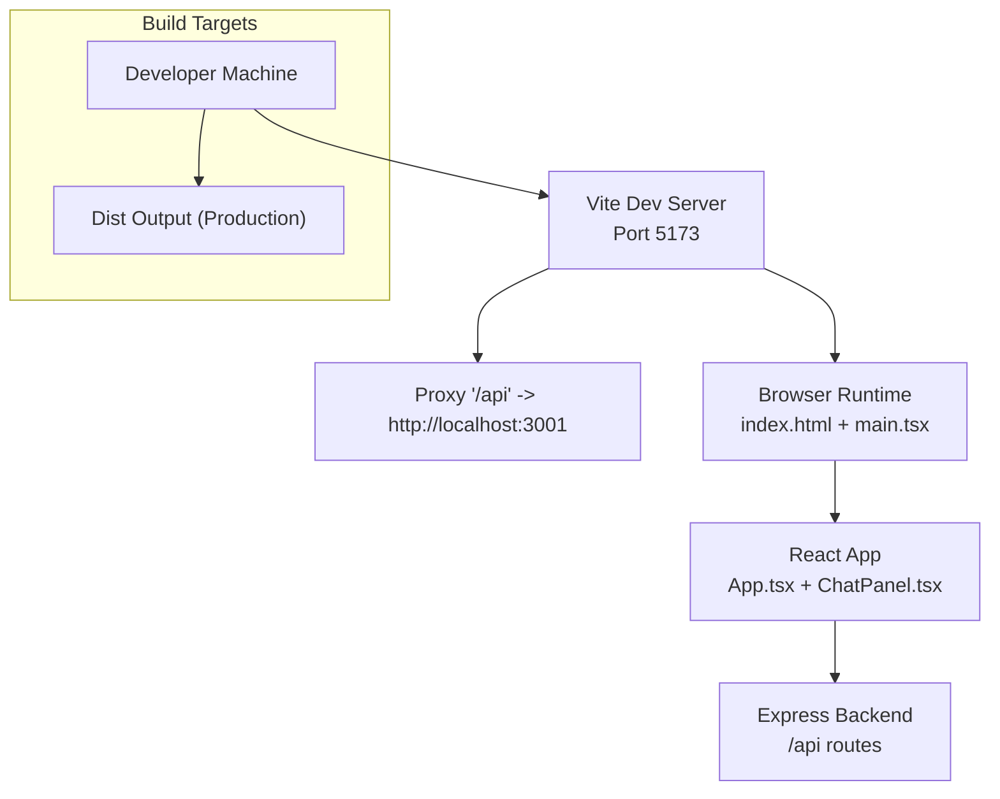
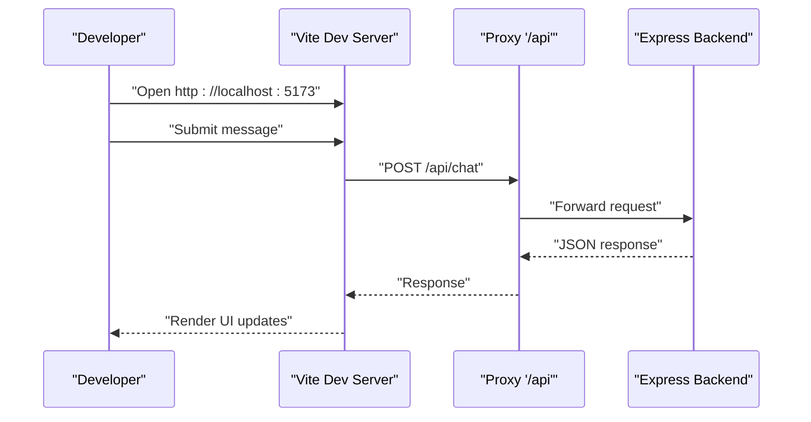
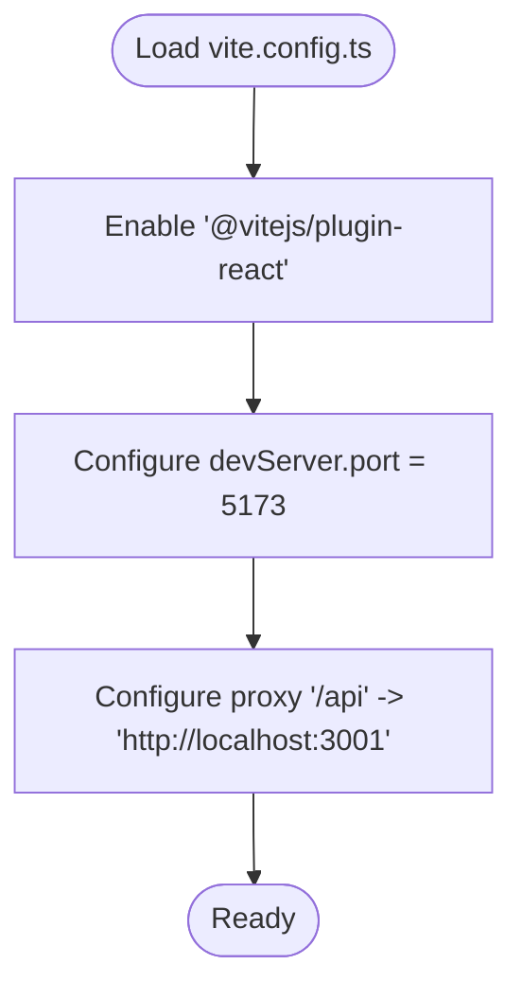
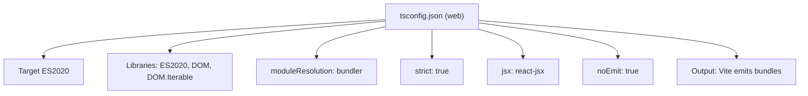
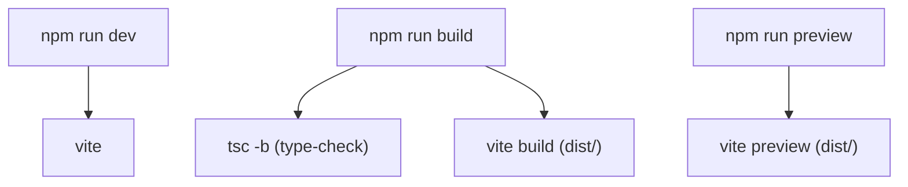
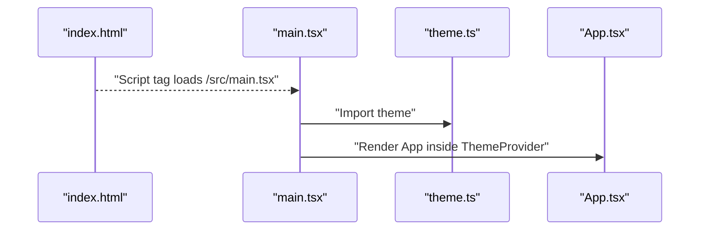
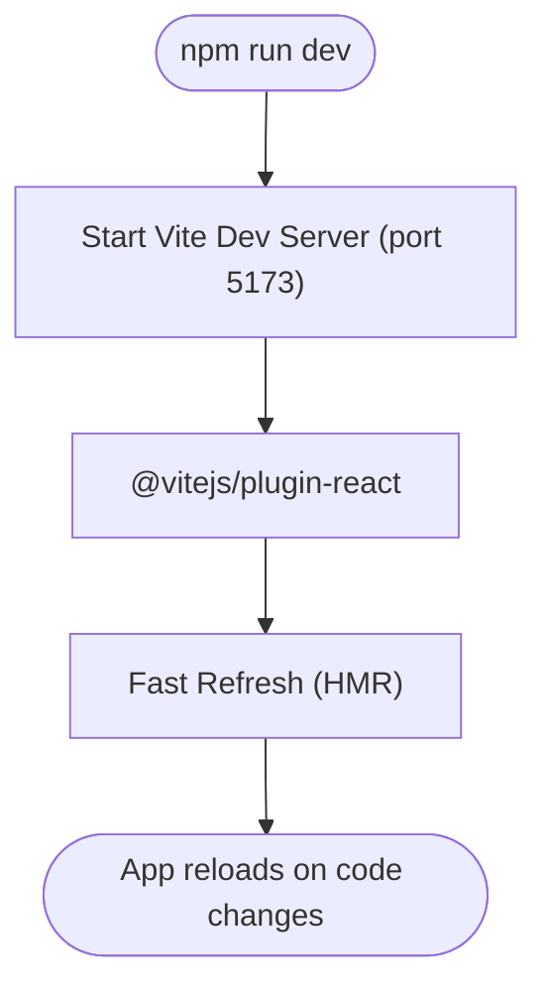
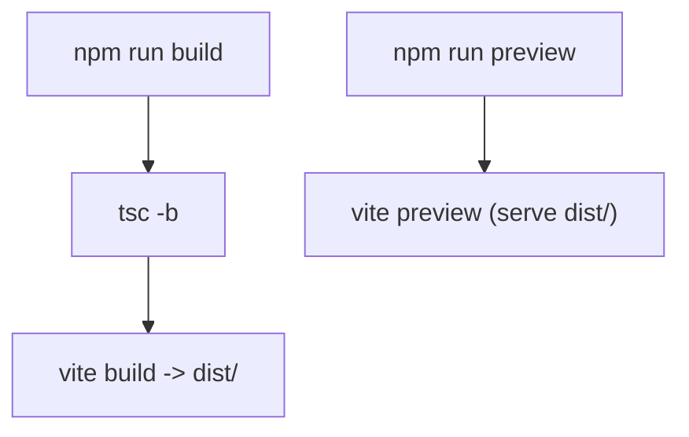
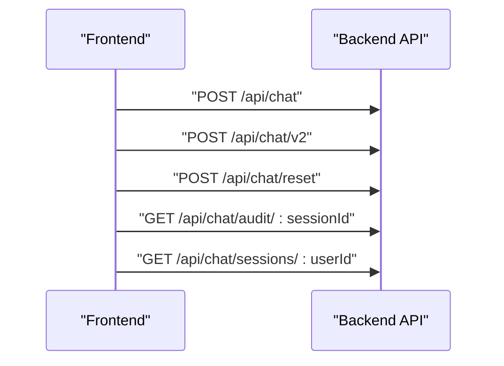
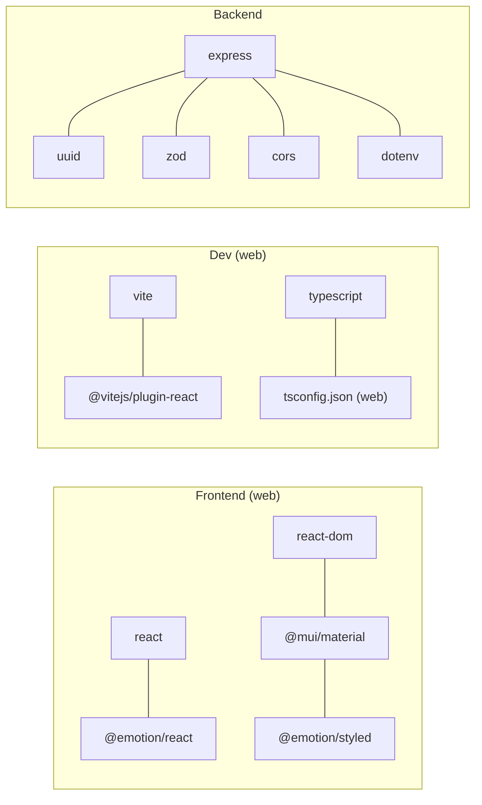

# Build Configuration

<cite>
**Referenced Files in This Document**
- [web/vite.config.ts](file://web/vite.config.ts)
- [web/package.json](file://web/package.json)
- [web/tsconfig.json](file://web/tsconfig.json)
- [web/index.html](file://web/index.html)
- [web/src/main.tsx](file://web/src/main.tsx)
- [web/src/App.tsx](file://web/src/App.tsx)
- [web/src/theme.ts](file://web/src/theme.ts)
- [web/src/components/ChatPanel.tsx](file://web/src/components/ChatPanel.tsx)
- [package.json](file://package.json)
- [tsconfig.json](file://tsconfig.json)
- [src/api/chatRoutes.ts](file://src/api/chatRoutes.ts)
- [vitest.config.ts](file://vitest.config.ts)
</cite>

## Table of Contents
1. [Introduction](#introduction)
2. [Project Structure](#project-structure)
3. [Core Components](#core-components)
4. [Architecture Overview](#architecture-overview)
5. [Detailed Component Analysis](#detailed-component-analysis)
6. [Dependency Analysis](#dependency-analysis)
7. [Performance Considerations](#performance-considerations)
8. [Troubleshooting Guide](#troubleshooting-guide)
9. [Conclusion](#conclusion)
10. [Appendices](#appendices)

## Introduction
This document explains the frontend build configuration and development environment setup for the web application. It covers the Vite configuration, TypeScript setup, module resolution, development server, build targets, environment variables, and deployment preparation. It also includes performance optimization strategies, bundle analysis guidance, and troubleshooting steps for common build issues.

## Project Structure
The frontend is organized under the web directory and integrates with the backend server via a proxy. The build system uses Vite for dev and build, TypeScript for type checking and transpilation, and Material UI theming for styling.

**Diagram sources**
- [web/vite.config.ts:1-16](file://web/vite.config.ts#L1-L16)
- [web/index.html:1-16](file://web/index.html#L1-L16)
- [web/src/main.tsx:1-15](file://web/src/main.tsx#L1-L15)
- [web/src/App.tsx:1-23](file://web/src/App.tsx#L1-L23)
- [src/api/chatRoutes.ts:14-91](file://src/api/chatRoutes.ts#L14-L91)

**Section sources**
- [web/vite.config.ts:1-16](file://web/vite.config.ts#L1-L16)
- [web/package.json:1-27](file://web/package.json#L1-L27)
- [web/tsconfig.json:1-22](file://web/tsconfig.json#L1-L22)
- [web/index.html:1-16](file://web/index.html#L1-L16)
- [web/src/main.tsx:1-15](file://web/src/main.tsx#L1-L15)
- [web/src/App.tsx:1-23](file://web/src/App.tsx#L1-L23)
- [src/api/chatRoutes.ts:14-91](file://src/api/chatRoutes.ts#L14-L91)

## Core Components
- Vite configuration defines the React plugin, dev server port, and API proxy to the backend.
- TypeScript configuration enables modern ECMAScript features, strictness, and bundler module resolution for the frontend.
- Package scripts orchestrate dev, build, and preview tasks.
- HTML entry point wires the React root and loads the main module.
- Theming and UI components integrate Material UI with a custom theme.

**Section sources**
- [web/vite.config.ts:1-16](file://web/vite.config.ts#L1-L16)
- [web/tsconfig.json:1-22](file://web/tsconfig.json#L1-L22)
- [web/package.json:1-27](file://web/package.json#L1-L27)
- [web/index.html:1-16](file://web/index.html#L1-L16)
- [web/src/theme.ts:1-36](file://web/src/theme.ts#L1-L36)

## Architecture Overview
The frontend development server proxies API requests to the backend, enabling seamless local development. The React app renders the chat interface and communicates with backend endpoints.

**Diagram sources**
- [web/vite.config.ts:6-14](file://web/vite.config.ts#L6-L14)
- [src/api/chatRoutes.ts:14-41](file://src/api/chatRoutes.ts#L14-L41)
- [web/src/components/ChatPanel.tsx:83-110](file://web/src/components/ChatPanel.tsx#L83-L110)

## Detailed Component Analysis

### Vite Configuration
- Plugin stack: React plugin for JSX/TSX transforms and Fast Refresh.
- Dev server:
  - Port 5173.
  - Proxy for "/api" to http://localhost:3001 with origin change enabled.
- Build output: defaults to dist/ for production builds.

**Diagram sources**
- [web/vite.config.ts:4-15](file://web/vite.config.ts#L4-L15)

**Section sources**
- [web/vite.config.ts:1-16](file://web/vite.config.ts#L1-L16)

### TypeScript Configuration (Frontend)
- Target and modules: ES2020 with ESNext modules.
- DOM libraries included for browser runtime.
- Module resolution: "bundler" for Vite-compatible resolution.
- Strictness: enabled with practical allowances (unused locals/parameters configurable).
- JSX transform: "react-jsx".
- No emit: tsc used only for type-checking in dev/build scripts.

**Diagram sources**
- [web/tsconfig.json:2-19](file://web/tsconfig.json#L2-L19)

**Section sources**
- [web/tsconfig.json:1-22](file://web/tsconfig.json#L1-L22)

### TypeScript Configuration (Root/Backend)
- Node target and module resolution tailored for the backend.
- Path mapping for internal packages:
  - @engine/*
  - @tools/*
  - @chat/*
  - @rag/*
- Output directory configured for distribution artifacts.

**Section sources**
- [tsconfig.json:1-27](file://tsconfig.json#L1-L27)

### Package Scripts and Workflow
- Scripts:
  - dev: runs Vite dev server.
  - build: runs tsc (type-check) then vite build.
  - preview: serves built assets locally.
- Frontend dependencies include React, Material UI, and Emotion for styling.
- Dev dependencies include Vite, React plugin, TypeScript, and related types.

**Diagram sources**
- [web/package.json:6-10](file://web/package.json#L6-L10)

**Section sources**
- [web/package.json:1-27](file://web/package.json#L1-L27)

### HTML Entry Point and Root Rendering
- index.html:
  - Provides the root element (#root).
  - Loads the main module script.
  - Includes Google Fonts preconnects for performance.
- main.tsx:
  - Renders the React root.
  - Wraps the app with Material UI ThemeProvider and CssBaseline.
  - Uses the custom theme from theme.ts.
- App.tsx:
  - Defines the top-level layout with AppBar and ChatPanel.

**Diagram sources**
- [web/index.html:11-14](file://web/index.html#L11-L14)
- [web/src/main.tsx:1-15](file://web/src/main.tsx#L1-15)
- [web/src/theme.ts:1-36](file://web/src/theme.ts#L1-L36)
- [web/src/App.tsx:1-23](file://web/src/App.tsx#L1-L23)

**Section sources**
- [web/index.html:1-16](file://web/index.html#L1-L16)
- [web/src/main.tsx:1-15](file://web/src/main.tsx#L1-L15)
- [web/src/theme.ts:1-36](file://web/src/theme.ts#L1-L36)
- [web/src/App.tsx:1-23](file://web/src/App.tsx#L1-L23)

### Development Server and Hot Reloading
- Vite dev server runs on port 5173.
- React plugin enables Fast Refresh for instant UI updates during development.
- Proxy configuration allows the frontend to call backend endpoints seamlessly.

**Diagram sources**
- [web/vite.config.ts:4-8](file://web/vite.config.ts#L4-L8)

**Section sources**
- [web/vite.config.ts:1-16](file://web/vite.config.ts#L1-L16)

### Build Targets and Deployment Preparation
- Production build:
  - Type-check via tsc -b.
  - Bundle and optimize via vite build (default dist/).
- Preview built assets locally with vite preview.
- Backend deployment:
  - Serve the dist/ folder from the Vite build as static assets.
  - Ensure the backend remains reachable at http://localhost:3001 for API calls.

**Diagram sources**
- [web/package.json:7-9](file://web/package.json#L7-L9)

**Section sources**
- [web/package.json:1-27](file://web/package.json#L1-L27)

### Environment Variables and Backend Integration
- Frontend:
  - Uses proxy for "/api" to backend service.
- Backend:
  - Exposes chat endpoints:
    - POST /api/chat
    - POST /api/chat/v2
    - POST /api/chat/reset
    - GET /api/chat/audit/:sessionId
    - GET /api/chat/sessions/:userId
  - Optional shadow mode and debug toggles controlled by environment variables.

**Diagram sources**
- [src/api/chatRoutes.ts:14-91](file://src/api/chatRoutes.ts#L14-L91)

**Section sources**
- [src/api/chatRoutes.ts:1-91](file://src/api/chatRoutes.ts#L1-L91)

### Testing Configuration
- Vitest configuration includes test pattern and a setup file to load environment variables once for test runs.

**Section sources**
- [vitest.config.ts:1-12](file://vitest.config.ts#L1-L12)

## Dependency Analysis
- Frontend dependencies:
  - React and ReactDOM for UI.
  - Material UI and Emotion for styling and theming.
- Dev dependencies:
  - Vite and @vitejs/plugin-react for dev/build.
  - TypeScript for type checking and compilation.
- Backend dependencies:
  - Express for API routes.
  - UUID, Zod, CORS, dotenv for runtime support.

**Diagram sources**
- [web/package.json:11-25](file://web/package.json#L11-L25)
- [package.json:21-29](file://package.json#L21-L29)

**Section sources**
- [web/package.json:1-27](file://web/package.json#L1-L27)
- [package.json:1-45](file://package.json#L1-L45)

## Performance Considerations
- Module resolution:
  - Use bundler moduleResolution for Vite to minimize bundling overhead.
- Strictness:
  - Keep strict enabled for safety; adjust unused lint flags per team preference.
- Build pipeline:
  - Separate type-check (tsc -b) from bundling (vite build) to speed up incremental builds.
- Asset delivery:
  - Serve the dist/ folder via the backend or a CDN for production.
- Network:
  - Proxy "/api" avoids CORS complexities during development.
- Theming:
  - Centralized theme reduces runtime computation and improves consistency.

[No sources needed since this section provides general guidance]

## Troubleshooting Guide
- Proxy not working:
  - Verify the proxy target matches the backend address and port.
  - Confirm the backend is running before testing API calls.
- Build fails on type errors:
  - Run tsc -b to catch issues before vite build.
- Unexpected non-JSON responses:
  - The frontend expects JSON from /api endpoints; ensure backend returns proper JSON and status codes.
- Missing fonts or styles:
  - Confirm index.html preconnects and that the theme is applied at the root.

**Section sources**
- [web/vite.config.ts:6-14](file://web/vite.config.ts#L6-L14)
- [web/package.json:7-9](file://web/package.json#L7-L9)
- [web/src/components/ChatPanel.tsx:82-110](file://web/src/components/ChatPanel.tsx#L82-L110)
- [web/index.html:7-9](file://web/index.html#L7-L9)

## Conclusion
The frontend build system leverages Vite for fast development and optimized production builds, TypeScript for type safety, and Material UI for a cohesive design system. The proxy configuration simplifies local development by routing API calls to the backend. Following the scripts and configurations outlined here ensures a smooth development and deployment experience.

[No sources needed since this section summarizes without analyzing specific files]

## Appendices

### Local Development Setup
- Start the backend server on port 3001.
- Run the frontend dev server with npm run dev.
- Open the app in the browser at the Vite dev server URL.
- Use the proxy to communicate with backend endpoints.

**Section sources**
- [web/vite.config.ts:6-14](file://web/vite.config.ts#L6-L14)
- [src/api/chatRoutes.ts:14-41](file://src/api/chatRoutes.ts#L14-L41)

### Production Build Process
- Run npm run build to type-check and bundle.
- Serve the dist/ directory via the backend or a static host.
- Use npm run preview to validate the built output locally.

**Section sources**
- [web/package.json:7-9](file://web/package.json#L7-L9)

### Environment Variables Reference
- Backend:
  - GATIOD_V2_SHADOW_MODE: toggles shadow mode for v2 pipeline evaluation.
  - GATIOD_DEBUG_RESPONSES: controls debug response mode for v2.
  - GATIOD_RUN_SEMANTIC_SHADOW: enables semantic shadow runner tests.
  - GATIOD_RUN_EXCEL_SCENARIOS: enables Excel scenario tests.
  - GEMINI_API_KEY: loaded by the test setup for API access in selected tests.

**Section sources**
- [src/api/chatRoutes.ts:29-33](file://src/api/chatRoutes.ts#L29-L33)
- [src/api/chatRoutes.ts:56-59](file://src/api/chatRoutes.ts#L56-L59)
- [vitest.config.ts:6-10](file://vitest.config.ts#L6-L10)