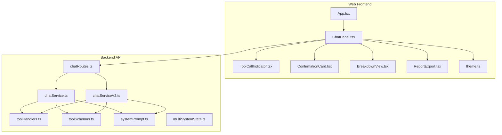
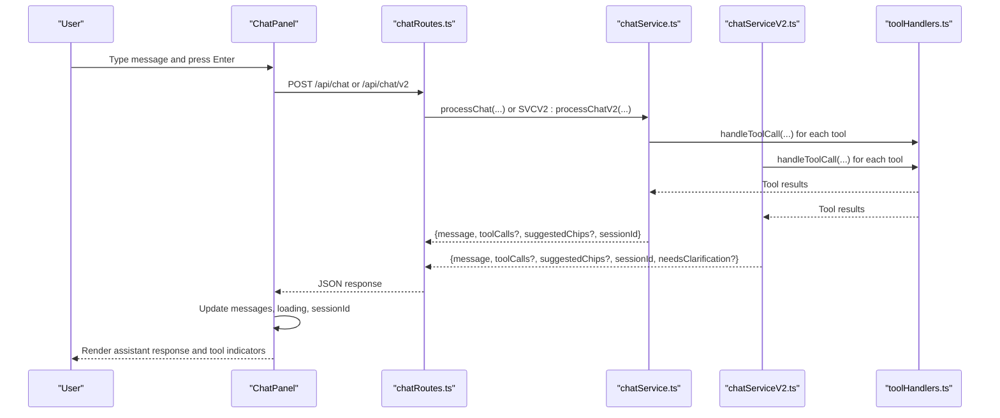
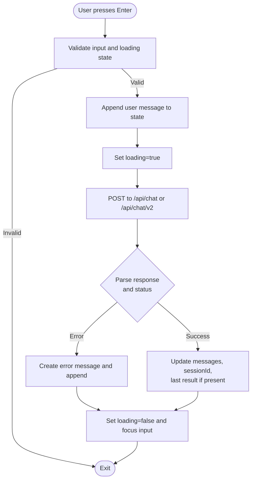
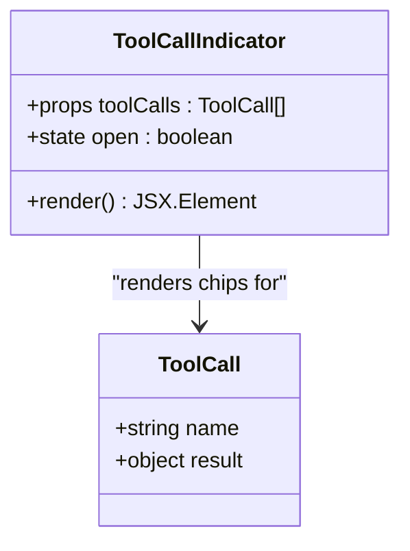
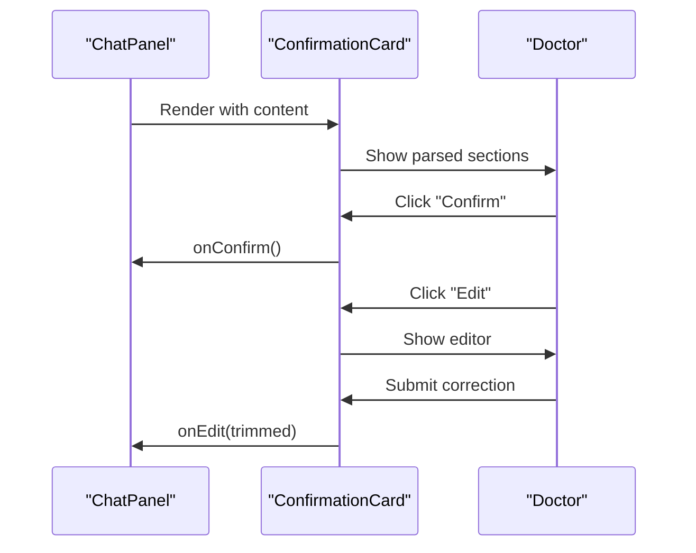
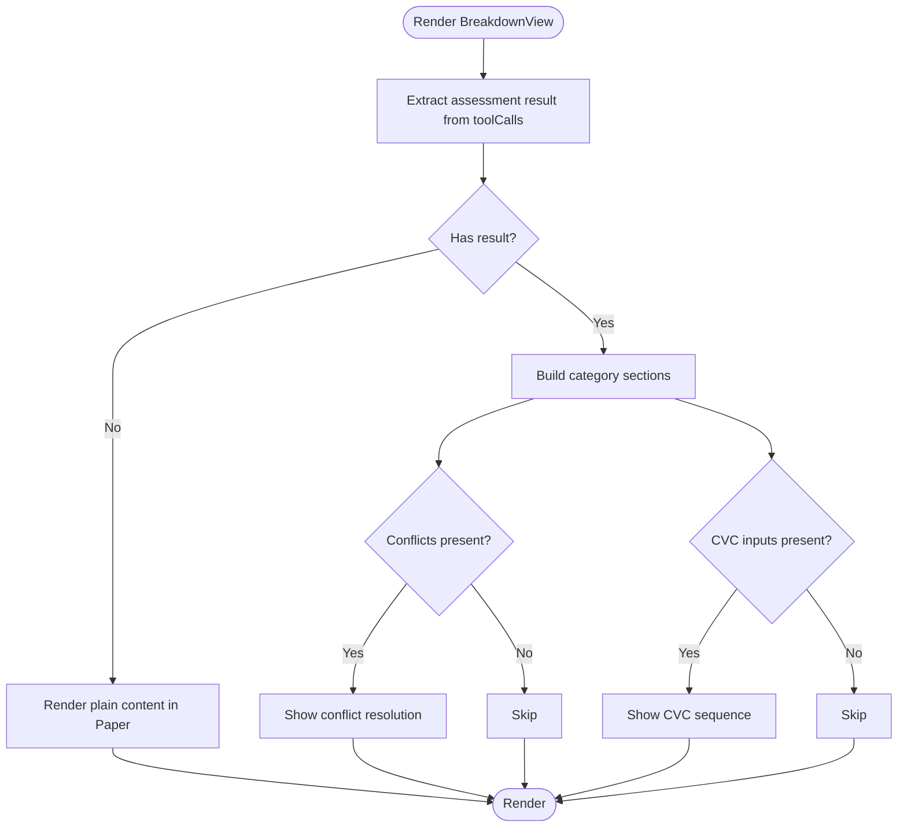
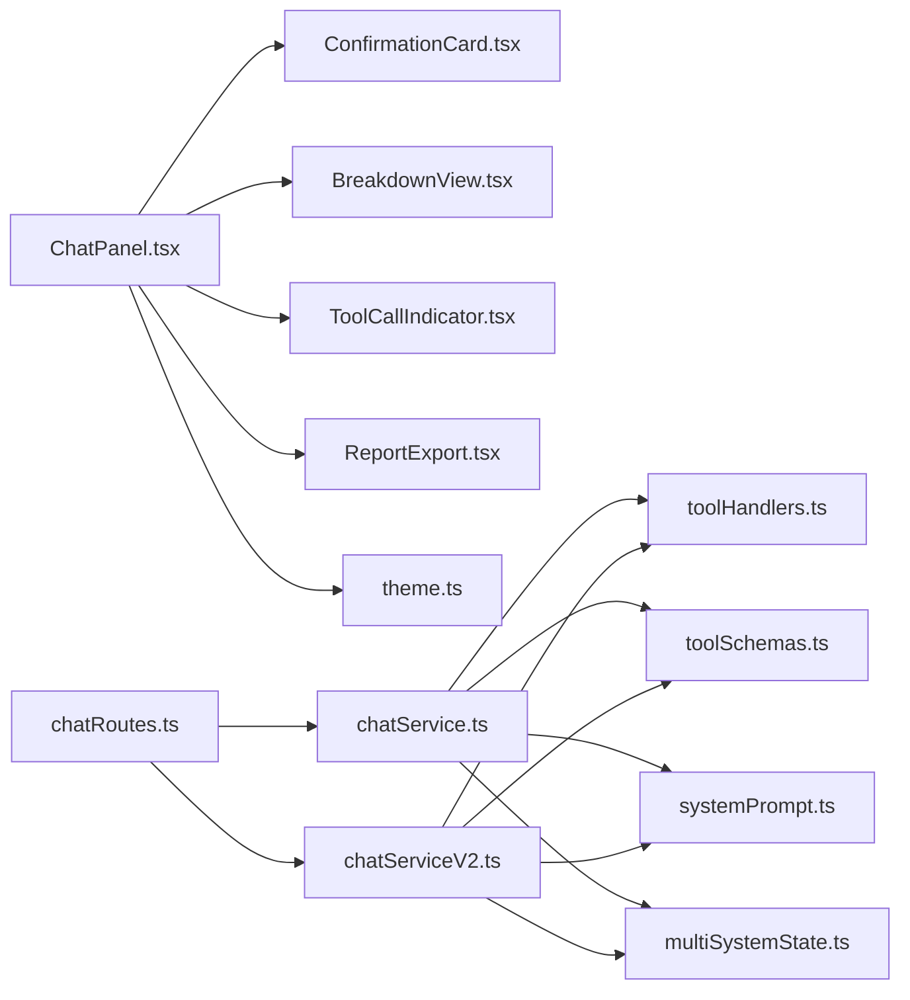

# Chat Components

<cite>
**Referenced Files in This Document**
- [ChatPanel.tsx](file://web/src/components/ChatPanel.tsx)
- [ToolCallIndicator.tsx](file://web/src/components/ToolCallIndicator.tsx)
- [ConfirmationCard.tsx](file://web/src/components/ConfirmationCard.tsx)
- [BreakdownView.tsx](file://web/src/components/BreakdownView.tsx)
- [ReportExport.tsx](file://web/src/components/ReportExport.tsx)
- [App.tsx](file://web/src/App.tsx)
- [theme.ts](file://web/src/theme.ts)
- [chatRoutes.ts](file://src/api/chatRoutes.ts)
- [chatService.ts](file://src/chat/chatService.ts)
- [chatServiceV2.ts](file://src/chat/chatServiceV2.ts)
- [toolHandlers.ts](file://src/tools/toolHandlers.ts)
- [toolSchemas.ts](file://src/tools/toolSchemas.ts)
- [systemPrompt.ts](file://src/chat/systemPrompt.ts)
- [multiSystemState.ts](file://src/chat/multiSystemState.ts)
</cite>

## Table of Contents
1. [Introduction](#introduction)
2. [Project Structure](#project-structure)
3. [Core Components](#core-components)
4. [Architecture Overview](#architecture-overview)
5. [Detailed Component Analysis](#detailed-component-analysis)
6. [Dependency Analysis](#dependency-analysis)
7. [Performance Considerations](#performance-considerations)
8. [Troubleshooting Guide](#troubleshooting-guide)
9. [Conclusion](#conclusion)
10. [Appendices](#appendices)

## Introduction
This document provides comprehensive technical and practical documentation for the chat interface components, focusing on the ChatPanel and ToolCallIndicator, along with supporting UI components and backend integration. It explains user interaction patterns, real-time messaging, typing indicators, tool call visualization, API integration, error handling, loading states, accessibility, keyboard navigation, and responsive behavior.

## Project Structure
The chat UI is implemented in the web application and integrates with backend services that orchestrate AI-assisted clinical assessments across nine body systems. The frontend components are organized under web/src/components and integrate with MUI for theming and layout. The backend exposes REST endpoints for chat, reset, and audit tracing, and delegates to chat services that manage sessions, tool execution, and result rendering.

**Diagram sources**
- [App.tsx:1-23](file://web/src/App.tsx#L1-L23)
- [ChatPanel.tsx:1-362](file://web/src/components/ChatPanel.tsx#L1-L362)
- [ToolCallIndicator.tsx:1-65](file://web/src/components/ToolCallIndicator.tsx#L1-L65)
- [ConfirmationCard.tsx:1-141](file://web/src/components/ConfirmationCard.tsx#L1-L141)
- [BreakdownView.tsx:1-182](file://web/src/components/BreakdownView.tsx#L1-L182)
- [ReportExport.tsx:1-143](file://web/src/components/ReportExport.tsx#L1-L143)
- [chatRoutes.ts:1-91](file://src/api/chatRoutes.ts#L1-L91)
- [chatService.ts:1-183](file://src/chat/chatService.ts#L1-L183)
- [chatServiceV2.ts:1-1041](file://src/chat/chatServiceV2.ts#L1-L1041)
- [toolHandlers.ts:1-435](file://src/tools/toolHandlers.ts#L1-L435)
- [toolSchemas.ts:1-487](file://src/tools/toolSchemas.ts#L1-L487)
- [systemPrompt.ts:1-391](file://src/chat/systemPrompt.ts#L1-L391)
- [multiSystemState.ts:1-111](file://src/chat/multiSystemState.ts#L1-L111)
- [theme.ts:1-36](file://web/src/theme.ts#L1-L36)

**Section sources**
- [App.tsx:1-23](file://web/src/App.tsx#L1-L23)
- [ChatPanel.tsx:1-362](file://web/src/components/ChatPanel.tsx#L1-L362)
- [chatRoutes.ts:1-91](file://src/api/chatRoutes.ts#L1-L91)

## Core Components
- ChatPanel: Central chat container managing messages, input, API modes, loading states, and rendering of assistant responses (text, confirmation cards, breakdown views, and tool call indicators). Integrates with backend endpoints for chat, reset, and audit.
- ToolCallIndicator: Lightweight component visualizing AI tool usage with expandable chips indicating success/failure per tool.
- ConfirmationCard: Renders structured confirmation summaries for system assessments with confirm/edit actions.
- BreakdownView: Displays detailed assessment breakdowns with collapsible categories, conflict resolution, and CVC sequences.
- ReportExport: Generates and exports markdown reports for completed assessments.

Key props and state:
- ChatPanel manages messages, input text, loading flag, API mode, session ID, last result, and suggested chips. It exposes callbacks for sending messages, resetting, and switching API modes.
- ToolCallIndicator receives an array of tool call records and toggles visibility of chips.
- ConfirmationCard expects content and callbacks for confirm/edit.
- BreakdownView expects content and tool calls to render system-specific results.
- ReportExport expects a result object to generate a markdown report.

**Section sources**
- [ChatPanel.tsx:12-32](file://web/src/components/ChatPanel.tsx#L12-L32)
- [ChatPanel.tsx:49-181](file://web/src/components/ChatPanel.tsx#L49-L181)
- [ToolCallIndicator.tsx:28-64](file://web/src/components/ToolCallIndicator.tsx#L28-L64)
- [ConfirmationCard.tsx:7-17](file://web/src/components/ConfirmationCard.tsx#L7-L17)
- [BreakdownView.tsx:35-38](file://web/src/components/BreakdownView.tsx#L35-L38)
- [ReportExport.tsx:9-11](file://web/src/components/ReportExport.tsx#L9-L11)

## Architecture Overview
The chat UI communicates with backend endpoints to process user messages and receive AI-assisted responses. The backend orchestrates tool calls and renders results, returning structured payloads consumed by the UI.

**Diagram sources**
- [ChatPanel.tsx:69-142](file://web/src/components/ChatPanel.tsx#L69-L142)
- [chatRoutes.ts:14-66](file://src/api/chatRoutes.ts#L14-L66)
- [chatService.ts:38-154](file://src/chat/chatService.ts#L38-L154)
- [chatServiceV2.ts:258-1040](file://src/chat/chatServiceV2.ts#L258-L1040)
- [toolHandlers.ts:47-102](file://src/tools/toolHandlers.ts#L47-L102)

## Detailed Component Analysis

### ChatPanel Component
Responsibilities:
- Manages user input and message history.
- Handles Enter key submission and Shift+Enter for new lines.
- Switches between legacy and V2 API modes, resetting session state when switching.
- Renders different message types: text, confirmation cards, breakdown views, and tool call indicators.
- Displays typing indicators during processing and suggested chips for the last assistant message.
- Integrates with backend endpoints for chat, reset, and audit.

State and effects:
- Maintains messages, input text, loading state, API mode, session ID, last result, and suggested chips.
- Scrolls to bottom when messages change.
- Persists API mode to localStorage.
- Focuses input after errors or completion.

Event handling:
- handleKeyDown triggers sendMessage on Enter (Shift+Enter allows newline).
- handleApiModeChange switches API mode, resets session, and clears state.

Rendering logic:
- Empty state shows welcome text and quick-hint chips.
- For assistant messages, detects message type (text, confirmation, breakdown) and renders accordingly.
- ToolCallIndicator is shown when toolCalls exist.
- ReportExport is shown when a breakdown result exists.

API integration:
- Sends POST requests to /api/chat or /api/chat/v2 with {message, sessionId}.
- Parses JSON responses and handles non-JSON responses by throwing descriptive errors.
- On success, updates messages with user and assistant entries, sets sessionId if missing, and stores last assessment result.

Error handling:
- Catches errors during fetch and creates an assistant error message.
- Ensures loading is turned off and input is focused.

Accessibility and keyboard:
- Input supports Enter submission and Shift+Enter new line.
- Buttons and controls use MUI’s accessible defaults with tooltips.

Responsive behavior:
- Flexbox layout adapts to viewport height and width.
- Input area is scrollable and resizable with multiline support.

**Diagram sources**
- [ChatPanel.tsx:69-142](file://web/src/components/ChatPanel.tsx#L69-L142)
- [chatRoutes.ts:14-66](file://src/api/chatRoutes.ts#L14-L66)

**Section sources**
- [ChatPanel.tsx:49-362](file://web/src/components/ChatPanel.tsx#L49-L362)
- [chatRoutes.ts:14-66](file://src/api/chatRoutes.ts#L14-L66)

### ToolCallIndicator Component
Responsibilities:
- Visualizes AI tool usage with a toggleable chip list.
- Displays count of tools used and per-tool success/failure status.
- Provides localized labels for known tool names.

Props:
- toolCalls: Array of { name, result: { success, data? } }.

Behavior:
- Clicking the indicator toggles visibility of chips.
- Chips reflect success/failure with distinct styles.
- Unknown tool names fall back to raw keys.

**Diagram sources**
- [ToolCallIndicator.tsx:28-64](file://web/src/components/ToolCallIndicator.tsx#L28-L64)
- [ToolCallIndicator.tsx:5-8](file://web/src/components/ToolCallIndicator.tsx#L5-L8)

**Section sources**
- [ToolCallIndicator.tsx:1-65](file://web/src/components/ToolCallIndicator.tsx#L1-L65)

### ConfirmationCard Component
Responsibilities:
- Parses and displays structured confirmation content for a system assessment.
- Allows doctor to confirm or edit findings.
- Supports inline editing with validation and submission.

Props:
- content: Assistant message containing structured confirmation text.
- onConfirm: Callback invoked when confirming.
- onEdit: Callback invoked with corrected text.

Parsing logic:
- Extracts system, side, and sections from the confirmation text.
- Handles bullet-point continuations for multi-line values.

Actions:
- Confirm: Calls onConfirm.
- Edit: Opens editor, validates, and calls onEdit with trimmed text.

**Diagram sources**
- [ConfirmationCard.tsx:47-140](file://web/src/components/ConfirmationCard.tsx#L47-L140)

**Section sources**
- [ConfirmationCard.tsx:1-141](file://web/src/components/ConfirmationCard.tsx#L1-L141)

### BreakdownView Component
Responsibilities:
- Renders detailed assessment breakdowns for system results.
- Displays category sections (amputation, ROM, neurological, DBE) with collapsible details.
- Shows conflict resolution and CVC combination sequence when applicable.
- Falls back to plain text rendering if no structured result is available.

Props:
- content: Assistant message text.
- toolCalls: Tool call array to extract structured result.

Rendering logic:
- Extracts the first successful assessment tool call (excluding global CVC).
- Builds category sections with expand/collapse behavior.
- Displays conflicts and CVC inputs when present.

**Diagram sources**
- [BreakdownView.tsx:94-181](file://web/src/components/BreakdownView.tsx#L94-L181)
- [BreakdownView.tsx:52-61](file://web/src/components/BreakdownView.tsx#L52-L61)

**Section sources**
- [BreakdownView.tsx:1-182](file://web/src/components/BreakdownView.tsx#L1-L182)

### ReportExport Component
Responsibilities:
- Generates a markdown report from the latest assessment result.
- Allows inline editing of the report before download.
- Supports expand/collapse and download as .md.

Props:
- result: Assessment result object.

Behavior:
- Generates markdown with headings, category lists, conflicts, and CVC inputs.
- Provides edit mode with a textarea and reset option.
- Downloads a Blob with .md extension.

**Section sources**
- [ReportExport.tsx:1-143](file://web/src/components/ReportExport.tsx#L1-L143)

## Dependency Analysis
Frontend dependencies:
- ChatPanel depends on ConfirmationCard, BreakdownView, ToolCallIndicator, ReportExport, and MUI components.
- Theming is centralized in theme.ts affecting all components.

Backend dependencies:
- chatRoutes.ts routes requests to chatService.ts (legacy) or chatServiceV2.ts (V2).
- Both services depend on toolHandlers.ts to execute tools and toolSchemas.ts for function declarations.
- systemPrompt.ts defines the LLM behavior and tool usage strategy.
- multiSystemState.ts provides multi-system orchestration utilities.

**Diagram sources**
- [ChatPanel.tsx:1-11](file://web/src/components/ChatPanel.tsx#L1-L11)
- [chatRoutes.ts:1-12](file://src/api/chatRoutes.ts#L1-L12)
- [chatService.ts:6-18](file://src/chat/chatService.ts#L6-L18)
- [chatServiceV2.ts:1-46](file://src/chat/chatServiceV2.ts#L1-L46)
- [toolHandlers.ts:1-40](file://src/tools/toolHandlers.ts#L1-L40)
- [toolSchemas.ts:1-14](file://src/tools/toolSchemas.ts#L1-L14)
- [systemPrompt.ts:1-8](file://src/chat/systemPrompt.ts#L1-L8)
- [multiSystemState.ts:1-10](file://src/chat/multiSystemState.ts#L1-L10)

**Section sources**
- [ChatPanel.tsx:1-11](file://web/src/components/ChatPanel.tsx#L1-L11)
- [chatRoutes.ts:1-12](file://src/api/chatRoutes.ts#L1-L12)
- [chatService.ts:6-18](file://src/chat/chatService.ts#L6-L18)
- [chatServiceV2.ts:1-46](file://src/chat/chatServiceV2.ts#L1-L46)

## Performance Considerations
- Rendering optimization: ChatPanel memoizes formatted markdown and uses efficient list rendering. ToolCallIndicator uses Collapse to defer rendering of chips until expanded.
- Network efficiency: Backend retries Gemini calls and persists session state before invoking the model to minimize rework on transient failures.
- Memory: Tool results are stored only when relevant (last result for report export) and cleared on reset.
- Accessibility: Keyboard navigation is supported via Enter submission and button focus states. Tooltips enhance discoverability.

[No sources needed since this section provides general guidance]

## Troubleshooting Guide
Common issues and resolutions:
- Unexpected non-JSON response: The frontend checks content-type and throws a descriptive error including status and a snippet of the body. Verify backend endpoint availability and CORS configuration.
- Rate limiting or service unavailability: Backend surfaces user-friendly messages for quota/timeouts; the UI displays an assistant error message and keeps loading off.
- Session reset: Use the reset button to POST to /api/chat/reset with sessionId; clears messages, session ID, and last result.
- API mode switching: When switching between legacy and V2, the UI resets state and calls reset endpoint to avoid mixed session states.

**Section sources**
- [ChatPanel.tsx:82-110](file://web/src/components/ChatPanel.tsx#L82-L110)
- [chatService.ts:89-96](file://src/chat/chatService.ts#L89-L96)
- [chatRoutes.ts:68-74](file://src/api/chatRoutes.ts#L68-L74)

## Conclusion
The chat interface components provide a robust, accessible, and responsive foundation for clinical assessment conversations. They integrate seamlessly with backend services that orchestrate AI-assisted evaluations across multiple body systems, offering structured feedback, tool call transparency, and exportable reports. The design emphasizes clarity, safety, and usability for specialists.

[No sources needed since this section summarizes without analyzing specific files]

## Appendices

### API Definitions
- POST /api/chat
  - Request: { message: string, sessionId?: string, userId?: string, claimId?: string }
  - Response: { message: string, toolCalls?: Array<{ name: string, result: unknown }>, suggestedChips?: string[], sessionId: string, error?: string }
- POST /api/chat/v2
  - Request: { message: string, sessionId?: string, userId?: string, claimId?: string, shadow?: boolean }
  - Response: { message: string, toolCalls?: Array<{ name: string, result: unknown }>, suggestedChips?: string[], sessionId: string, needsClarification?: boolean, clarificationQuestion?: string, shadowMode?: boolean }
- POST /api/chat/reset
  - Request: { sessionId?: string }
  - Response: { success: boolean }

**Section sources**
- [chatRoutes.ts:14-66](file://src/api/chatRoutes.ts#L14-L66)

### Tool Execution Flow
- Tool schemas define function signatures for Gemini function calling.
- Tool handlers execute tools and return structured results.
- Results are aggregated and returned to the UI for rendering.

**Section sources**
- [toolSchemas.ts:14-487](file://src/tools/toolSchemas.ts#L14-L487)
- [toolHandlers.ts:47-102](file://src/tools/toolHandlers.ts#L47-L102)

### Theming and Accessibility Notes
- Theme defines primary/secondary colors, typography, and component overrides.
- Components use MUI’s accessible defaults; interactive elements include tooltips and focus states.

**Section sources**
- [theme.ts:1-36](file://web/src/theme.ts#L1-L36)