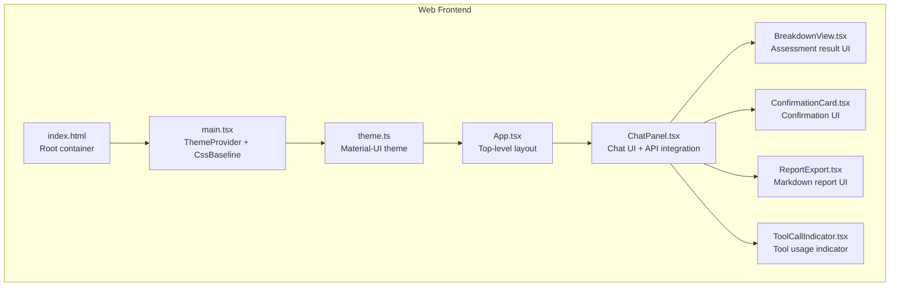
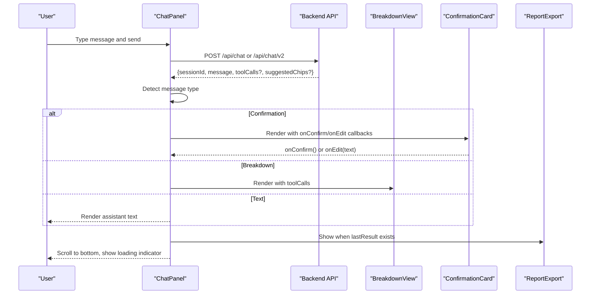
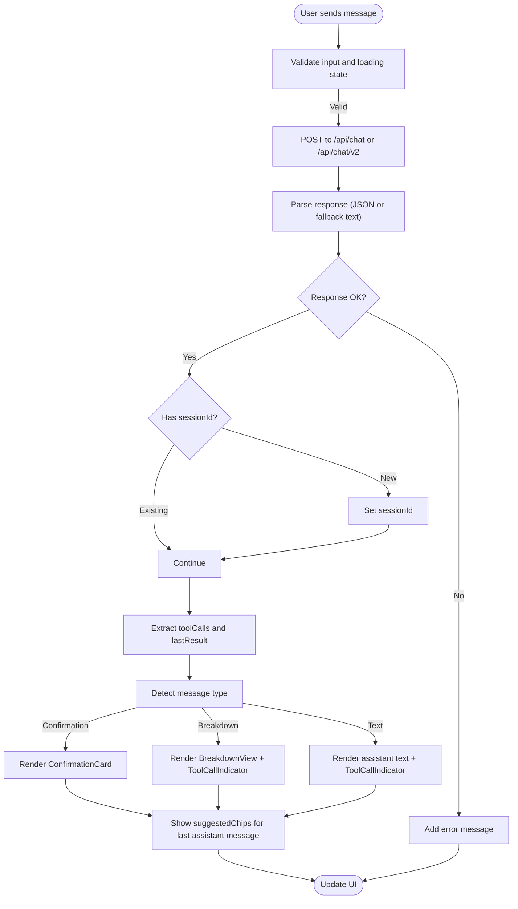
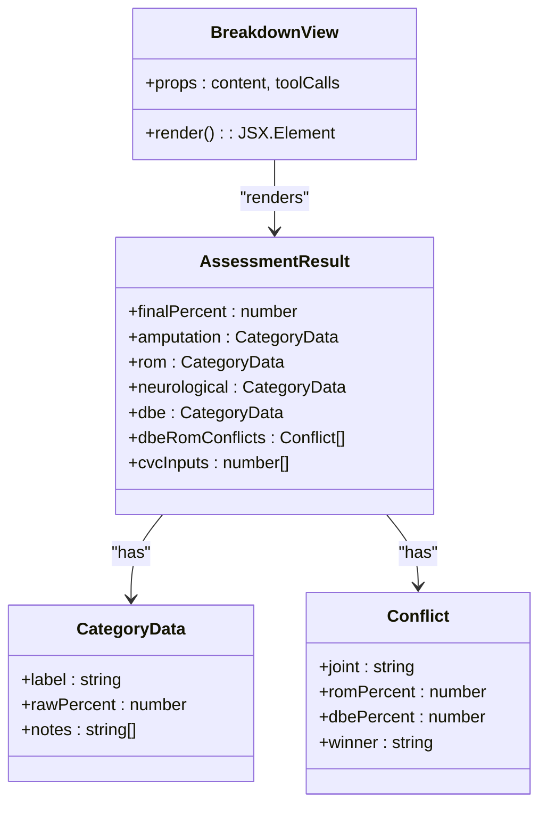
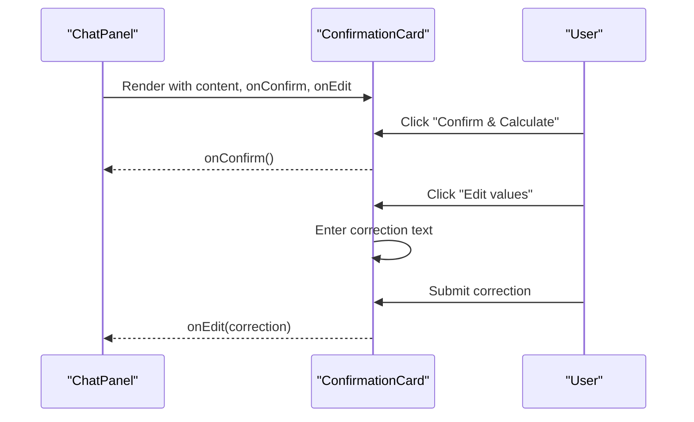
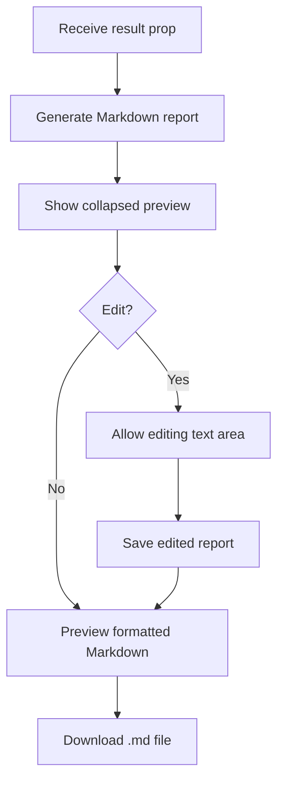
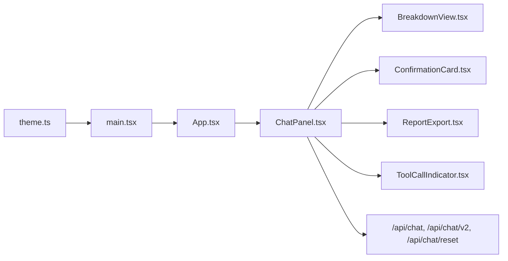

# Frontend Interface

<cite>
**Referenced Files in This Document**
- [web/src/App.tsx](file://web/src/App.tsx)
- [web/src/main.tsx](file://web/src/main.tsx)
- [web/src/theme.ts](file://web/src/theme.ts)
- [web/src/components/ChatPanel.tsx](file://web/src/components/ChatPanel.tsx)
- [web/src/components/BreakdownView.tsx](file://web/src/components/BreakdownView.tsx)
- [web/src/components/ConfirmationCard.tsx](file://web/src/components/ConfirmationCard.tsx)
- [web/src/components/ReportExport.tsx](file://web/src/components/ReportExport.tsx)
- [web/src/components/ToolCallIndicator.tsx](file://web/src/components/ToolCallIndicator.tsx)
- [web/vite.config.ts](file://web/vite.config.ts)
- [web/package.json](file://web/package.json)
- [web/tsconfig.json](file://web/tsconfig.json)
- [web/index.html](file://web/index.html)
- [src/api/chatRoutes.ts](file://src/api/chatRoutes.ts)
- [src/chat/chatService.ts](file://src/chat/chatService.ts)
</cite>

## Table of Contents
1. [Introduction](#introduction)
2. [Project Structure](#project-structure)
3. [Core Components](#core-components)
4. [Architecture Overview](#architecture-overview)
5. [Detailed Component Analysis](#detailed-component-analysis)
6. [Dependency Analysis](#dependency-analysis)
7. [Performance Considerations](#performance-considerations)
8. [Troubleshooting Guide](#troubleshooting-guide)
9. [Conclusion](#conclusion)
10. [Appendices](#appendices)

## Introduction
This document describes the React-based frontend interface for the GATIOD Assessment Assistant. It covers the component architecture, visual appearance, behavior, and user interaction patterns. It documents the main application structure, chat panel functionality, breakdown view rendering, and confirmation card interactions. It also includes component props/attributes, events, customization options, usage examples, Material-UI theming, responsive design principles, accessibility compliance, component composition patterns, state management, real-time update mechanisms, and build/deployment considerations.

## Project Structure
The frontend is a Vite-powered React application using Material-UI for UI primitives and theming. The app bootstraps via a theme provider and renders a top app bar and a central chat panel. The chat panel integrates with backend APIs to stream responses, present structured results, and support report export.

**Diagram sources**
- [web/index.html:1-16](file://web/index.html#L1-L16)
- [web/src/main.tsx:1-15](file://web/src/main.tsx#L1-L15)
- [web/src/theme.ts:1-36](file://web/src/theme.ts#L1-L36)
- [web/src/App.tsx:1-23](file://web/src/App.tsx#L1-L23)
- [web/src/components/ChatPanel.tsx:1-362](file://web/src/components/ChatPanel.tsx#L1-L362)
- [web/src/components/BreakdownView.tsx:1-182](file://web/src/components/BreakdownView.tsx#L1-L182)
- [web/src/components/ConfirmationCard.tsx:1-141](file://web/src/components/ConfirmationCard.tsx#L1-L141)
- [web/src/components/ReportExport.tsx:1-143](file://web/src/components/ReportExport.tsx#L1-L143)
- [web/src/components/ToolCallIndicator.tsx:1-65](file://web/src/components/ToolCallIndicator.tsx#L1-L65)

**Section sources**
- [web/src/App.tsx:1-23](file://web/src/App.tsx#L1-L23)
- [web/src/main.tsx:1-15](file://web/src/main.tsx#L1-L15)
- [web/src/theme.ts:1-36](file://web/src/theme.ts#L1-L36)
- [web/vite.config.ts:1-16](file://web/vite.config.ts#L1-L16)
- [web/package.json:1-27](file://web/package.json#L1-L27)
- [web/tsconfig.json:1-22](file://web/tsconfig.json#L1-L22)
- [web/index.html:1-16](file://web/index.html#L1-L16)

## Core Components
- App: Provides the top-level layout with an app bar and a full-height chat panel container.
- ChatPanel: Central chat UI that manages messages, input, API modes, loading states, and rendering of different message types.
- BreakdownView: Renders assessment results with collapsible categories, conflict resolution, and CVC combination details.
- ConfirmationCard: Presents structured confirmation content with confirm/edit actions and inline editing.
- ReportExport: Generates, previews, and downloads a Markdown report of the latest assessment.
- ToolCallIndicator: Summarizes tool calls used during the assistant’s reasoning.

**Section sources**
- [web/src/App.tsx:1-23](file://web/src/App.tsx#L1-L23)
- [web/src/components/ChatPanel.tsx:1-362](file://web/src/components/ChatPanel.tsx#L1-L362)
- [web/src/components/BreakdownView.tsx:1-182](file://web/src/components/BreakdownView.tsx#L1-L182)
- [web/src/components/ConfirmationCard.tsx:1-141](file://web/src/components/ConfirmationCard.tsx#L1-L141)
- [web/src/components/ReportExport.tsx:1-143](file://web/src/components/ReportExport.tsx#L1-L143)
- [web/src/components/ToolCallIndicator.tsx:1-65](file://web/src/components/ToolCallIndicator.tsx#L1-L65)

## Architecture Overview
The frontend communicates with backend routes for chat and reset operations. The chat panel detects message types (text, confirmation, breakdown) and renders the appropriate UI. Assessment results are extracted from tool calls and rendered via BreakdownView. Confirmation messages are presented via ConfirmationCard. A report can be generated and exported via ReportExport. Tool usage is indicated via ToolCallIndicator.

**Diagram sources**
- [web/src/components/ChatPanel.tsx:69-142](file://web/src/components/ChatPanel.tsx#L69-L142)
- [src/api/chatRoutes.ts:14-66](file://src/api/chatRoutes.ts#L14-L66)
- [web/src/components/BreakdownView.tsx:94-181](file://web/src/components/BreakdownView.tsx#L94-L181)
- [web/src/components/ConfirmationCard.tsx:47-140](file://web/src/components/ConfirmationCard.tsx#L47-L140)
- [web/src/components/ReportExport.tsx:64-142](file://web/src/components/ReportExport.tsx#L64-L142)

## Detailed Component Analysis

### App Component
- Purpose: Top-level layout with a static app bar and a scrollable chat area.
- Behavior: Sets up the theme provider and renders the ChatPanel inside a container with column layout and full viewport height.
- Accessibility: Uses semantic AppBar and Toolbar; typography variants provide readable headings.

**Section sources**
- [web/src/App.tsx:1-23](file://web/src/App.tsx#L1-L23)

### ChatPanel Component
- Responsibilities:
  - Manages messages, input, loading, API mode, session ID, and last assessment result.
  - Sends user messages to backend and handles responses.
  - Detects message type (text, confirmation, breakdown) and renders accordingly.
  - Supports API mode switching and session reset.
  - Renders suggested chips for quick follow-up prompts.
  - Integrates ReportExport when an assessment result is available.
- Props: None (manages internal state).
- Events: None (communicates via callbacks passed to child components).
- Key behaviors:
  - Auto-scroll to bottom on new messages.
  - Stores API mode preference in local storage.
  - Formats markdown for assistant messages.
  - Handles non-JSON responses and errors gracefully.
- Real-time updates: Streaming-like behavior via incremental message addition; loading state indicates ongoing processing.

**Diagram sources**
- [web/src/components/ChatPanel.tsx:69-142](file://web/src/components/ChatPanel.tsx#L69-L142)
- [web/src/components/ChatPanel.tsx:236-306](file://web/src/components/ChatPanel.tsx#L236-L306)

**Section sources**
- [web/src/components/ChatPanel.tsx:1-362](file://web/src/components/ChatPanel.tsx#L1-L362)
- [src/api/chatRoutes.ts:14-66](file://src/api/chatRoutes.ts#L14-L66)

### BreakdownView Component
- Purpose: Visualizes assessment results with category sections, conflict resolution, and CVC combination.
- Data model:
  - AssessmentResult includes final percent, amputation, ROM, neurological, DBE, conflicts, and CVC inputs.
- Behavior:
  - Extracts the first successful assessment tool call.
  - Renders category sections with expand/collapse.
  - Shows conflict resolution and CVC combination when present.
  - Falls back to plain text rendering if extraction fails.
- Interactions: Clicking category headers toggles collapse state.

**Diagram sources**
- [web/src/components/BreakdownView.tsx:25-38](file://web/src/components/BreakdownView.tsx#L25-L38)
- [web/src/components/BreakdownView.tsx:107-112](file://web/src/components/BreakdownView.tsx#L107-L112)

**Section sources**
- [web/src/components/BreakdownView.tsx:1-182](file://web/src/components/BreakdownView.tsx#L1-L182)

### ConfirmationCard Component
- Purpose: Presents structured confirmation content and allows user confirmation or edits.
- Parsing:
  - Extracts system and side from the header.
  - Parses labeled sections and bullet points into structured sections.
- Interactions:
  - Confirm action triggers a callback to proceed with calculation.
  - Edit mode enables inline correction submission.
- Accessibility: Clear labels, icons, and keyboard-friendly buttons.

**Diagram sources**
- [web/src/components/ConfirmationCard.tsx:47-140](file://web/src/components/ConfirmationCard.tsx#L47-L140)
- [web/src/components/ChatPanel.tsx:254-254](file://web/src/components/ChatPanel.tsx#L254-L254)

**Section sources**
- [web/src/components/ConfirmationCard.tsx:1-141](file://web/src/components/ConfirmationCard.tsx#L1-L141)

### ReportExport Component
- Purpose: Generates a Markdown report from the latest assessment result, supports editing, and downloading.
- Behavior:
  - Generates report content from AssessmentResult.
  - Collapsible preview with edit mode.
  - Downloads a .md file with a date-based filename.
- Customization: Users can edit the generated Markdown before download.

**Diagram sources**
- [web/src/components/ReportExport.tsx:64-142](file://web/src/components/ReportExport.tsx#L64-L142)

**Section sources**
- [web/src/components/ReportExport.tsx:1-143](file://web/src/components/ReportExport.tsx#L1-L143)

### ToolCallIndicator Component
- Purpose: Summarizes tool calls used during the assistant’s reasoning.
- Behavior:
  - Toggles visibility of a list of tool names.
  - Uses success/failure indicators with distinct styles.
- Customization: Tool labels mapped via a lookup table.

**Section sources**
- [web/src/components/ToolCallIndicator.tsx:1-65](file://web/src/components/ToolCallIndicator.tsx#L1-L65)

## Dependency Analysis
- Material-UI: Used for layout, typography, buttons, chips, and cards. Theming is centralized.
- React hooks: useState, useRef, useEffect, useCallback, useMemo drive state and lifecycle.
- Backend integration: Fetch endpoints for chat and reset; API mode selection switches endpoints.
- Tooling: Vite dev server with proxy to backend; TypeScript strict mode; ES module bundling.

**Diagram sources**
- [web/src/components/ChatPanel.tsx:1-11](file://web/src/components/ChatPanel.tsx#L1-L11)
- [web/src/App.tsx:1-23](file://web/src/App.tsx#L1-L23)
- [web/src/main.tsx:1-15](file://web/src/main.tsx#L1-L15)
- [web/src/theme.ts:1-36](file://web/src/theme.ts#L1-L36)
- [src/api/chatRoutes.ts:14-74](file://src/api/chatRoutes.ts#L14-L74)

**Section sources**
- [web/src/components/ChatPanel.tsx:1-11](file://web/src/components/ChatPanel.tsx#L1-L11)
- [web/src/App.tsx:1-23](file://web/src/App.tsx#L1-L23)
- [web/src/main.tsx:1-15](file://web/src/main.tsx#L1-L15)
- [web/src/theme.ts:1-36](file://web/src/theme.ts#L1-L36)
- [src/api/chatRoutes.ts:14-74](file://src/api/chatRoutes.ts#L14-L74)

## Performance Considerations
- Rendering optimization:
  - Memoized report generation in ReportExport prevents unnecessary recomputation.
  - Conditional rendering of components (confirmation, breakdown, text) reduces DOM overhead.
- Network efficiency:
  - Minimal retries and clear error messaging reduce wasted requests.
  - Non-JSON responses are handled gracefully to avoid UI crashes.
- UI responsiveness:
  - Auto-scroll to bottom uses a ref and effect to avoid blocking the main thread.
  - Loading indicators provide immediate feedback.

[No sources needed since this section provides general guidance]

## Troubleshooting Guide
- Backend connectivity:
  - The dev server proxies /api to the backend on localhost. Ensure the backend is running on the configured port.
- API mode switching:
  - Switching between legacy and v2 resets the session and clears state to prevent mixed-mode artifacts.
- Error handling:
  - Non-JSON responses from the backend are surfaced as user-facing errors with context.
  - Rate-limiting and timeout conditions are detected and reported with actionable messages.
- Session reset:
  - Reset endpoint clears the current session and resets UI state.

**Section sources**
- [web/vite.config.ts:6-14](file://web/vite.config.ts#L6-L14)
- [web/src/components/ChatPanel.tsx:144-181](file://web/src/components/ChatPanel.tsx#L144-L181)
- [src/api/chatRoutes.ts:68-74](file://src/api/chatRoutes.ts#L68-L74)

## Conclusion
The frontend provides a cohesive, accessible, and responsive chat interface for the GATIOD Assessment Assistant. It integrates tightly with backend APIs, renders structured results, and supports user-driven confirmations and report generation. Material-UI theming ensures consistent visuals, while thoughtful state management and error handling improve reliability and UX.

[No sources needed since this section summarizes without analyzing specific files]

## Appendices

### Material-UI Theming
- Palette: Light mode with carefully chosen primary, secondary, background, and text colors.
- Typography: DM Sans for readability; JetBrains Mono for code-like elements.
- Components: Overrides for buttons and paper provide consistent styling across the app.

**Section sources**
- [web/src/theme.ts:1-36](file://web/src/theme.ts#L1-L36)

### Responsive Design Principles
- Layout:
  - Full viewport height with a centered chat container and constrained max width.
  - Flexible message containers with alignment based on role.
- Typography:
  - Variant-based sizing and spacing for readability across devices.
- Input area:
  - Multiline text field with adjustable rows and tooltip-enhanced controls.

**Section sources**
- [web/src/App.tsx:7-20](file://web/src/App.tsx#L7-L20)
- [web/src/components/ChatPanel.tsx:184-352](file://web/src/components/ChatPanel.tsx#L184-L352)

### Accessibility Compliance
- Semantic markup:
  - AppBar and Toolbar for navigation structure.
  - Buttons and icons with meaningful labels and tooltips.
- Keyboard navigation:
  - Enter key submits messages; Escape and Tab are available for native form controls.
- Contrast and focus:
  - Theme provides sufficient contrast; interactive elements highlight on hover.

**Section sources**
- [web/src/App.tsx:8-16](file://web/src/App.tsx#L8-L16)
- [web/src/components/ChatPanel.tsx:324-351](file://web/src/components/ChatPanel.tsx#L324-L351)

### Component Composition Patterns
- ChatPanel composes ConfirmationCard, BreakdownView, ToolCallIndicator, and ReportExport based on message type and data availability.
- BreakdownView encapsulates category rendering and conflict resolution.
- ConfirmationCard encapsulates parsing and editing logic.
- ReportExport encapsulates report generation and download.

**Section sources**
- [web/src/components/ChatPanel.tsx:253-269](file://web/src/components/ChatPanel.tsx#L253-L269)
- [web/src/components/BreakdownView.tsx:94-181](file://web/src/components/BreakdownView.tsx#L94-L181)
- [web/src/components/ConfirmationCard.tsx:47-140](file://web/src/components/ConfirmationCard.tsx#L47-L140)
- [web/src/components/ReportExport.tsx:64-142](file://web/src/components/ReportExport.tsx#L64-L142)

### State Management
- Local state:
  - Messages, input, loading, API mode, session ID, and last result are managed in ChatPanel.
  - Local storage persists API mode preference.
- Derived state:
  - Suggested chips are shown only for the last assistant message.
- External state:
  - Backend maintains session history and audit trails.

**Section sources**
- [web/src/components/ChatPanel.tsx:50-67](file://web/src/components/ChatPanel.tsx#L50-L67)
- [src/chat/chatService.ts:38-154](file://src/chat/chatService.ts#L38-L154)

### Real-Time Update Mechanisms
- Incremental message addition: New assistant messages append to the list, triggering re-render.
- Auto-scroll: Effect scrolls to the latest message.
- Loading indicators: Progress spinner and status text inform the user of ongoing processing.

**Section sources**
- [web/src/components/ChatPanel.tsx:62-66](file://web/src/components/ChatPanel.tsx#L62-L66)
- [web/src/components/ChatPanel.tsx:308-315](file://web/src/components/ChatPanel.tsx#L308-L315)

### Build Configuration and Deployment
- Toolchain:
  - Vite for development and build; React plugin; TypeScript transpile-on-build.
  - Dev server proxy routes /api to backend.
- Scripts:
  - dev, build, preview commands align with Vite conventions.
- Fonts:
  - Preconnect and font links included in index.html for optimal loading.

**Section sources**
- [web/vite.config.ts:1-16](file://web/vite.config.ts#L1-L16)
- [web/package.json:6-10](file://web/package.json#L6-L10)
- [web/tsconfig.json:1-22](file://web/tsconfig.json#L1-L22)
- [web/index.html:7-9](file://web/index.html#L7-L9)

### Integration Guidelines
- API endpoints:
  - POST /api/chat: Legacy chat with function calling.
  - POST /api/chat/v2: V2 chat with optional shadow mode and reduced response payload.
  - POST /api/chat/reset: Reset session state.
- Environment variables:
  - GEMINI_API_KEY: Required for chat service.
  - GATIOD_CHAT_ENABLED: Feature flag to enable/disable chat.
  - GATIOD_V2_SHADOW_MODE: Controls shadow mode for v2 evaluation.
  - GATIOD_DEBUG_RESPONSES: Enables full debug responses in v2.
- Backend integration:
  - ChatPanel detects message type and renders appropriate UI.
  - Tool calls are summarized and displayed alongside messages.

**Section sources**
- [src/api/chatRoutes.ts:14-74](file://src/api/chatRoutes.ts#L14-L74)
- [src/chat/chatService.ts:43-49](file://src/chat/chatService.ts#L43-L49)