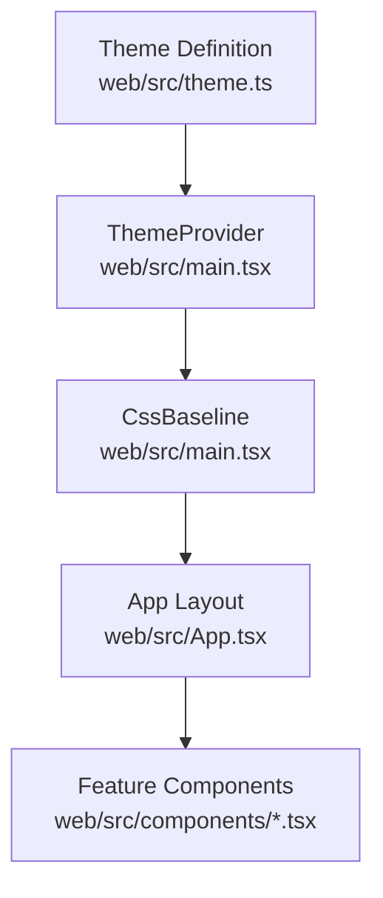
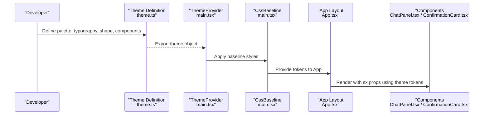
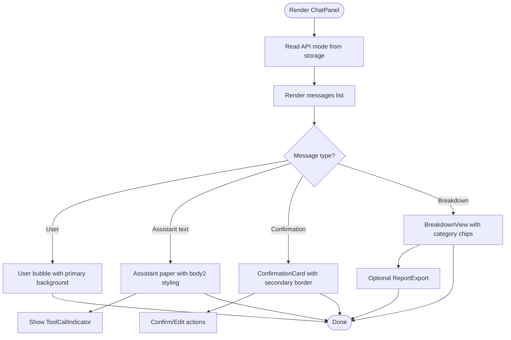
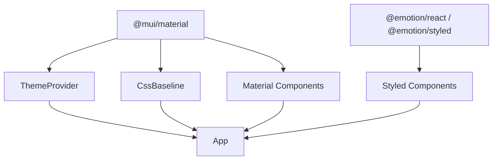

# Theming and Styling

<cite>
**Referenced Files in This Document**
- [theme.ts](file://web/src/theme.ts)
- [main.tsx](file://web/src/main.tsx)
- [App.tsx](file://web/src/App.tsx)
- [ChatPanel.tsx](file://web/src/components/ChatPanel.tsx)
- [ConfirmationCard.tsx](file://web/src/components/ConfirmationCard.tsx)
- [BreakdownView.tsx](file://web/src/components/BreakdownView.tsx)
- [ReportExport.tsx](file://web/src/components/ReportExport.tsx)
- [ToolCallIndicator.tsx](file://web/src/components/ToolCallIndicator.tsx)
- [package.json](file://web/package.json)
</cite>

## Table of Contents
1. [Introduction](#introduction)
2. [Project Structure](#project-structure)
3. [Core Components](#core-components)
4. [Architecture Overview](#architecture-overview)
5. [Detailed Component Analysis](#detailed-component-analysis)
6. [Dependency Analysis](#dependency-analysis)
7. [Performance Considerations](#performance-considerations)
8. [Troubleshooting Guide](#troubleshooting-guide)
9. [Conclusion](#conclusion)

## Introduction
This document explains the Material-UI theming and styling system used in the application. It covers theme configuration, color schemes, typography, component customizations, design system principles, spacing conventions, and responsive behavior. It also documents how the theme integrates with the application’s visual identity, accessibility considerations, dark/light mode support, and cross-platform consistency. Finally, it provides guidelines for extending the theme while maintaining design system coherence.

## Project Structure
The theming system is centralized in a single theme definition and applied globally via the Material-UI ThemeProvider. Components consume theme tokens through sx prop values and Material-UI component props. The application’s frontend is structured as follows:
- Theme definition: web/src/theme.ts
- Global provider and baseline: web/src/main.tsx
- Top-level layout consuming theme tokens: web/src/App.tsx
- Feature components that demonstrate theme usage: web/src/components/*.tsx

**Diagram sources**
- [theme.ts](file://web/src/theme.ts)
- [main.tsx](file://web/src/main.tsx)
- [App.tsx](file://web/src/App.tsx)
- [ChatPanel.tsx](file://web/src/components/ChatPanel.tsx)
- [ConfirmationCard.tsx](file://web/src/components/ConfirmationCard.tsx)
- [BreakdownView.tsx](file://web/src/components/BreakdownView.tsx)
- [ReportExport.tsx](file://web/src/components/ReportExport.tsx)
- [ToolCallIndicator.tsx](file://web/src/components/ToolCallIndicator.tsx)

**Section sources**
- [theme.ts](file://web/src/theme.ts)
- [main.tsx](file://web/src/main.tsx)
- [App.tsx](file://web/src/App.tsx)

## Core Components
This section describes the theme configuration and how it is applied across the application.

- Theme creation and configuration
  - Palette: Defines primary, secondary, background, text, and semantic colors (success, warning, error). Includes mode selection for light mode.
  - Typography: Sets a modern sans-serif font family and adjusts weights and letter spacing for headings and body text.
  - Shape: Centralizes border radius for rounded corners across components.
  - Components: Applies global overrides for Button and Paper to align with brand aesthetics and UX expectations.

- Global provider and baseline
  - ThemeProvider wraps the app to inject the theme into the component tree.
  - CssBaseline normalizes styles and establishes baseline typography and spacing.

- Application-level usage
  - App layout uses theme tokens for background, borders, and typography to maintain visual consistency.

**Section sources**
- [theme.ts](file://web/src/theme.ts)
- [main.tsx](file://web/src/main.tsx)
- [App.tsx](file://web/src/App.tsx)

## Architecture Overview
The theming architecture is a unidirectional flow: theme definition feeds the provider, which distributes tokens to all components. Components consume tokens via sx props and component props, ensuring consistent design across the UI.

**Diagram sources**
- [theme.ts](file://web/src/theme.ts)
- [main.tsx](file://web/src/main.tsx)
- [App.tsx](file://web/src/App.tsx)
- [ChatPanel.tsx](file://web/src/components/ChatPanel.tsx)
- [ConfirmationCard.tsx](file://web/src/components/ConfirmationCard.tsx)

## Detailed Component Analysis
This section examines how the theme is consumed and customized across key components.

### Theme Tokens and Design Principles
- Color scheme
  - Primary palette anchors branding for headers, accents, and interactive states.
  - Secondary palette supports confirmations and actionable items.
  - Background and paper palettes separate app shell and card surfaces.
  - Text palette ensures readable contrast for primary and secondary text.
  - Semantic colors communicate success, warning, and error states.
- Typography
  - A modern sans-serif stack improves readability across platforms.
  - Adjusted heading weights and letter spacing reinforce hierarchy and brand tone.
  - Body line heights and caption adjustments improve scannability.
- Shape
  - Centralized border radius creates a cohesive, modern look across components.
- Component overrides
  - Buttons: No text transform, bold weight, and rounded corners.
  - Paper: Subtle box-shadow for depth without overwhelming the layout.

**Section sources**
- [theme.ts](file://web/src/theme.ts)

### App Shell and Navigation
- The top App Bar uses primary dark for background and divider for borders, aligning with the theme’s palette.
- Typography variants and letter spacing emphasize brand identity.
- Chip styling leverages theme tokens for color and contrast.

**Section sources**
- [App.tsx](file://web/src/App.tsx)
- [theme.ts](file://web/src/theme.ts)

### Chat Panel and Messaging UI
- Message bubbles use primary color for user messages and paper background for assistant messages.
- Interactive states (hover, focus) reference theme tokens for consistent feedback.
- Suggested chips and action buttons apply theme tokens for borders, colors, and transitions.
- Input area uses a standard variant with underlines removed and theme-aligned typography.

**Diagram sources**
- [ChatPanel.tsx](file://web/src/components/ChatPanel.tsx)
- [ConfirmationCard.tsx](file://web/src/components/ConfirmationCard.tsx)
- [BreakdownView.tsx](file://web/src/components/BreakdownView.tsx)
- [ReportExport.tsx](file://web/src/components/ReportExport.tsx)
- [ToolCallIndicator.tsx](file://web/src/components/ToolCallIndicator.tsx)

**Section sources**
- [ChatPanel.tsx](file://web/src/components/ChatPanel.tsx)
- [ConfirmationCard.tsx](file://web/src/components/ConfirmationCard.tsx)
- [BreakdownView.tsx](file://web/src/components/BreakdownView.tsx)
- [ReportExport.tsx](file://web/src/components/ReportExport.tsx)
- [ToolCallIndicator.tsx](file://web/src/components/ToolCallIndicator.tsx)

### Confirmation Card
- Uses secondary palette for header and border to signal confirmations.
- Typography and spacing leverage theme tokens for readability and alignment.
- Action buttons apply theme tokens for hover states and borders.

**Section sources**
- [ConfirmationCard.tsx](file://web/src/components/ConfirmationCard.tsx)
- [theme.ts](file://web/src/theme.ts)

### Breakdown View
- Displays assessment results with category chips colored per category.
- Uses primary palette for the header and theme tokens for typography and spacing.
- Conflict resolution and CVC combination sections use theme tokens for labels and chips.

**Section sources**
- [BreakdownView.tsx](file://web/src/components/BreakdownView.tsx)
- [theme.ts](file://web/src/theme.ts)

### Report Export
- Collapsible report panel with theme-aligned borders and hover states.
- Editable report uses a monospace font and theme tokens for background and text.

**Section sources**
- [ReportExport.tsx](file://web/src/components/ReportExport.tsx)
- [theme.ts](file://web/src/theme.ts)

### Tool Call Indicator
- Chips reflect tool success/failure using theme tokens for background and color.
- Hover and collapse behaviors use theme tokens for opacity and transitions.

**Section sources**
- [ToolCallIndicator.tsx](file://web/src/components/ToolCallIndicator.tsx)
- [theme.ts](file://web/src/theme.ts)

## Dependency Analysis
Material-UI and Emotion are the core dependencies enabling the theming system:
- @mui/material: Provides ThemeProvider, CssBaseline, components, and design tokens.
- @emotion/react and @emotion/styled: Enable styled components and theme-aware styling.

**Diagram sources**
- [package.json](file://web/package.json)
- [main.tsx](file://web/src/main.tsx)

**Section sources**
- [package.json](file://web/package.json)
- [main.tsx](file://web/src/main.tsx)

## Performance Considerations
- Prefer sx props for component-level overrides to avoid unnecessary styled() wrappers.
- Reuse theme tokens to minimize duplication and reduce CSS output.
- Keep component overrides minimal to preserve Material-UI defaults and reduce maintenance overhead.
- Use shape and typography tokens consistently to maintain a cohesive design system.

## Troubleshooting Guide
- Theme not applied
  - Ensure ThemeProvider wraps the root component and CssBaseline is included.
  - Verify the theme export is correctly imported in main.tsx.
- Typography or spacing inconsistencies
  - Confirm component props (e.g., variant, spacing) align with theme tokens.
  - Check sx prop usage for overrides that may conflict with component defaults.
- Color mismatches
  - Validate palette usage against theme.ts and ensure semantic tokens are used appropriately.
- Dark/light mode
  - The current theme sets mode to light. To enable dark mode, update the mode and adjust palette values accordingly.

**Section sources**
- [main.tsx](file://web/src/main.tsx)
- [theme.ts](file://web/src/theme.ts)

## Conclusion
The application’s theming system centers on a single, well-defined theme that drives consistent color, typography, shape, and component behavior. By applying ThemeProvider and CssBaseline at the root and consuming tokens through sx props and component APIs, the UI remains coherent and maintainable. Extending the theme should follow established patterns: centralize changes in theme.ts, reuse tokens across components, and keep overrides minimal. Accessibility and cross-platform consistency are supported by Material-UI’s built-in design system and theme tokens.