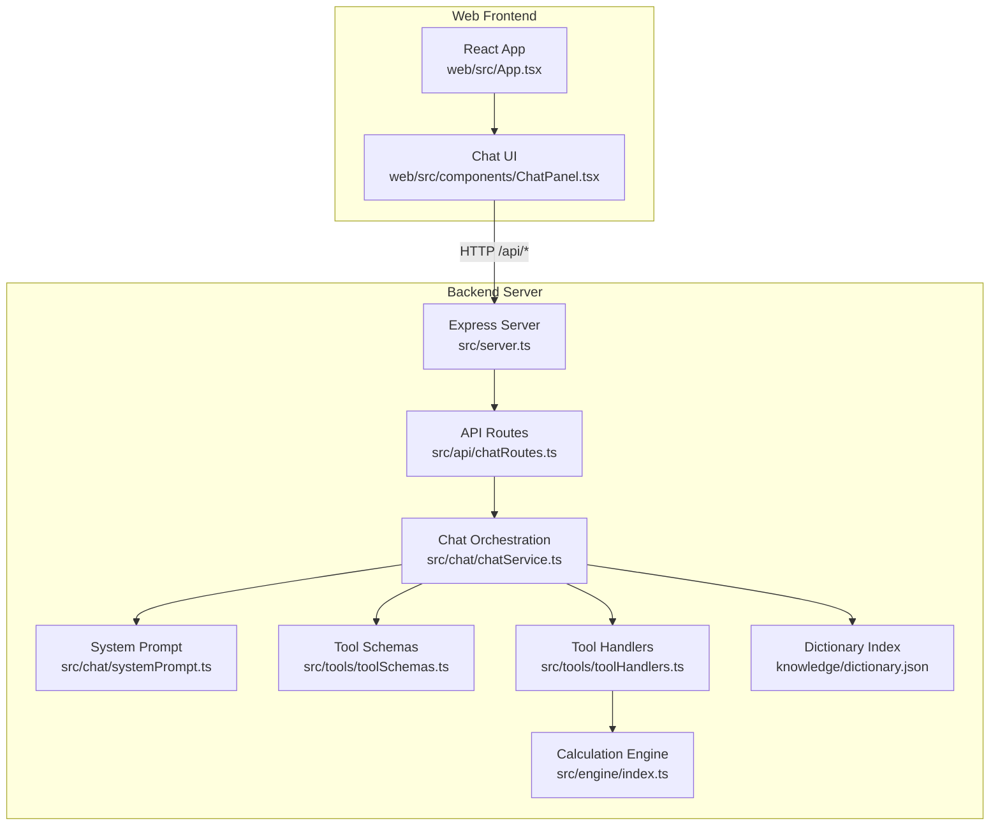
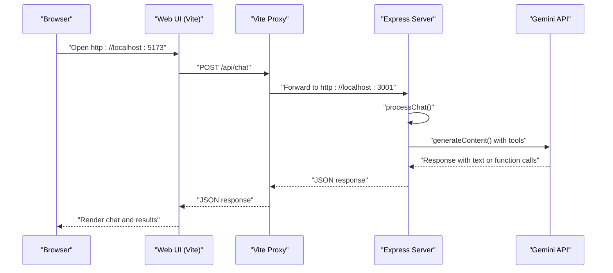
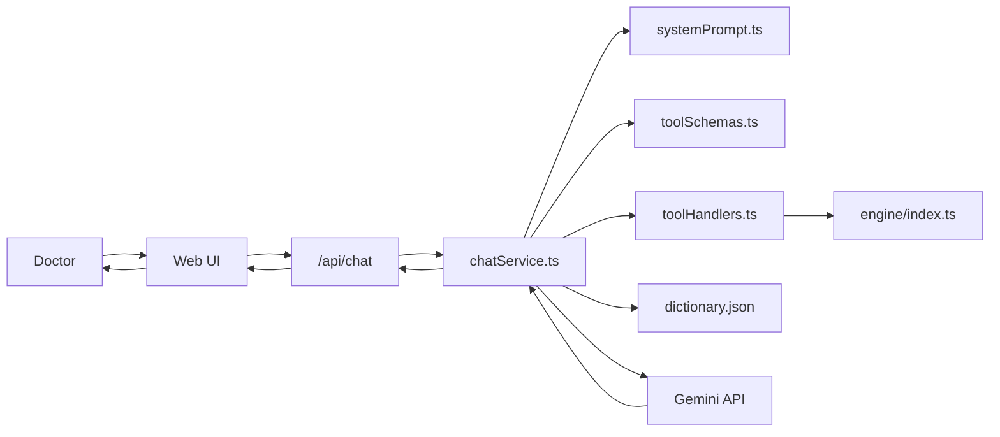
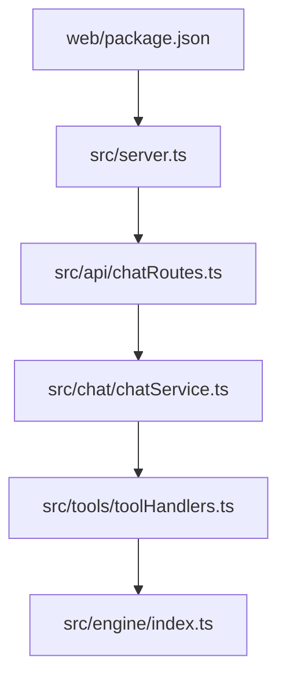

# Getting Started

<cite>
**Referenced Files in This Document**
- [README.md](file://README.md)
- [package.json](file://package.json)
- [src/server.ts](file://src/server.ts)
- [src/api/chatRoutes.ts](file://src/api/chatRoutes.ts)
- [src/chat/chatService.ts](file://src/chat/chatService.ts)
- [src/chat/systemPrompt.ts](file://src/chat/systemPrompt.ts)
- [src/tools/toolSchemas.ts](file://src/tools/toolSchemas.ts)
- [src/tools/toolHandlers.ts](file://src/tools/toolHandlers.ts)
- [src/engine/index.ts](file://src/engine/index.ts)
- [web/package.json](file://web/package.json)
- [web/vite.config.ts](file://web/vite.config.ts)
- [web/src/App.tsx](file://web/src/App.tsx)
- [web/src/components/ChatPanel.tsx](file://web/src/components/ChatPanel.tsx)
- [knowledge/dictionary.json](file://knowledge/dictionary.json)
</cite>

## Table of Contents
1. [Introduction](#introduction)
2. [Project Structure](#project-structure)
3. [Prerequisites](#prerequisites)
4. [Installation](#installation)
5. [Environment Configuration](#environment-configuration)
6. [Running the Development Server](#running-the-development-server)
7. [Quick Start Example](#quick-start-example)
8. [Basic Architecture Overview](#basic-architecture-overview)
9. [Core Components](#core-components)
10. [Dependency Analysis](#dependency-analysis)
11. [Performance Considerations](#performance-considerations)
12. [Troubleshooting Guide](#troubleshooting-guide)
13. [Conclusion](#conclusion)

## Introduction
GATIOD Chat Assistant is a conversational front-end to AcuScore's GATIOD calculation engine. It lets doctors describe clinical findings naturally, with an LLM extracting structured data and invoking deterministic calculation tools. The LLM never performs arithmetic; it orchestrates tools that compute Permanent Incapacity (PI%) scores across nine body systems.

## Project Structure
The repository is organized into:
- Backend server and APIs
- Chat orchestration and system prompt
- Tool schemas and handlers for function calling
- Calculation engine modules (pure TypeScript)
- Web UI built with React and Material UI
- Knowledge base for dictionary search
- Tests and documentation



**Diagram sources**
- [src/server.ts:1-68](file://src/server.ts#L1-L68)
- [src/api/chatRoutes.ts:1-91](file://src/api/chatRoutes.ts#L1-L91)
- [src/chat/chatService.ts:1-183](file://src/chat/chatService.ts#L1-L183)
- [src/chat/systemPrompt.ts:1-391](file://src/chat/systemPrompt.ts#L1-L391)
- [src/tools/toolSchemas.ts:1-487](file://src/tools/toolSchemas.ts#L1-L487)
- [src/tools/toolHandlers.ts:1-435](file://src/tools/toolHandlers.ts#L1-L435)
- [src/engine/index.ts:1-89](file://src/engine/index.ts#L1-L89)
- [web/src/App.tsx:1-23](file://web/src/App.tsx#L1-L23)
- [web/src/components/ChatPanel.tsx:1-200](file://web/src/components/ChatPanel.tsx#L1-L200)
- [knowledge/dictionary.json:1-200](file://knowledge/dictionary.json#L1-L200)

**Section sources**
- [README.md:47-61](file://README.md#L47-L61)
- [src/server.ts:1-68](file://src/server.ts#L1-L68)
- [web/src/App.tsx:1-23](file://web/src/App.tsx#L1-L23)

## Prerequisites
- Node.js version 20 or later
- npm (comes with Node.js)
- A Gemini API key from Google AI Studio

These requirements are enforced by the project configuration and runtime checks.

**Section sources**
- [package.json:41-44](file://package.json#L41-L44)
- [src/server.ts:45-68](file://src/server.ts#L45-L68)

## Installation
1. Install dependencies for the backend:
   - Navigate to the repository root and run:
     ```bash
     npm install
     ```
2. Install dependencies for the web UI:
   - Navigate to the web directory and run:
     ```bash
     cd web && npm install
     ```

Notes:
- The backend uses TypeScript and Node.js >= 20.
- The web UI uses React, Vite, and Material UI.

**Section sources**
- [package.json:1-45](file://package.json#L1-L45)
- [web/package.json:1-27](file://web/package.json#L1-L27)

## Environment Configuration
Set the Gemini API key before starting the server.

- Linux/macOS:
  ```bash
  export GEMINI_API_KEY=your-key-here
  ```
- Windows (Command Prompt):
  ```cmd
  set GEMINI_API_KEY=your-key-here
  ```
- Windows (PowerShell):
  ```powershell
  $env:GEMINI_API_KEY="your-key-here"
  ```

The server logs a warning if the key is missing and will fail chat requests until configured.

**Section sources**
- [README.md:17-24](file://README.md#L17-L24)
- [src/server.ts:52-54](file://src/server.ts#L52-L54)
- [src/chat/chatService.ts:43-49](file://src/chat/chatService.ts#L43-L49)

## Running the Development Server
Start the backend server and the web UI:

1. Start the backend server:
   - From the repository root:
     ```bash
     npm run dev
     ```
   - The server listens on port 3001 by default and prints usage hints.

2. Start the web UI:
   - From the web directory:
     ```bash
     cd web && npm run dev
     ```
   - The web UI runs on port 5173 and proxies API calls to the backend.

3. Access the application:
   - Open your browser to http://localhost:5173



**Diagram sources**
- [web/vite.config.ts:6-14](file://web/vite.config.ts#L6-L14)
- [src/server.ts:13-68](file://src/server.ts#L13-L68)
- [src/api/chatRoutes.ts:14-41](file://src/api/chatRoutes.ts#L14-L41)
- [src/chat/chatService.ts:38-154](file://src/chat/chatService.ts#L38-L154)

**Section sources**
- [README.md:17-24](file://README.md#L17-L24)
- [web/vite.config.ts:1-16](file://web/vite.config.ts#L1-L16)
- [src/server.ts:45-68](file://src/server.ts#L45-L68)

## Quick Start Example
Send a clinical assessment request using curl:

```bash
curl -X POST http://localhost:3001/api/chat \
  -H "Content-Type: application/json" \
  -d '{"message": "Left shoulder, flexion limited to 120 degrees, abduction to 90. Suprascapular nerve damage, combined, partial loss."}'
```

Expected behavior:
- The LLM extracts structured findings and asks for confirmation before calculation.
- After confirmation, the backend invokes the appropriate assessment tool and returns a breakdown and final PI%.

Tip:
- Use the web UI at http://localhost:5173 for an interactive chat experience.

**Section sources**
- [README.md:32-38](file://README.md#L32-L38)
- [src/api/chatRoutes.ts:14-41](file://src/api/chatRoutes.ts#L14-L41)

## Basic Architecture Overview
The system follows a clear separation of concerns:
- The LLM (Gemini) interprets natural language and enforces the interview protocol.
- The system prompt defines rules, tool usage strategy, and domain-specific guidance.
- Tool schemas declare the functions the LLM can call.
- Tool handlers translate function calls into deterministic calculations.
- The calculation engine modules implement the GATIOD scoring logic for each body system.
- The web UI sends requests to the backend and renders results.



**Diagram sources**
- [src/chat/systemPrompt.ts:1-391](file://src/chat/systemPrompt.ts#L1-L391)
- [src/tools/toolSchemas.ts:1-487](file://src/tools/toolSchemas.ts#L1-L487)
- [src/tools/toolHandlers.ts:1-435](file://src/tools/toolHandlers.ts#L1-L435)
- [src/engine/index.ts:1-89](file://src/engine/index.ts#L1-L89)
- [knowledge/dictionary.json:1-200](file://knowledge/dictionary.json#L1-L200)
- [src/api/chatRoutes.ts:1-91](file://src/api/chatRoutes.ts#L1-L91)
- [web/src/components/ChatPanel.tsx:69-142](file://web/src/components/ChatPanel.tsx#L69-L142)

**Section sources**
- [README.md:5-15](file://README.md#L5-L15)

## Core Components
- Express server and routes
  - Provides health checks, API routes, and static serving for the web UI.
  - Validates environment variables and system registry integrity before serving requests.

- Chat orchestration
  - Manages sessions, audit logging, and retries.
  - Integrates with Gemini, handles function calls, and persists state.

- Tool schemas and handlers
  - Define the function signatures exposed to the LLM.
  - Bridge function calls to system-specific calculators.

- Calculation engine
  - Pure TypeScript modules implementing scoring logic for nine systems.

- Web UI
  - React-based chat interface with API mode toggle and tool-call visualization.

**Section sources**
- [src/server.ts:1-68](file://src/server.ts#L1-L68)
- [src/api/chatRoutes.ts:1-91](file://src/api/chatRoutes.ts#L1-L91)
- [src/chat/chatService.ts:1-183](file://src/chat/chatService.ts#L1-L183)
- [src/chat/systemPrompt.ts:1-391](file://src/chat/systemPrompt.ts#L1-L391)
- [src/tools/toolSchemas.ts:1-487](file://src/tools/toolSchemas.ts#L1-L487)
- [src/tools/toolHandlers.ts:1-435](file://src/tools/toolHandlers.ts#L1-L435)
- [src/engine/index.ts:1-89](file://src/engine/index.ts#L1-L89)
- [web/src/App.tsx:1-23](file://web/src/App.tsx#L1-L23)
- [web/src/components/ChatPanel.tsx:1-200](file://web/src/components/ChatPanel.tsx#L1-L200)

## Dependency Analysis
Runtime dependencies include:
- Express for HTTP routing
- CORS for cross-origin requests
- @google/generative-ai for Gemini integration
- better-sqlite3 for local persistence
- uuid for session IDs
- zod for validation

Development dependencies include TypeScript, Vitest, and Vite.



**Diagram sources**
- [src/server.ts:1-68](file://src/server.ts#L1-L68)
- [src/api/chatRoutes.ts:1-91](file://src/api/chatRoutes.ts#L1-L91)
- [src/chat/chatService.ts:1-183](file://src/chat/chatService.ts#L1-L183)
- [src/tools/toolHandlers.ts:1-435](file://src/tools/toolHandlers.ts#L1-L435)
- [src/engine/index.ts:1-89](file://src/engine/index.ts#L1-L89)
- [web/package.json:1-27](file://web/package.json#L1-L27)

**Section sources**
- [package.json:21-40](file://package.json#L21-L40)
- [web/package.json:11-25](file://web/package.json#L11-L25)

## Performance Considerations
- Gemini API latency and quotas: The chat service retries with backoff and surfaces user-friendly errors for rate limits or timeouts.
- Session persistence: History is persisted before calling Gemini to avoid losing progress during transient failures.
- Tool call batching: Multiple function calls are executed sequentially, with results appended to history.

Recommendations:
- Keep messages concise to reduce token usage.
- Use lookup tools to validate values before full calculations.
- Monitor network stability and retry logic when encountering transient errors.

**Section sources**
- [src/chat/chatService.ts:156-172](file://src/chat/chatService.ts#L156-L172)
- [src/chat/chatService.ts:81-96](file://src/chat/chatService.ts#L81-L96)

## Troubleshooting Guide
Common issues and resolutions:

- Missing Gemini API key
  - Symptom: Warning on startup and chat failures.
  - Resolution: Set GEMINI_API_KEY before starting the server.

- Port already in use
  - Symptom: Port 3001 busy.
  - Resolution: The server attempts the next port automatically; use a different port or terminate the conflicting process.

- Unexpected non-JSON response from /api/chat
  - Symptom: Non-JSON response indicates backend route unavailability.
  - Resolution: Ensure the backend is running and reachable at http://localhost:3001.

- Rate limit or quota exceeded
  - Symptom: Chat errors mentioning rate limiting or quota.
  - Resolution: Wait and retry; your session is saved.

- Timeout or connection refused
  - Symptom: Temporary AI service unavailability.
  - Resolution: Retry after a moment; your session is saved.

- Web UI cannot reach backend
  - Symptom: API calls fail from the browser.
  - Resolution: Confirm Vite proxy is enabled and running on port 5173; backend must be reachable at http://localhost:3001.

- Dictionary search returns unexpected results
  - Symptom: Ambiguous terms yield many matches.
  - Resolution: Refine the query or use search_dictionary to narrow down.

**Section sources**
- [src/server.ts:52-64](file://src/server.ts#L52-L64)
- [src/chat/chatService.ts:89-95](file://src/chat/chatService.ts#L89-L95)
- [web/vite.config.ts:8-14](file://web/vite.config.ts#L8-L14)
- [web/src/components/ChatPanel.tsx:92-102](file://web/src/components/ChatPanel.tsx#L92-L102)
- [knowledge/dictionary.json:1-200](file://knowledge/dictionary.json#L1-L200)

## Conclusion
You are now ready to use GATIOD Chat Assistant. Describe clinical findings naturally, confirm structured inputs, and receive deterministic PI% assessments powered by the GATIOD engine. For advanced usage, explore the V2 API mode and multi-system assessments, and leverage the dictionary and lookup tools for precision.