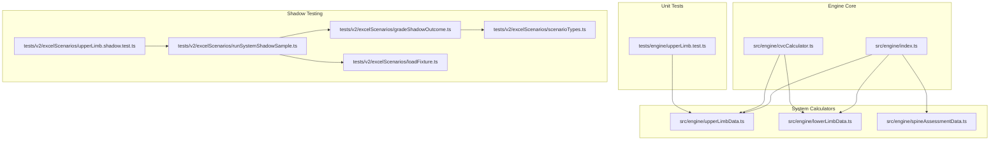
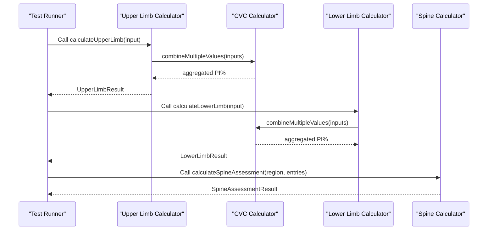
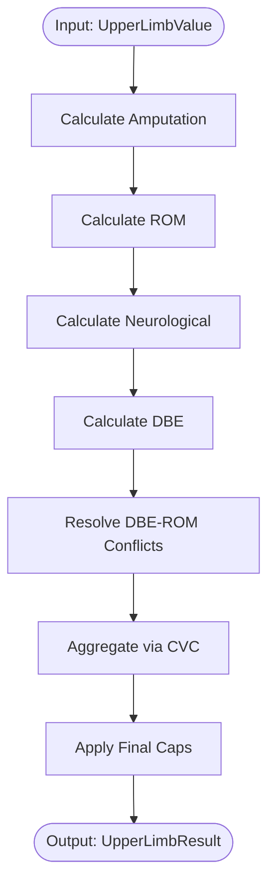
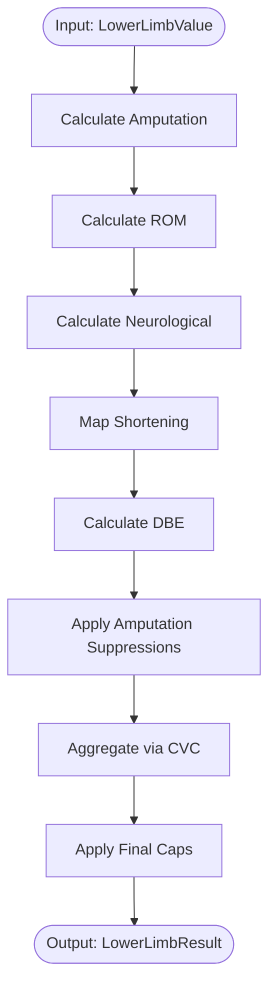
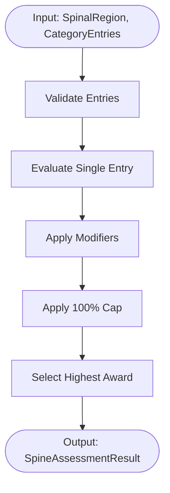
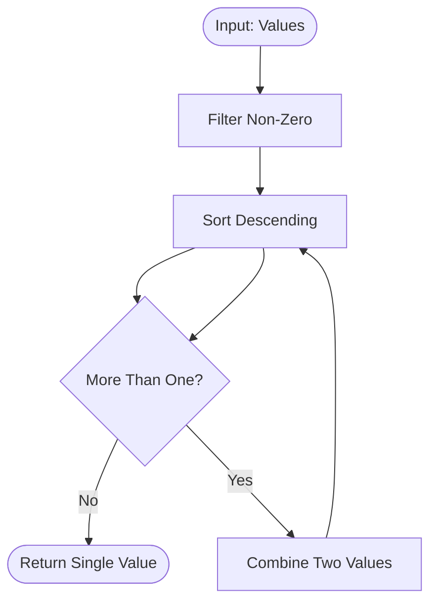
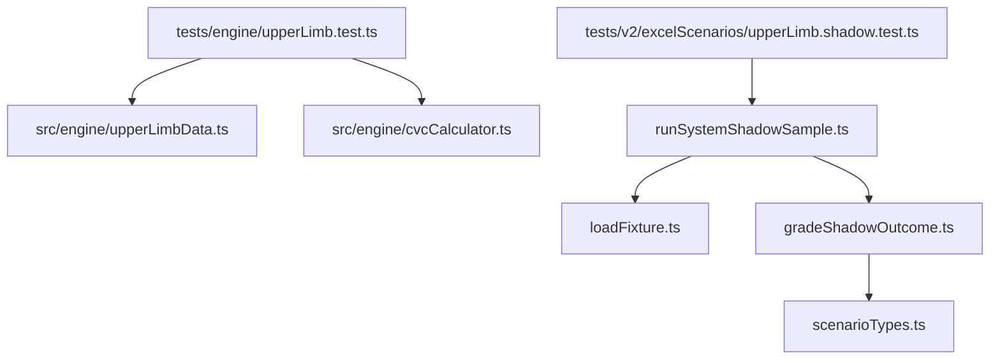

# Engine Calculation Validation

<cite>
**Referenced Files in This Document**
- [index.ts](file://src/engine/index.ts)
- [cvcCalculator.ts](file://src/engine/cvcCalculator.ts)
- [upperLimbData.ts](file://src/engine/upperLimbData.ts)
- [lowerLimbData.ts](file://src/engine/lowerLimbData.ts)
- [spineAssessmentData.ts](file://src/engine/spineAssessmentData.ts)
- [upperLimb.test.ts](file://tests/engine/upperLimb.test.ts)
- [upperLimb.shadow.test.ts](file://tests/v2/excelScenarios/upperLimb.shadow.test.ts)
- [runSystemShadowSample.ts](file://tests/v2/excelScenarios/runSystemShadowSample.ts)
- [gradeShadowOutcome.ts](file://tests/v2/excelScenarios/gradeShadowOutcome.ts)
- [loadFixture.ts](file://tests/v2/excelScenarios/loadFixture.ts)
- [scenarioTypes.ts](file://tests/v2/excelScenarios/scenarioTypes.ts)
</cite>

## Table of Contents
1. [Introduction](#introduction)
2. [Project Structure](#project-structure)
3. [Core Components](#core-components)
4. [Architecture Overview](#architecture-overview)
5. [Detailed Component Analysis](#detailed-component-analysis)
6. [Dependency Analysis](#dependency-analysis)
7. [Performance Considerations](#performance-considerations)
8. [Troubleshooting Guide](#troubleshooting-guide)
9. [Conclusion](#conclusion)

## Introduction
This document provides comprehensive guidance for engine calculation validation testing across all body systems in the GATIOD calculation engine. It explains how to validate deterministic calculation algorithms for Upper Limb, Lower Limb, Spine, and other systems, covering testing methodology for accuracy, input validation, edge cases, result formatting, and error conditions. It also documents performance benchmarking approaches and outlines best practices for adding new calculation tests while maintaining coverage for critical mathematical operations.

## Project Structure
The engine calculation validation spans several modules:
- Engine core exports and calculation entry points
- System-specific calculation modules (Upper Limb, Lower Limb, Spine)
- CVC (Combined Values Chart) calculator utilities
- Unit tests for individual systems
- Shadow testing pipeline for cross-scenario validation

**Diagram sources**
- [index.ts:1-89](file://src/engine/index.ts#L1-L89)
- [cvcCalculator.ts:1-108](file://src/engine/cvcCalculator.ts#L1-L108)
- [upperLimbData.ts:1-800](file://src/engine/upperLimbData.ts#L1-L800)
- [lowerLimbData.ts:1-800](file://src/engine/lowerLimbData.ts#L1-L800)
- [spineAssessmentData.ts:1-573](file://src/engine/spineAssessmentData.ts#L1-L573)
- [upperLimb.test.ts:1-156](file://tests/engine/upperLimb.test.ts#L1-L156)
- [upperLimb.shadow.test.ts:1-26](file://tests/v2/excelScenarios/upperLimb.shadow.test.ts#L1-L26)
- [runSystemShadowSample.ts:1-187](file://tests/v2/excelScenarios/runSystemShadowSample.ts#L1-L187)
- [gradeShadowOutcome.ts:1-180](file://tests/v2/excelScenarios/gradeShadowOutcome.ts#L1-L180)
- [loadFixture.ts:1-50](file://tests/v2/excelScenarios/loadFixture.ts#L1-L50)
- [scenarioTypes.ts:1-97](file://tests/v2/excelScenarios/scenarioTypes.ts#L1-L97)

**Section sources**
- [index.ts:1-89](file://src/engine/index.ts#L1-L89)

## Core Components
This section outlines the primary calculation modules and their roles in validation:

- Engine exports: Centralized exports for all system calculators and shared utilities.
- CVC Calculator: Provides standardized combination formulas for aggregating multiple PI% values.
- Upper Limb Calculator: Handles amputation, ROM, neurological deficits, DBE conditions, and final PI% computation.
- Lower Limb Calculator: Manages amputation, ROM, neurological deficits, shortening, DBE conditions, and final PI% computation.
- Spine Calculator: Evaluates spinal regions, diagnosis categories, severities, and computes final PI% with caps and modifiers.

Key validation responsibilities:
- Deterministic calculation accuracy across all systems
- Input validation and schema compliance
- Edge case handling (caps, conflicts, suppressions)
- Result formatting and rounding rules
- Error propagation and suppression messages

**Section sources**
- [index.ts:6-89](file://src/engine/index.ts#L6-L89)
- [cvcCalculator.ts:1-108](file://src/engine/cvcCalculator.ts#L1-L108)
- [upperLimbData.ts:160-186](file://src/engine/upperLimbData.ts#L160-L186)
- [lowerLimbData.ts:155-181](file://src/engine/lowerLimbData.ts#L155-L181)
- [spineAssessmentData.ts:478-550](file://src/engine/spineAssessmentData.ts#L478-L550)

## Architecture Overview
The validation architecture combines unit-level assertions with end-to-end shadow testing:

**Diagram sources**
- [upperLimb.test.ts:84-155](file://tests/engine/upperLimb.test.ts#L84-L155)
- [cvcCalculator.ts:58-89](file://src/engine/cvcCalculator.ts#L58-L89)
- [upperLimbData.ts:160-186](file://src/engine/upperLimbData.ts#L160-L186)
- [lowerLimbData.ts:155-181](file://src/engine/lowerLimbData.ts#L155-L181)
- [spineAssessmentData.ts:478-550](file://src/engine/spineAssessmentData.ts#L478-L550)

## Detailed Component Analysis

### Upper Limb Validation Testing
The Upper Limb module includes:
- Amputation calculations with caps and suppression logic
- ROM lookup interpolation and ankylosis tables
- Neurological deficit scoring with ROM-from-neuro exclusion
- DBE condition scoring and ROM-DBE conflict resolution
- Final PI% aggregation via CVC

Recommended validation approach:
- Test ROM lookup interpolation and boundary conditions
- Validate amputation caps and finger summation limits
- Verify neurological exclusion flag behavior
- Confirm DBE-ROM conflict resolution outcomes
- Validate final PI% aggregation and caps

**Diagram sources**
- [upperLimb.test.ts:14-155](file://tests/engine/upperLimb.test.ts#L14-L155)
- [upperLimbData.ts:160-186](file://src/engine/upperLimbData.ts#L160-L186)

**Section sources**
- [upperLimb.test.ts:14-155](file://tests/engine/upperLimb.test.ts#L14-L155)
- [upperLimbData.ts:234-285](file://src/engine/upperLimbData.ts#L234-L285)
- [upperLimbData.ts:312-533](file://src/engine/upperLimbData.ts#L312-L533)
- [upperLimbData.ts:537-593](file://src/engine/upperLimbData.ts#L537-L593)
- [upperLimbData.ts:599-737](file://src/engine/upperLimbData.ts#L599-L737)

### Lower Limb Validation Testing
The Lower Limb module includes:
- Amputation calculations with foot caps and suppression logic
- ROM lookup tables and ankylosis handling
- Neurological deficit scoring
- Shortening mapping from centimeters to PI%
- DBE condition scoring and ROM-DBE conflict resolution
- Final PI% aggregation via CVC

Recommended validation approach:
- Test ROM lookup interpolation and ankylosis overrides
- Validate amputation caps and toe summation limits
- Verify shortening mapping accuracy
- Confirm DBE condition canonical validation and sanitization
- Validate final PI% aggregation and caps

**Diagram sources**
- [lowerLimbData.ts:155-181](file://src/engine/lowerLimbData.ts#L155-L181)

**Section sources**
- [lowerLimbData.ts:246-291](file://src/engine/lowerLimbData.ts#L246-L291)
- [lowerLimbData.ts:302-462](file://src/engine/lowerLimbData.ts#L302-L462)
- [lowerLimbData.ts:466-481](file://src/engine/lowerLimbData.ts#L466-L481)
- [lowerLimbData.ts:485-502](file://src/engine/lowerLimbData.ts#L485-L502)
- [lowerLimbData.ts:511-642](file://src/engine/lowerLimbData.ts#L511-L642)
- [lowerLimbData.ts:737-768](file://src/engine/lowerLimbData.ts#L737-L768)

### Spine Validation Testing
The Spine module includes:
- Severity selection per spinal region with availability checks
- Base PI% lookup matrix
- Monoparesis halving modifier
- Bladder/bowel add-on percentages
- Highest-award override and 100% hard cap

Recommended validation approach:
- Test severity availability per region
- Validate base PI% lookups and modifiers
- Confirm monoparesis applicability and halving
- Verify bladder/bowel add-ons and region applicability
- Validate highest-award suppression and final cap

**Diagram sources**
- [spineAssessmentData.ts:435-470](file://src/engine/spineAssessmentData.ts#L435-L470)
- [spineAssessmentData.ts:478-550](file://src/engine/spineAssessmentData.ts#L478-L550)

**Section sources**
- [spineAssessmentData.ts:292-319](file://src/engine/spineAssessmentData.ts#L292-L319)
- [spineAssessmentData.ts:382-403](file://src/engine/spineAssessmentData.ts#L382-L403)
- [spineAssessmentData.ts:435-470](file://src/engine/spineAssessmentData.ts#L435-L470)
- [spineAssessmentData.ts:478-550](file://src/engine/spineAssessmentData.ts#L478-L550)

### CVC Calculator Validation Testing
The CVC calculator provides:
- Two-value combination using iterative formula
- Two-value combination using chart behavior (whole-number chart cells)
- Multiple-value combination via iterative application
- Additive combination with optional caps
- Highest score selection

Recommended validation approach:
- Test order independence and rounding behavior
- Validate chart behavior with fractional remainders
- Confirm caps and additive combinations
- Verify highest score selection for special cases

**Diagram sources**
- [cvcCalculator.ts:58-68](file://src/engine/cvcCalculator.ts#L58-L68)

**Section sources**
- [cvcCalculator.ts:34-51](file://src/engine/cvcCalculator.ts#L34-L51)
- [cvcCalculator.ts:58-89](file://src/engine/cvcCalculator.ts#L58-L89)
- [cvcCalculator.ts:95-107](file://src/engine/cvcCalculator.ts#L95-L107)

## Dependency Analysis
The validation pipeline integrates unit tests with shadow testing:

**Diagram sources**
- [upperLimb.test.ts:1-12](file://tests/engine/upperLimb.test.ts#L1-L12)
- [upperLimb.shadow.test.ts:1-25](file://tests/v2/excelScenarios/upperLimb.shadow.test.ts#L1-L25)
- [runSystemShadowSample.ts:100-186](file://tests/v2/excelScenarios/runSystemShadowSample.ts#L100-L186)
- [gradeShadowOutcome.ts:36-128](file://tests/v2/excelScenarios/gradeShadowOutcome.ts#L36-L128)
- [loadFixture.ts:26-44](file://tests/v2/excelScenarios/loadFixture.ts#L26-L44)
- [scenarioTypes.ts:11-42](file://tests/v2/excelScenarios/scenarioTypes.ts#L11-L42)

**Section sources**
- [upperLimb.test.ts:1-12](file://tests/engine/upperLimb.test.ts#L1-L12)
- [upperLimb.shadow.test.ts:1-25](file://tests/v2/excelScenarios/upperLimb.shadow.test.ts#L1-L25)
- [runSystemShadowSample.ts:34-82](file://tests/v2/excelScenarios/runSystemShadowSample.ts#L34-L82)
- [gradeShadowOutcome.ts:16-32](file://tests/v2/excelScenarios/gradeShadowOutcome.ts#L16-L32)
- [loadFixture.ts:26-44](file://tests/v2/excelScenarios/loadFixture.ts#L26-L44)
- [scenarioTypes.ts:11-42](file://tests/v2/excelScenarios/scenarioTypes.ts#L11-L42)

## Performance Considerations
- CVC combination complexity: Iterative combination scales linearly with the number of inputs; ensure filtering non-zero values reduces unnecessary operations.
- Lookup tables: ROM and DBE tables are accessed via direct lookups; maintain sorted keys and efficient table structures for interpolation.
- Shadow testing: Sampling strategies reduce runtime while maintaining statistical validity; adjust sample sizes via environment variables for CI vs full runs.
- Memory usage: Avoid retaining large fixtures unnecessarily; load and cache where appropriate.

[No sources needed since this section provides general guidance]

## Troubleshooting Guide
Common validation issues and resolutions:
- Unexpected PI% aggregation: Verify CVC rounding and caps; confirm input sorting and zero-filtering.
- ROM lookup errors: Check angle boundaries and interpolation logic; validate ankylosis table usage when applicable.
- Amputation caps exceeded: Ensure finger summation caps and total caps are enforced; verify suppression logic for proximal amputations.
- DBE-ROM conflicts: Confirm conflict resolution rules and category eligibility.
- Shadow test failures: Review outcome classification and PI match criteria; use mismatch samples to refine expectations.

**Section sources**
- [cvcCalculator.ts:11-12](file://src/engine/cvcCalculator.ts#L11-L12)
- [upperLimbData.ts:283-285](file://src/engine/upperLimbData.ts#L283-L285)
- [lowerLimbData.ts:287-291](file://src/engine/lowerLimbData.ts#L287-L291)
- [gradeShadowOutcome.ts:36-128](file://tests/v2/excelScenarios/gradeShadowOutcome.ts#L36-L128)

## Conclusion
Engine calculation validation requires a dual-layer approach: rigorous unit testing for deterministic algorithms and comprehensive shadow testing for real-world scenario coverage. By validating accuracy, input constraints, edge cases, and result formatting across Upper Limb, Lower Limb, Spine, and other systems, teams can ensure reliable PI% computations. Adopt the recommended testing methodologies, maintain strict coverage for critical mathematical operations, and leverage shadow testing to enforce ADR-0001 thresholds for safe promotion.