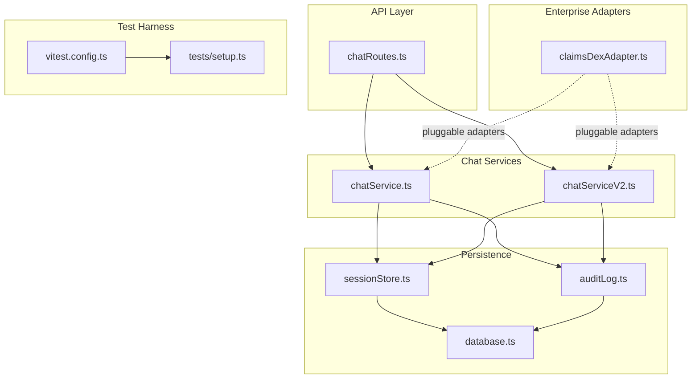
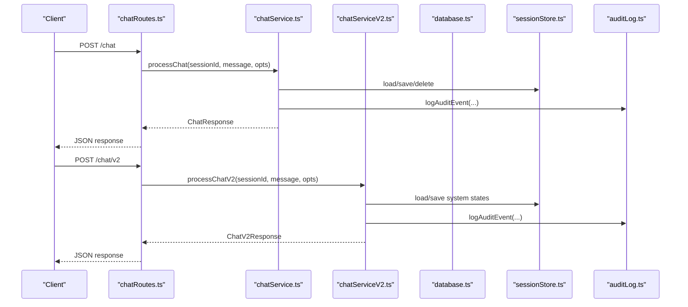
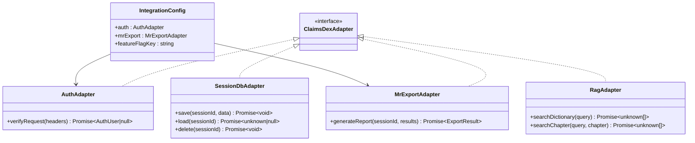
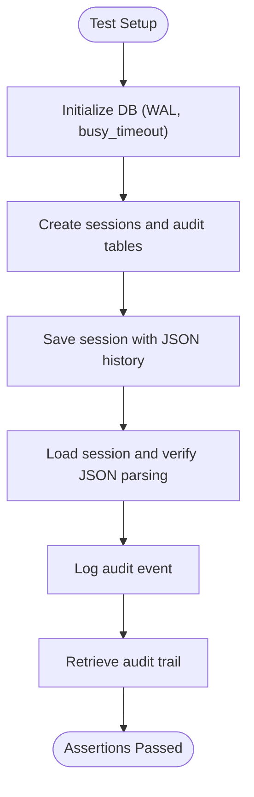
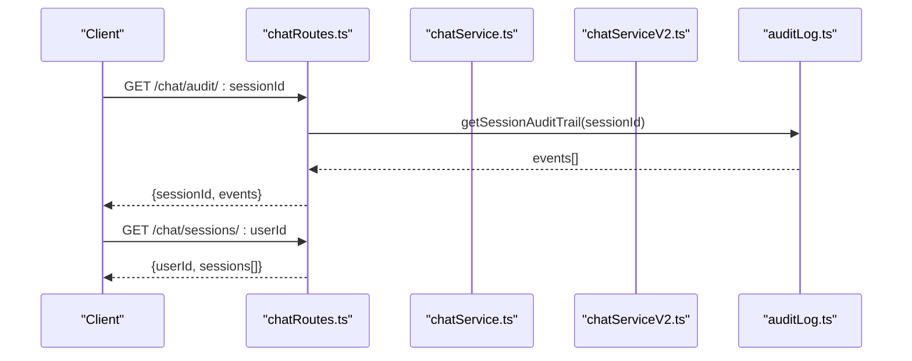
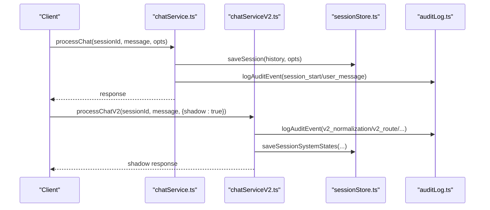
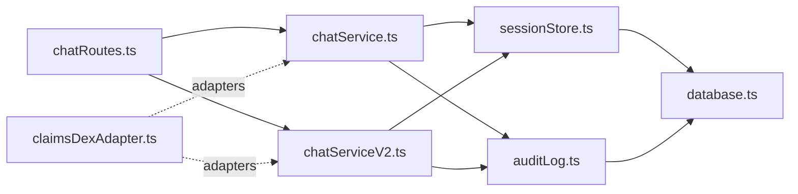

# Integration Testing

<cite>
**Referenced Files in This Document**
- [claimsDexAdapter.ts](file://src/integration/claimsDexAdapter.ts)
- [database.ts](file://src/db/database.ts)
- [sessionStore.ts](file://src/db/sessionStore.ts)
- [auditLog.ts](file://src/db/auditLog.ts)
- [chatRoutes.ts](file://src/api/chatRoutes.ts)
- [chatService.ts](file://src/chat/chatService.ts)
- [chatServiceV2.ts](file://src/chat/chatServiceV2.ts)
- [vitest.config.ts](file://vitest.config.ts)
- [setup.ts](file://tests/setup.ts)
- [runSystemShadowSample.ts](file://tests/v2/excelScenarios/runSystemShadowSample.ts)
- [hearing.shadow.test.ts](file://tests/v2/excelScenarios/hearing.shadow.test.ts)
- [policyEngine.test.ts](file://tests/v2/policyEngine.test.ts)
- [p1A.semanticShadowGrader.test.ts](file://tests/v2/p1A.semanticShadowGrader.test.ts)
</cite>

## Table of Contents
1. [Introduction](#introduction)
2. [Project Structure](#project-structure)
3. [Core Components](#core-components)
4. [Architecture Overview](#architecture-overview)
5. [Detailed Component Analysis](#detailed-component-analysis)
6. [Dependency Analysis](#dependency-analysis)
7. [Performance Considerations](#performance-considerations)
8. [Troubleshooting Guide](#troubleshooting-guide)
9. [Conclusion](#conclusion)
10. [Appendices](#appendices)

## Introduction
This document describes integration testing approaches for validating interactions among system components: database persistence, external API connectivity, and enterprise system adapters. It focuses on ClaimsDex integration patterns, session management, and audit logging. It also provides methodological guidance for testing API endpoints, database transactions, and external service integrations, along with mock strategies, environment setup, and end-to-end workflow validation. The goal is to ensure system boundaries are respected, errors propagate predictably, and data remains consistent across integrated components.

## Project Structure
The integration testing landscape centers around:
- API routes exposing chat endpoints and audit/session queries
- Chat services orchestrating LLM interactions, tool calls, and state transitions
- Database layer with SQLite for standalone mode and audit/session persistence
- ClaimsDex adapter interfaces enabling pluggable auth, session storage, RAG, and report generation
- Test harness leveraging Vitest with a shared setup for environment loading

**Diagram sources**
- [chatRoutes.ts:1-91](file://src/api/chatRoutes.ts#L1-L91)
- [chatService.ts:1-183](file://src/chat/chatService.ts#L1-L183)
- [chatServiceV2.ts:1-800](file://src/chat/chatServiceV2.ts#L1-L800)
- [database.ts:1-57](file://src/db/database.ts#L1-L57)
- [sessionStore.ts:1-110](file://src/db/sessionStore.ts#L1-L110)
- [auditLog.ts:1-91](file://src/db/auditLog.ts#L1-L91)
- [claimsDexAdapter.ts:1-105](file://src/integration/claimsDexAdapter.ts#L1-L105)
- [vitest.config.ts:1-12](file://vitest.config.ts#L1-L12)
- [setup.ts:1-8](file://tests/setup.ts#L1-L8)

**Section sources**
- [chatRoutes.ts:1-91](file://src/api/chatRoutes.ts#L1-L91)
- [chatService.ts:1-183](file://src/chat/chatService.ts#L1-L183)
- [chatServiceV2.ts:1-800](file://src/chat/chatServiceV2.ts#L1-L800)
- [database.ts:1-57](file://src/db/database.ts#L1-L57)
- [sessionStore.ts:1-110](file://src/db/sessionStore.ts#L1-L110)
- [auditLog.ts:1-91](file://src/db/auditLog.ts#L1-L91)
- [claimsDexAdapter.ts:1-105](file://src/integration/claimsDexAdapter.ts#L1-L105)
- [vitest.config.ts:1-12](file://vitest.config.ts#L1-L12)
- [setup.ts:1-8](file://tests/setup.ts#L1-L8)

## Core Components
- ClaimsDex adapter interfaces define pluggable contracts for authentication, session storage, retrieval-augmented search, and medical report export. These enable standalone mocks and enterprise replacements.
- Database layer initializes SQLite tables for sessions and audit logs, with WAL mode and busy timeouts configured for concurrency and reliability.
- Session store persists chat histories and system states, supporting CRUD operations and listing for user resume.
- Audit log captures lifecycle events for medico-legal traceability, with defensive error handling to avoid crashing the main flow.
- API routes expose chat endpoints, session reset, audit trail retrieval, and user session listing, coordinating with services and persistence.

**Section sources**
- [claimsDexAdapter.ts:1-105](file://src/integration/claimsDexAdapter.ts#L1-L105)
- [database.ts:1-57](file://src/db/database.ts#L1-L57)
- [sessionStore.ts:1-110](file://src/db/sessionStore.ts#L1-L110)
- [auditLog.ts:1-91](file://src/db/auditLog.ts#L1-L91)
- [chatRoutes.ts:1-91](file://src/api/chatRoutes.ts#L1-L91)

## Architecture Overview
The integration architecture couples API routes to chat services, which in turn persist state and audit events to the database. ClaimsDex adapters plug into the chat services to replace local implementations with enterprise equivalents.

**Diagram sources**
- [chatRoutes.ts:14-66](file://src/api/chatRoutes.ts#L14-L66)
- [chatService.ts:38-154](file://src/chat/chatService.ts#L38-L154)
- [chatServiceV2.ts:258-525](file://src/chat/chatServiceV2.ts#L258-L525)
- [sessionStore.ts:21-94](file://src/db/sessionStore.ts#L21-L94)
- [auditLog.ts:58-73](file://src/db/auditLog.ts#L58-L73)
- [database.ts:11-49](file://src/db/database.ts#L11-L49)

## Detailed Component Analysis

### ClaimsDex Integration Interfaces
ClaimsDex adapter defines:
- Authentication adapter contract and a standalone no-op implementation
- Session database adapter contract and replacement strategy
- Retrieval-Augmented Search (RAG) adapter contract and replacement strategy
- Medical report export adapter with format and content contract
- Integration configuration with feature flag support

Testing strategy:
- Inject alternate adapters via configuration to validate enterprise replacements
- Use environment toggles to enable/disable chat features during tests
- Validate adapter contracts with minimal mocks that satisfy interfaces

**Diagram sources**
- [claimsDexAdapter.ts:12-104](file://src/integration/claimsDexAdapter.ts#L12-L104)

**Section sources**
- [claimsDexAdapter.ts:1-105](file://src/integration/claimsDexAdapter.ts#L1-L105)

### Database Integration and Transactions
The database layer:
- Initializes SQLite with WAL mode and busy timeouts
- Creates tables for sessions and audit logs with appropriate indexes
- Exposes connection and lifecycle helpers

Session store:
- Persists chat histories and system states
- Supports save, load, delete, complete, and listing by user
- Uses JSON serialization for complex fields

Audit log:
- Records lifecycle events with defensive error handling
- Provides audit trail retrieval by session

Testing methodology:
- Use in-memory databases for isolated tests
- Validate transaction-like semantics via save/load cycles
- Assert indexes and constraints via schema initialization tests

**Diagram sources**
- [database.ts:11-49](file://src/db/database.ts#L11-L49)
- [sessionStore.ts:21-94](file://src/db/sessionStore.ts#L21-L94)
- [auditLog.ts:58-90](file://src/db/auditLog.ts#L58-L90)

**Section sources**
- [database.ts:1-57](file://src/db/database.ts#L1-L57)
- [sessionStore.ts:1-110](file://src/db/sessionStore.ts#L1-L110)
- [auditLog.ts:1-91](file://src/db/auditLog.ts#L1-L91)

### API Endpoints and End-to-End Workflows
API routes:
- POST /chat: orchestrates legacy chat flow, supports shadow mode mirroring to v2
- POST /chat/v2: orchestrates v2 chat flow with optional debug response shaping
- POST /chat/reset: clears a session
- GET /chat/audit/:sessionId: retrieves audit trail
- GET /chat/sessions/:userId: lists user sessions

Testing methodology:
- Validate request validation and error responses
- Exercise shadow mode behavior and debug response shaping
- Verify audit trail and session listing endpoints
- Use deterministic session IDs to assert end-to-end state progression

**Diagram sources**
- [chatRoutes.ts:76-90](file://src/api/chatRoutes.ts#L76-L90)
- [auditLog.ts:75-90](file://src/db/auditLog.ts#L75-L90)

**Section sources**
- [chatRoutes.ts:1-91](file://src/api/chatRoutes.ts#L1-L91)

### Session Management and State Consistency
Legacy flow:
- Validates feature flags and environment prerequisites
- Logs session start and user messages
- Persists session before invoking external LLM to ensure resilience
- Handles retries and error categorization with user-friendly messages

V2 flow:
- Normalizes input and runs consensus orchestration
- Logs extensive audit events for routing, policy, extraction, and confirmations
- Manages structured confirmations and pending observations
- Supports shadow mode for evaluation against production traffic

Testing methodology:
- Inject semantic model client stubs for deterministic behavior
- Validate audit events for each major stage
- Assert session state transitions and system state persistence
- Use shadow runner to validate behavioral parity across versions

**Diagram sources**
- [chatService.ts:38-154](file://src/chat/chatService.ts#L38-L154)
- [chatServiceV2.ts:258-525](file://src/chat/chatServiceV2.ts#L258-L525)
- [sessionStore.ts:21-94](file://src/db/sessionStore.ts#L21-L94)
- [auditLog.ts:58-90](file://src/db/auditLog.ts#L58-L90)

**Section sources**
- [chatService.ts:1-183](file://src/chat/chatService.ts#L1-L183)
- [chatServiceV2.ts:1-800](file://src/chat/chatServiceV2.ts#L1-L800)
- [sessionStore.ts:1-110](file://src/db/sessionStore.ts#L1-L110)
- [auditLog.ts:1-91](file://src/db/auditLog.ts#L1-L91)

### External API Connections and Mock Strategies
External dependencies include:
- Gemini LLM (invoked by chat services)
- Semantic model client (optional, injected for tests)

Mock strategies:
- Stub semantic model client in tests to avoid external calls
- Use environment toggles to disable or alter behavior for tests
- Leverage Vitest setup to load environment variables once for opt-in tests

Validation:
- Unit tests exercise policy decisions and state transitions without external calls
- Shadow runners evaluate behavioral parity against production traffic
- Graders validate semantic interpretation outcomes

**Section sources**
- [chatService.ts:43-49](file://src/chat/chatService.ts#L43-L49)
- [chatServiceV2.ts:150-180](file://src/chat/chatServiceV2.ts#L150-L180)
- [policyEngine.test.ts:1-123](file://tests/v2/policyEngine.test.ts#L1-L123)
- [p1A.semanticShadowGrader.test.ts:1-200](file://tests/v2/p1A.semanticShadowGrader.test.ts#L1-L200)
- [runSystemShadowSample.ts:100-187](file://tests/v2/excelScenarios/runSystemShadowSample.ts#L100-L187)
- [vitest.config.ts:1-12](file://vitest.config.ts#L1-L12)
- [setup.ts:1-8](file://tests/setup.ts#L1-L8)

### Test Environment Setup and Execution
- Vitest configuration includes a setup file to load environment variables once before all tests
- Tests can selectively enable external API access via environment flags
- Shadow runners configure an in-memory database for isolation

Guidelines:
- Use environment variables to toggle features and external integrations
- Prefer deterministic inputs and controlled session IDs for reproducibility
- Keep integration tests focused on boundary behavior and error propagation

**Section sources**
- [vitest.config.ts:1-12](file://vitest.config.ts#L1-L12)
- [setup.ts:1-8](file://tests/setup.ts#L1-L8)
- [runSystemShadowSample.ts:110-111](file://tests/v2/excelScenarios/runSystemShadowSample.ts#L110-L111)

## Dependency Analysis
The integration layer exhibits clear separation of concerns:
- API routes depend on chat services and persistence
- Chat services depend on session store and audit log
- Persistence depends on the database layer
- ClaimsDex adapters decouple enterprise-specific implementations from core logic

**Diagram sources**
- [chatRoutes.ts:1-91](file://src/api/chatRoutes.ts#L1-L91)
- [chatService.ts:1-183](file://src/chat/chatService.ts#L1-L183)
- [chatServiceV2.ts:1-800](file://src/chat/chatServiceV2.ts#L1-L800)
- [sessionStore.ts:1-110](file://src/db/sessionStore.ts#L1-L110)
- [auditLog.ts:1-91](file://src/db/auditLog.ts#L1-L91)
- [database.ts:1-57](file://src/db/database.ts#L1-L57)
- [claimsDexAdapter.ts:1-105](file://src/integration/claimsDexAdapter.ts#L1-L105)

**Section sources**
- [chatRoutes.ts:1-91](file://src/api/chatRoutes.ts#L1-L91)
- [chatService.ts:1-183](file://src/chat/chatService.ts#L1-L183)
- [chatServiceV2.ts:1-800](file://src/chat/chatServiceV2.ts#L1-L800)
- [sessionStore.ts:1-110](file://src/db/sessionStore.ts#L1-L110)
- [auditLog.ts:1-91](file://src/db/auditLog.ts#L1-L91)
- [database.ts:1-57](file://src/db/database.ts#L1-L57)
- [claimsDexAdapter.ts:1-105](file://src/integration/claimsDexAdapter.ts#L1-L105)

## Performance Considerations
- Database tuning: WAL mode and busy timeouts improve concurrency; ensure adequate disk I/O for test runs
- Retry logic: Gemini calls include exponential backoff; tests should honor delays to avoid flakiness
- Shadow runs: enable only when needed to reduce test runtime
- In-memory databases: use for fast, isolated tests; ensure schema initialization overhead is acceptable

## Troubleshooting Guide
Common issues and resolutions:
- Missing environment variables: ensure GEMINI_API_KEY and feature flags are set appropriately for tests requiring external APIs
- Audit logging failures: audit logging is defensive; verify database connectivity and schema initialization
- Session persistence anomalies: validate JSON serialization/deserialization and conflict resolution behavior
- Shadow mode discrepancies: confirm shadow flag and deterministic inputs; compare v2 responses with expected outcomes

**Section sources**
- [chatService.ts:43-49](file://src/chat/chatService.ts#L43-L49)
- [auditLog.ts:69-72](file://src/db/auditLog.ts#L69-L72)
- [sessionStore.ts:27-43](file://src/db/sessionStore.ts#L27-L43)
- [runSystemShadowSample.ts:120-152](file://tests/v2/excelScenarios/runSystemShadowSample.ts#L120-L152)

## Conclusion
Integration testing in this codebase emphasizes robust validation of system boundaries, error propagation, and data consistency across database, API, and chat services. By leveraging pluggable ClaimsDex adapters, deterministic test environments, and shadow runners, teams can confidently validate both legacy and modern chat flows while maintaining medico-legal traceability through audit logging.

## Appendices

### Example Test Scenarios
- Shadow runner calibration: use the shared runner to evaluate system-specific scenarios and enforce ADR-0001 thresholds
- Policy decision tests: validate routing and tool proposal logic under varying confidence and grounding conditions
- Semantic grading: assert correctness of semantic interpretation outcomes and missing-field detection

**Section sources**
- [hearing.shadow.test.ts:1-30](file://tests/v2/excelScenarios/hearing.shadow.test.ts#L1-L30)
- [runSystemShadowSample.ts:100-187](file://tests/v2/excelScenarios/runSystemShadowSample.ts#L100-L187)
- [policyEngine.test.ts:1-123](file://tests/v2/policyEngine.test.ts#L1-L123)
- [p1A.semanticShadowGrader.test.ts:1-200](file://tests/v2/p1A.semanticShadowGrader.test.ts#L1-L200)