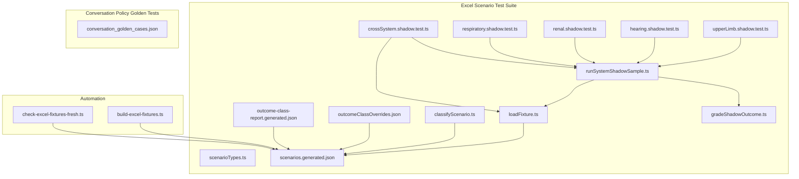
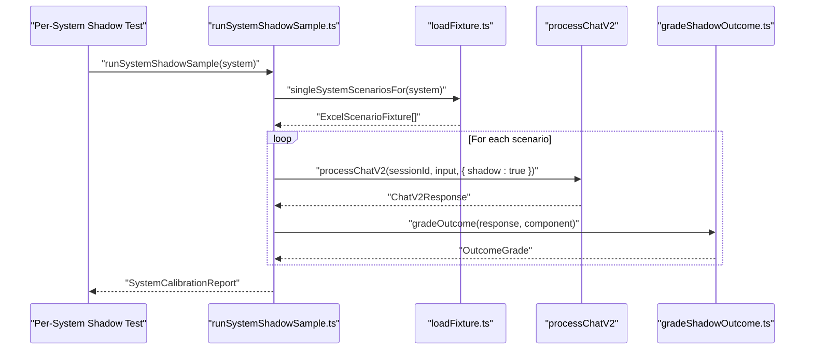
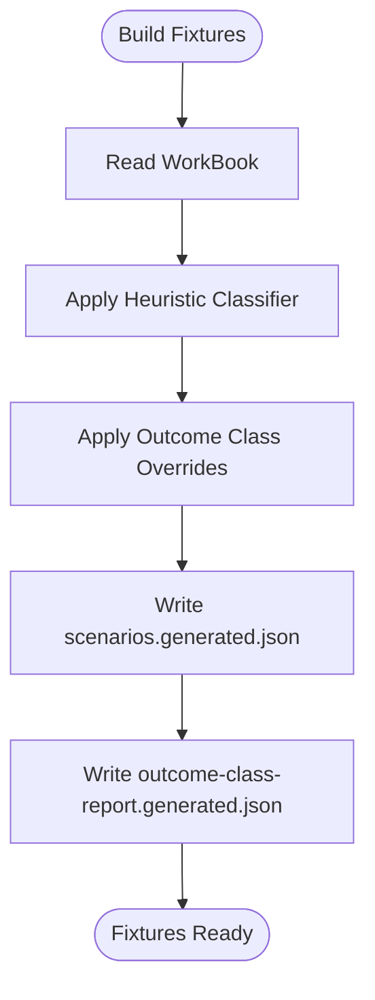
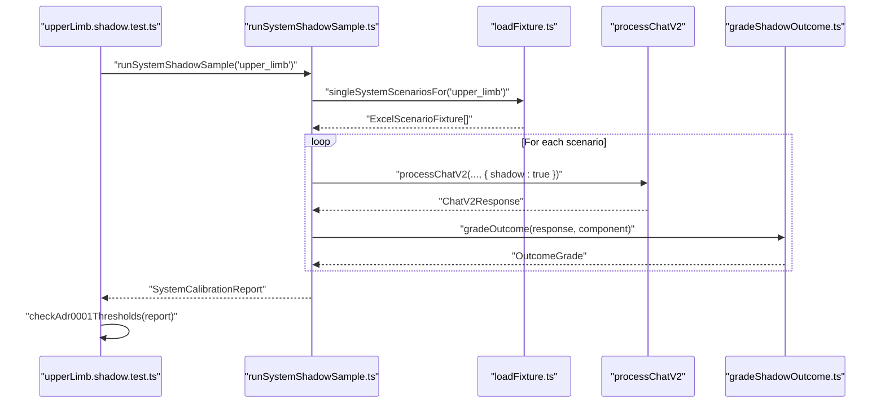
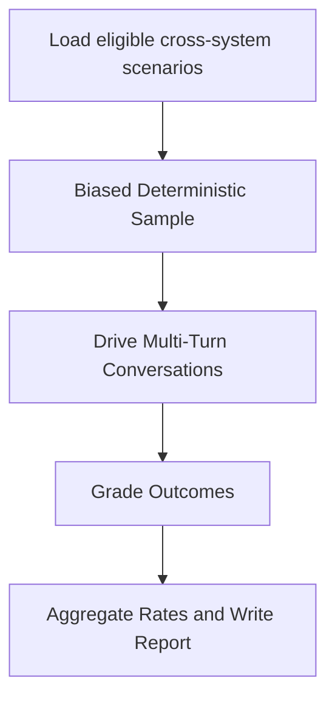
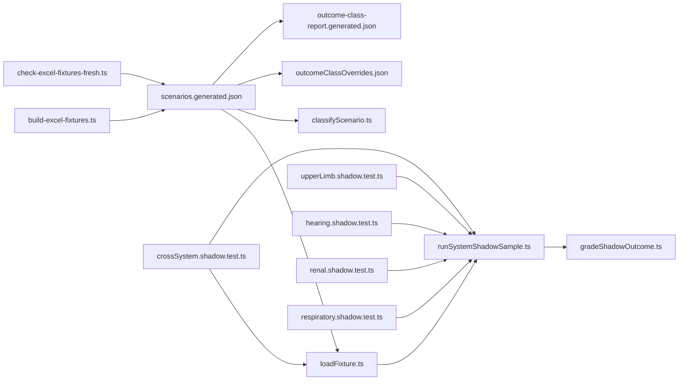

# Test Data Management

<cite>
**Referenced Files in This Document**
- [loadFixture.ts](file://tests/v2/excelScenarios/loadFixture.ts)
- [classifyScenario.ts](file://tests/v2/excelScenarios/classifyScenario.ts)
- [scenarioTypes.ts](file://tests/v2/excelScenarios/scenarioTypes.ts)
- [crossSystem.shadow.test.ts](file://tests/v2/excelScenarios/crossSystem.shadow.test.ts)
- [upperLimb.shadow.test.ts](file://tests/v2/excelScenarios/upperLimb.shadow.test.ts)
- [hearing.shadow.test.ts](file://tests/v2/excelScenarios/hearing.shadow.test.ts)
- [respiratory.shadow.test.ts](file://tests/v2/excelScenarios/respiratory.shadow.test.ts)
- [renal.shadow.test.ts](file://tests/v2/excelScenarios/renal.shadow.test.ts)
- [runSystemShadowSample.ts](file://tests/v2/excelScenarios/runSystemShadowSample.ts)
- [gradeShadowOutcome.ts](file://tests/v2/excelScenarios/gradeShadowOutcome.ts)
- [outcomeClassOverrides.json](file://tests/v2/excelScenarios/outcomeClassOverrides.json)
- [outcome-class-report.generated.json](file://tests/v2/excelScenarios/outcome-class-report.generated.json)
- [scenarios.generated.json](file://tests/v2/excelScenarios/scenarios.generated.json)
- [conversation_golden_cases.json](file://gatiod_conversation_policy_data/tests/conversation_golden_cases.json)
- [build-excel-fixtures.ts](file://scripts/build-excel-fixtures.ts)
- [check-excel-fixtures-fresh.ts](file://scripts/check-excel-fixtures-fresh.ts)
</cite>

## Table of Contents
1. [Introduction](#introduction)
2. [Project Structure](#project-structure)
3. [Core Components](#core-components)
4. [Architecture Overview](#architecture-overview)
5. [Detailed Component Analysis](#detailed-component-analysis)
6. [Dependency Analysis](#dependency-analysis)
7. [Performance Considerations](#performance-considerations)
8. [Troubleshooting Guide](#troubleshooting-guide)
9. [Conclusion](#conclusion)
10. [Appendices](#appendices)

## Introduction
This document explains how test data is organized, maintained, and executed across the system. It focuses on:
- Excel scenario fixtures and shadow testing for body systems
- Golden test cases for conversation policy behavior
- Contract validation data and calibration reports
- Strategies for managing large datasets, enforcing reproducibility, and maintaining integrity across environments

The goal is to help contributors create, update, and validate test fixtures reliably, while keeping test suites fast, observable, and aligned with architectural decisions.

## Project Structure
Test data and fixtures are primarily located under:
- tests/v2/excelScenarios: Excel scenario catalog fixtures, classifiers, shadow runners, and calibration reports
- gatiod_conversation_policy_data/tests: Golden cases for conversation policy behavior
- scripts: Automation to build and validate fixtures

**Diagram sources**
- [loadFixture.ts:1-50](file://tests/v2/excelScenarios/loadFixture.ts#L1-L50)
- [scenarioTypes.ts:1-97](file://tests/v2/excelScenarios/scenarioTypes.ts#L1-L97)
- [classifyScenario.ts:1-291](file://tests/v2/excelScenarios/classifyScenario.ts#L1-L291)
- [scenarios.generated.json:1-200](file://tests/v2/excelScenarios/scenarios.generated.json#L1-L200)
- [outcomeClassOverrides.json:1-11](file://tests/v2/excelScenarios/outcomeClassOverrides.json#L1-L11)
- [outcome-class-report.generated.json:1-25](file://tests/v2/excelScenarios/outcome-class-report.generated.json#L1-L25)
- [upperLimb.shadow.test.ts:1-26](file://tests/v2/excelScenarios/upperLimb.shadow.test.ts#L1-L26)
- [hearing.shadow.test.ts:1-30](file://tests/v2/excelScenarios/hearing.shadow.test.ts#L1-L30)
- [renal.shadow.test.ts:1-26](file://tests/v2/excelScenarios/renal.shadow.test.ts#L1-L26)
- [respiratory.shadow.test.ts:1-26](file://tests/v2/excelScenarios/respiratory.shadow.test.ts#L1-L26)
- [crossSystem.shadow.test.ts:1-267](file://tests/v2/excelScenarios/crossSystem.shadow.test.ts#L1-L267)
- [runSystemShadowSample.ts:1-187](file://tests/v2/excelScenarios/runSystemShadowSample.ts#L1-L187)
- [gradeShadowOutcome.ts:1-180](file://tests/v2/excelScenarios/gradeShadowOutcome.ts#L1-L180)
- [build-excel-fixtures.ts](file://scripts/build-excel-fixtures.ts)
- [check-excel-fixtures-fresh.ts](file://scripts/check-excel-fixtures-fresh.ts)

**Section sources**
- [loadFixture.ts:1-50](file://tests/v2/excelScenarios/loadFixture.ts#L1-L50)
- [scenarioTypes.ts:1-97](file://tests/v2/excelScenarios/scenarioTypes.ts#L1-L97)
- [classifyScenario.ts:1-291](file://tests/v2/excelScenarios/classifyScenario.ts#L1-L291)
- [scenarios.generated.json:1-200](file://tests/v2/excelScenarios/scenarios.generated.json#L1-L200)
- [outcomeClassOverrides.json:1-11](file://tests/v2/excelScenarios/outcomeClassOverrides.json#L1-L11)
- [outcome-class-report.generated.json:1-25](file://tests/v2/excelScenarios/outcome-class-report.generated.json#L1-L25)
- [upperLimb.shadow.test.ts:1-26](file://tests/v2/excelScenarios/upperLimb.shadow.test.ts#L1-L26)
- [hearing.shadow.test.ts:1-30](file://tests/v2/excelScenarios/hearing.shadow.test.ts#L1-L30)
- [renal.shadow.test.ts:1-26](file://tests/v2/excelScenarios/renal.shadow.test.ts#L1-L26)
- [respiratory.shadow.test.ts:1-26](file://tests/v2/excelScenarios/respiratory.shadow.test.ts#L1-L26)
- [crossSystem.shadow.test.ts:1-267](file://tests/v2/excelScenarios/crossSystem.shadow.test.ts#L1-L267)
- [runSystemShadowSample.ts:1-187](file://tests/v2/excelScenarios/runSystemShadowSample.ts#L1-L187)
- [gradeShadowOutcome.ts:1-180](file://tests/v2/excelScenarios/gradeShadowOutcome.ts#L1-L180)
- [conversation_golden_cases.json:1-122](file://gatiod_conversation_policy_data/tests/conversation_golden_cases.json#L1-L122)
- [build-excel-fixtures.ts](file://scripts/build-excel-fixtures.ts)
- [check-excel-fixtures-fresh.ts](file://scripts/check-excel-fixtures-fresh.ts)

## Core Components
- Excel scenario fixtures: A JSON dataset derived from a workbook, containing scenario rows, expected outcomes, and metadata. See [scenarios.generated.json:1-200](file://tests/v2/excelScenarios/scenarios.generated.json#L1-L200).
- Scenario types and classification: Strongly typed structures and a heuristic classifier that assigns expected outcome classes per component and row. See [scenarioTypes.ts:1-97](file://tests/v2/excelScenarios/scenarioTypes.ts#L1-L97) and [classifyScenario.ts:1-291](file://tests/v2/excelScenarios/classifyScenario.ts#L1-L291).
- Shadow runners: Per-system and cross-system tests that execute assistant conversations against scenarios, grade outcomes, and produce calibration reports. See [runSystemShadowSample.ts:1-187](file://tests/v2/excelScenarios/runSystemShadowSample.ts#L1-L187), [gradeShadowOutcome.ts:1-180](file://tests/v2/excelScenarios/gradeShadowOutcome.ts#L1-L180), and [crossSystem.shadow.test.ts:1-267](file://tests/v2/excelScenarios/crossSystem.shadow.test.ts#L1-L267).
- Golden conversation tests: Policy-driven test cases validating state transitions and next-slot behavior. See [conversation_golden_cases.json:1-122](file://gatiod_conversation_policy_data/tests/conversation_golden_cases.json#L1-L122).
- Fixtures lifecycle: Build script generates the committed fixture and related artifacts; freshness checks ensure the dataset remains up-to-date. See [build-excel-fixtures.ts](file://scripts/build-excel-fixtures.ts) and [check-excel-fixtures-fresh.ts](file://scripts/check-excel-fixtures-fresh.ts).

**Section sources**
- [scenarioTypes.ts:1-97](file://tests/v2/excelScenarios/scenarioTypes.ts#L1-L97)
- [classifyScenario.ts:1-291](file://tests/v2/excelScenarios/classifyScenario.ts#L1-L291)
- [runSystemShadowSample.ts:1-187](file://tests/v2/excelScenarios/runSystemShadowSample.ts#L1-L187)
- [gradeShadowOutcome.ts:1-180](file://tests/v2/excelScenarios/gradeShadowOutcome.ts#L1-L180)
- [crossSystem.shadow.test.ts:1-267](file://tests/v2/excelScenarios/crossSystem.shadow.test.ts#L1-L267)
- [conversation_golden_cases.json:1-122](file://gatiod_conversation_policy_data/tests/conversation_golden_cases.json#L1-L122)
- [build-excel-fixtures.ts](file://scripts/build-excel-fixtures.ts)
- [check-excel-fixtures-fresh.ts](file://scripts/check-excel-fixtures-fresh.ts)

## Architecture Overview
The Excel scenario test suite is composed of:
- Fixture loader: Reads the committed JSON fixture and filters scenarios by system or cross-system composition.
- Classifier: Applies deterministic rules to derive expected outcome classes and PI expectations.
- Runner: Executes assistant conversations for single-system and cross-system scenarios, drives confirmation turns, and grades outcomes.
- Reports: Calibration summaries and mismatch samples for diagnostics and continuous improvement.

**Diagram sources**
- [runSystemShadowSample.ts:100-187](file://tests/v2/excelScenarios/runSystemShadowSample.ts#L100-L187)
- [loadFixture.ts:26-44](file://tests/v2/excelScenarios/loadFixture.ts#L26-L44)
- [gradeShadowOutcome.ts:36-128](file://tests/v2/excelScenarios/gradeShadowOutcome.ts#L36-L128)

**Section sources**
- [runSystemShadowSample.ts:1-187](file://tests/v2/excelScenarios/runSystemShadowSample.ts#L1-L187)
- [loadFixture.ts:1-50](file://tests/v2/excelScenarios/loadFixture.ts#L1-L50)
- [gradeShadowOutcome.ts:1-180](file://tests/v2/excelScenarios/gradeShadowOutcome.ts#L1-L180)

## Detailed Component Analysis

### Excel Scenario Catalog and Fixtures
- Dataset structure: The fixture is a JSON object containing source metadata, sheet counts, and an array of scenario rows. Each row includes input text, optional final PI, component-level details, and classification. See [scenarioTypes.ts:49-65](file://tests/v2/excelScenarios/scenarioTypes.ts#L49-L65) and [scenarios.generated.json:1-200](file://tests/v2/excelScenarios/scenarios.generated.json#L1-L200).
- Loader and filtering: The loader reads the committed fixture and exposes helpers to select single-system or cross-system scenarios. See [loadFixture.ts:16-44](file://tests/v2/excelScenarios/loadFixture.ts#L16-L44).
- Classification rules: A deterministic classifier maps workbook semantics to expected outcome classes and PI ranges, with overrides applied during generation. See [classifyScenario.ts:1-291](file://tests/v2/excelScenarios/classifyScenario.ts#L1-L291) and [outcomeClassOverrides.json:1-11](file://tests/v2/excelScenarios/outcomeClassOverrides.json#L1-L11).
- Build and freshness: A build script generates the fixture and related artifacts; a freshness checker ensures the dataset reflects the latest workbook. See [build-excel-fixtures.ts](file://scripts/build-excel-fixtures.ts) and [check-excel-fixtures-fresh.ts](file://scripts/check-excel-fixtures-fresh.ts).

**Diagram sources**
- [classifyScenario.ts:1-291](file://tests/v2/excelScenarios/classifyScenario.ts#L1-L291)
- [outcomeClassOverrides.json:1-11](file://tests/v2/excelScenarios/outcomeClassOverrides.json#L1-L11)
- [scenarios.generated.json:1-200](file://tests/v2/excelScenarios/scenarios.generated.json#L1-L200)
- [outcome-class-report.generated.json:1-25](file://tests/v2/excelScenarios/outcome-class-report.generated.json#L1-L25)

**Section sources**
- [scenarioTypes.ts:1-97](file://tests/v2/excelScenarios/scenarioTypes.ts#L1-L97)
- [loadFixture.ts:1-50](file://tests/v2/excelScenarios/loadFixture.ts#L1-L50)
- [classifyScenario.ts:1-291](file://tests/v2/excelScenarios/classifyScenario.ts#L1-L291)
- [outcomeClassOverrides.json:1-11](file://tests/v2/excelScenarios/outcomeClassOverrides.json#L1-L11)
- [scenarios.generated.json:1-200](file://tests/v2/excelScenarios/scenarios.generated.json#L1-L200)
- [outcome-class-report.generated.json:1-25](file://tests/v2/excelScenarios/outcome-class-report.generated.json#L1-L25)
- [build-excel-fixtures.ts](file://scripts/build-excel-fixtures.ts)
- [check-excel-fixtures-fresh.ts](file://scripts/check-excel-fixtures-fresh.ts)

### Per-System Shadow Testing
- Runner orchestration: The runner samples scenarios deterministically, executes assistant turns, grades outcomes, and writes a calibration report. See [runSystemShadowSample.ts:100-187](file://tests/v2/excelScenarios/runSystemShadowSample.ts#L100-L187).
- Outcome grading: The grader maps assistant behavior to observed outcome classes, including PI matching for exact calculations. See [gradeShadowOutcome.ts:36-128](file://tests/v2/excelScenarios/gradeShadowOutcome.ts#L36-L128).
- Threshold enforcement: Each system has target thresholds for safe outcomes and exact calculations; tests assert conformance. See [runSystemShadowSample.ts:34-82](file://tests/v2/excelScenarios/runSystemShadowSample.ts#L34-L82) and tests [upperLimb.shadow.test.ts:21-24](file://tests/v2/excelScenarios/upperLimb.shadow.test.ts#L21-L24), [hearing.shadow.test.ts:25-28](file://tests/v2/excelScenarios/hearing.shadow.test.ts#L25-L28), [respiratory.shadow.test.ts:21-24](file://tests/v2/excelScenarios/respiratory.shadow.test.ts#L21-L24), [renal.shadow.test.ts:21-24](file://tests/v2/excelScenarios/renal.shadow.test.ts#L21-L24).

**Diagram sources**
- [upperLimb.shadow.test.ts:1-26](file://tests/v2/excelScenarios/upperLimb.shadow.test.ts#L1-L26)
- [runSystemShadowSample.ts:100-187](file://tests/v2/excelScenarios/runSystemShadowSample.ts#L100-L187)
- [loadFixture.ts:26-44](file://tests/v2/excelScenarios/loadFixture.ts#L26-L44)
- [gradeShadowOutcome.ts:36-128](file://tests/v2/excelScenarios/gradeShadowOutcome.ts#L36-L128)

**Section sources**
- [runSystemShadowSample.ts:1-187](file://tests/v2/excelScenarios/runSystemShadowSample.ts#L1-L187)
- [gradeShadowOutcome.ts:1-180](file://tests/v2/excelScenarios/gradeShadowOutcome.ts#L1-L180)
- [upperLimb.shadow.test.ts:1-26](file://tests/v2/excelScenarios/upperLimb.shadow.test.ts#L1-L26)
- [hearing.shadow.test.ts:1-30](file://tests/v2/excelScenarios/hearing.shadow.test.ts#L1-L30)
- [respiratory.shadow.test.ts:1-26](file://tests/v2/excelScenarios/respiratory.shadow.test.ts#L1-L26)
- [renal.shadow.test.ts:1-26](file://tests/v2/excelScenarios/renal.shadow.test.ts#L1-L26)

### Cross-System Shadow Testing
- Scope: Validates Global CVC end-to-end behavior across cross-system rows, excluding legacy components. See [crossSystem.shadow.test.ts:1-267](file://tests/v2/excelScenarios/crossSystem.shadow.test.ts#L1-L267).
- Sampling: Biased deterministic sampling ensures live-only rows are fully covered and mixed rows are observed. See [crossSystem.shadow.test.ts:114-126](file://tests/v2/excelScenarios/crossSystem.shadow.test.ts#L114-L126).
- Metrics: Reports include rates for Global CVC offer/executed and final PI match, sliced by live-only vs mixed rows. See [crossSystem.shadow.test.ts:72-104](file://tests/v2/excelScenarios/crossSystem.shadow.test.ts#L72-L104).

**Diagram sources**
- [crossSystem.shadow.test.ts:114-137](file://tests/v2/excelScenarios/crossSystem.shadow.test.ts#L114-L137)
- [crossSystem.shadow.test.ts:139-239](file://tests/v2/excelScenarios/crossSystem.shadow.test.ts#L139-L239)

**Section sources**
- [crossSystem.shadow.test.ts:1-267](file://tests/v2/excelScenarios/crossSystem.shadow.test.ts#L1-L267)

### Golden Conversation Test Cases
- Purpose: Validate assistant state transitions, next-slot selection, and absence of premature PI rendering across body systems. See [conversation_golden_cases.json:1-122](file://gatiod_conversation_policy_data/tests/conversation_golden_cases.json#L1-L122).
- Structure: Each case defines an input, expected system(s), expected state or next slot, and constraints (e.g., must-not lists). See [conversation_golden_cases.json:4-121](file://gatiod_conversation_policy_data/tests/conversation_golden_cases.json#L4-L121).

**Section sources**
- [conversation_golden_cases.json:1-122](file://gatiod_conversation_policy_data/tests/conversation_golden_cases.json#L1-L122)

## Dependency Analysis
- Fixture ingestion: Per-system shadow tests depend on the loader to fetch scenarios; cross-system tests depend on the loader and the committed fixture. See [loadFixture.ts:16-44](file://tests/v2/excelScenarios/loadFixture.ts#L16-L44).
- Classification and overrides: The classifier and overrides influence expected outcomes and PI ranges; the grader consumes these expectations. See [classifyScenario.ts:1-291](file://tests/v2/excelScenarios/classifyScenario.ts#L1-L291), [outcomeClassOverrides.json:1-11](file://tests/v2/excelScenarios/outcomeClassOverrides.json#L1-L11), [gradeShadowOutcome.ts:36-128](file://tests/v2/excelScenarios/gradeShadowOutcome.ts#L36-L128).
- Automation: Build and freshness scripts manage fixture lifecycle. See [build-excel-fixtures.ts](file://scripts/build-excel-fixtures.ts), [check-excel-fixtures-fresh.ts](file://scripts/check-excel-fixtures-fresh.ts).

**Diagram sources**
- [build-excel-fixtures.ts](file://scripts/build-excel-fixtures.ts)
- [check-excel-fixtures-fresh.ts](file://scripts/check-excel-fixtures-fresh.ts)
- [scenarios.generated.json:1-200](file://tests/v2/excelScenarios/scenarios.generated.json#L1-L200)
- [loadFixture.ts:1-50](file://tests/v2/excelScenarios/loadFixture.ts#L1-L50)
- [classifyScenario.ts:1-291](file://tests/v2/excelScenarios/classifyScenario.ts#L1-L291)
- [outcomeClassOverrides.json:1-11](file://tests/v2/excelScenarios/outcomeClassOverrides.json#L1-L11)
- [outcome-class-report.generated.json:1-25](file://tests/v2/excelScenarios/outcome-class-report.generated.json#L1-L25)
- [runSystemShadowSample.ts:1-187](file://tests/v2/excelScenarios/runSystemShadowSample.ts#L1-L187)
- [gradeShadowOutcome.ts:1-180](file://tests/v2/excelScenarios/gradeShadowOutcome.ts#L1-L180)
- [crossSystem.shadow.test.ts:1-267](file://tests/v2/excelScenarios/crossSystem.shadow.test.ts#L1-L267)
- [upperLimb.shadow.test.ts:1-26](file://tests/v2/excelScenarios/upperLimb.shadow.test.ts#L1-L26)
- [hearing.shadow.test.ts:1-30](file://tests/v2/excelScenarios/hearing.shadow.test.ts#L1-L30)
- [renal.shadow.test.ts:1-26](file://tests/v2/excelScenarios/renal.shadow.test.ts#L1-L26)
- [respiratory.shadow.test.ts:1-26](file://tests/v2/excelScenarios/respiratory.shadow.test.ts#L1-L26)

**Section sources**
- [loadFixture.ts:1-50](file://tests/v2/excelScenarios/loadFixture.ts#L1-L50)
- [classifyScenario.ts:1-291](file://tests/v2/excelScenarios/classifyScenario.ts#L1-L291)
- [runSystemShadowSample.ts:1-187](file://tests/v2/excelScenarios/runSystemShadowSample.ts#L1-L187)
- [gradeShadowOutcome.ts:1-180](file://tests/v2/excelScenarios/gradeShadowOutcome.ts#L1-L180)
- [crossSystem.shadow.test.ts:1-267](file://tests/v2/excelScenarios/crossSystem.shadow.test.ts#L1-L267)
- [upperLimb.shadow.test.ts:1-26](file://tests/v2/excelScenarios/upperLimb.shadow.test.ts#L1-L26)
- [hearing.shadow.test.ts:1-30](file://tests/v2/excelScenarios/hearing.shadow.test.ts#L1-L30)
- [renal.shadow.test.ts:1-26](file://tests/v2/excelScenarios/renal.shadow.test.ts#L1-L26)
- [respiratory.shadow.test.ts:1-26](file://tests/v2/excelScenarios/respiratory.shadow.test.ts#L1-L26)
- [build-excel-fixtures.ts](file://scripts/build-excel-fixtures.ts)
- [check-excel-fixtures-fresh.ts](file://scripts/check-excel-fixtures-fresh.ts)

## Performance Considerations
- Sampling strategies:
  - Deterministic stride sampling reduces runtime while preserving coverage. See [runSystemShadowSample.ts:84-92](file://tests/v2/excelScenarios/runSystemShadowSample.ts#L84-L92) and [crossSystem.shadow.test.ts:114-126](file://tests/v2/excelScenarios/crossSystem.shadow.test.ts#L114-L126).
  - Full-run mode is available via environment flags for comprehensive validation. See [runSystemShadowSample.ts:26-28](file://tests/v2/excelScenarios/runSystemShadowSample.ts#L26-L28) and [crossSystem.shadow.test.ts:31-33](file://tests/v2/excelScenarios/crossSystem.shadow.test.ts#L31-L33).
- Memory isolation:
  - Tests use an in-memory database to avoid external dependencies and ensure reproducibility. See [crossSystem.shadow.test.ts](file://tests/v2/excelScenarios/crossSystem.shadow.test.ts#L143) and [runSystemShadowSample.ts](file://tests/v2/excelScenarios/runSystemShadowSample.ts#L110).
- Parallelization:
  - Per-system shadow tests can be run independently; cross-system tests are heavier and benefit from controlled sampling. See [upperLimb.shadow.test.ts:7-8](file://tests/v2/excelScenarios/upperLimb.shadow.test.ts#L7-L8), [hearing.shadow.test.ts:9-10](file://tests/v2/excelScenarios/hearing.shadow.test.ts#L9-L10), etc.

[No sources needed since this section provides general guidance]

## Troubleshooting Guide
- Fixtures not reflecting workbook updates:
  - Rebuild fixtures and verify freshness. See [build-excel-fixtures.ts](file://scripts/build-excel-fixtures.ts) and [check-excel-fixtures-fresh.ts](file://scripts/check-excel-fixtures-fresh.ts).
- Unexpected outcome class or PI mismatch:
  - Inspect the calibration report and mismatch samples; consider adding an override entry if the heuristic is incorrect. See [runSystemShadowSample.ts:168-176](file://tests/v2/excelScenarios/runSystemShadowSample.ts#L168-L176), [outcomeClassOverrides.json:1-11](file://tests/v2/excelScenarios/outcomeClassOverrides.json#L1-L11), and [outcome-class-report.generated.json:1-25](file://tests/v2/excelScenarios/outcome-class-report.generated.json#L1-L25).
- Cross-system Global CVC rates below threshold:
  - Review the cross-system report and ensure the sample includes live-only rows. See [crossSystem.shadow.test.ts:250-265](file://tests/v2/excelScenarios/crossSystem.shadow.test.ts#L250-L265).
- Conversation golden test failures:
  - Validate expected state and next-slot behavior against the golden cases. See [conversation_golden_cases.json:1-122](file://gatiod_conversation_policy_data/tests/conversation_golden_cases.json#L1-L122).

**Section sources**
- [build-excel-fixtures.ts](file://scripts/build-excel-fixtures.ts)
- [check-excel-fixtures-fresh.ts](file://scripts/check-excel-fixtures-fresh.ts)
- [runSystemShadowSample.ts:140-176](file://tests/v2/excelScenarios/runSystemShadowSample.ts#L140-L176)
- [outcomeClassOverrides.json:1-11](file://tests/v2/excelScenarios/outcomeClassOverrides.json#L1-L11)
- [outcome-class-report.generated.json:1-25](file://tests/v2/excelScenarios/outcome-class-report.generated.json#L1-L25)
- [crossSystem.shadow.test.ts:250-265](file://tests/v2/excelScenarios/crossSystem.shadow.test.ts#L250-L265)
- [conversation_golden_cases.json:1-122](file://gatiod_conversation_policy_data/tests/conversation_golden_cases.json#L1-L122)

## Conclusion
The test data management system centers on a robust, deterministic fixture pipeline for Excel scenarios, complemented by per-system and cross-system shadow tests. Golden cases ensure policy-aligned conversation behavior. By leveraging deterministic sampling, in-memory databases, and automated build/freshness checks, teams can maintain large test datasets efficiently while ensuring reproducibility and continuous quality through calibration reports and threshold enforcement.

[No sources needed since this section summarizes without analyzing specific files]

## Appendices

### Managing Large Test Datasets
- Use environment flags to control sample sizes and enable/disable Excel scenarios. See [crossSystem.shadow.test.ts:28-33](file://tests/v2/excelScenarios/crossSystem.shadow.test.ts#L28-L33) and [runSystemShadowSample.ts:103-108](file://tests/v2/excelScenarios/runSystemShadowSample.ts#L103-L108).
- Prefer deterministic sampling to keep runs fast and repeatable. See [runSystemShadowSample.ts:84-92](file://tests/v2/excelScenarios/runSystemShadowSample.ts#L84-L92) and [crossSystem.shadow.test.ts:114-126](file://tests/v2/excelScenarios/crossSystem.shadow.test.ts#L114-L126).

**Section sources**
- [crossSystem.shadow.test.ts:28-33](file://tests/v2/excelScenarios/crossSystem.shadow.test.ts#L28-L33)
- [runSystemShadowSample.ts:84-108](file://tests/v2/excelScenarios/runSystemShadowSample.ts#L84-L108)

### Versioning and Reproducibility
- Fixtures include source metadata and SHA checksums; freshness checks prevent drift. See [scenarios.generated.json:2-4](file://tests/v2/excelScenarios/scenarios.generated.json#L2-L4) and [check-excel-fixtures-fresh.ts](file://scripts/check-excel-fixtures-fresh.ts).
- In-memory DB and environment toggles ensure consistent test runs across environments. See [crossSystem.shadow.test.ts](file://tests/v2/excelScenarios/crossSystem.shadow.test.ts#L143) and [runSystemShadowSample.ts](file://tests/v2/excelScenarios/runSystemShadowSample.ts#L110).

**Section sources**
- [scenarios.generated.json:2-4](file://tests/v2/excelScenarios/scenarios.generated.json#L2-L4)
- [check-excel-fixtures-fresh.ts](file://scripts/check-excel-fixtures-fresh.ts)
- [crossSystem.shadow.test.ts](file://tests/v2/excelScenarios/crossSystem.shadow.test.ts#L143)
- [runSystemShadowSample.ts](file://tests/v2/excelScenarios/runSystemShadowSample.ts#L110)

### Guidelines for Synthetic Data and Dependencies
- Synthetic generation: Use the classifier and overrides to guide synthetic row creation; validate with golden cases and shadow tests. See [classifyScenario.ts:1-291](file://tests/v2/excelScenarios/classifyScenario.ts#L1-L291), [outcomeClassOverrides.json:1-11](file://tests/v2/excelScenarios/outcomeClassOverrides.json#L1-L11), and [conversation_golden_cases.json:1-122](file://gatiod_conversation_policy_data/tests/conversation_golden_cases.json#L1-L122).
- Dependency hygiene: Keep fixtures and overrides minimal and documented; rely on deterministic sampling and in-memory DBs to reduce flakiness. See [runSystemShadowSample.ts](file://tests/v2/excelScenarios/runSystemShadowSample.ts#L110) and [crossSystem.shadow.test.ts](file://tests/v2/excelScenarios/crossSystem.shadow.test.ts#L143).

**Section sources**
- [classifyScenario.ts:1-291](file://tests/v2/excelScenarios/classifyScenario.ts#L1-L291)
- [outcomeClassOverrides.json:1-11](file://tests/v2/excelScenarios/outcomeClassOverrides.json#L1-L11)
- [conversation_golden_cases.json:1-122](file://gatiod_conversation_policy_data/tests/conversation_golden_cases.json#L1-L122)
- [runSystemShadowSample.ts](file://tests/v2/excelScenarios/runSystemShadowSample.ts#L110)
- [crossSystem.shadow.test.ts](file://tests/v2/excelScenarios/crossSystem.shadow.test.ts#L143)