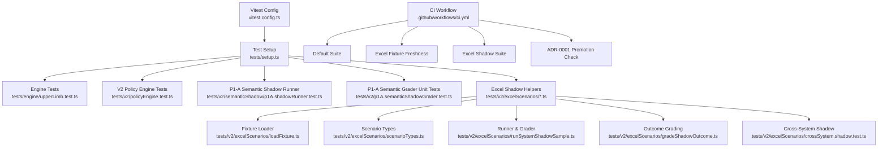
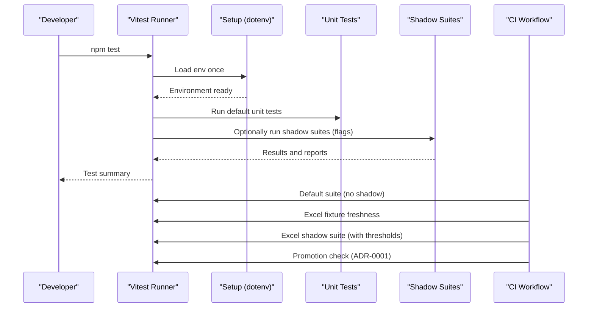
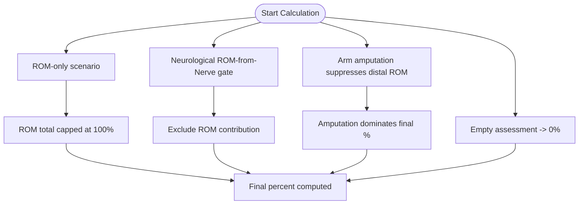
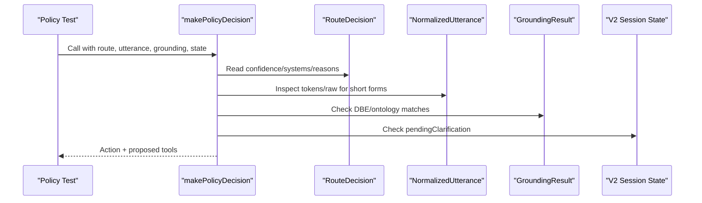
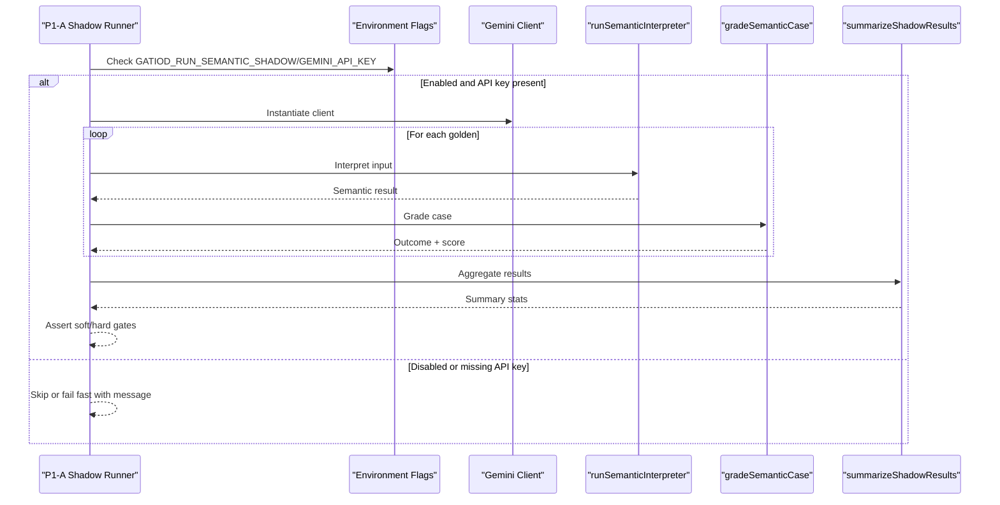
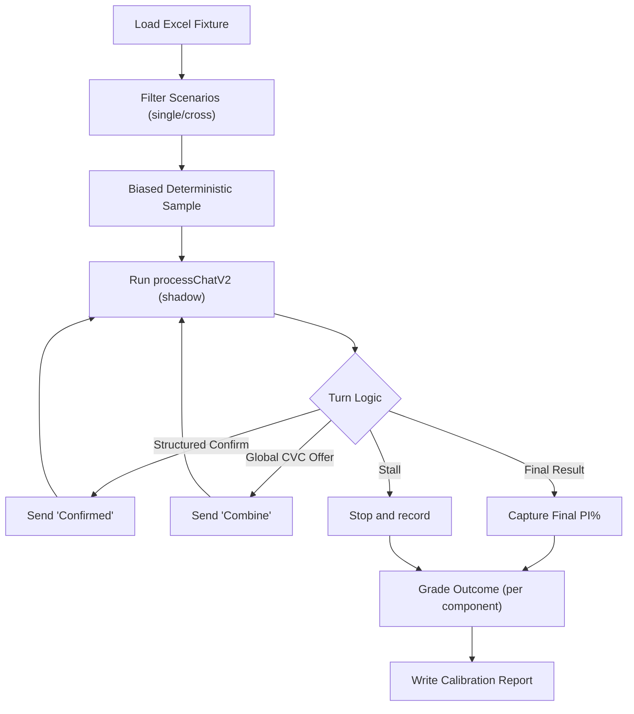
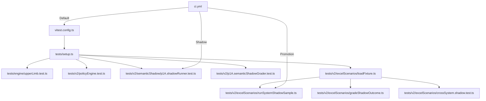

# Testing Strategy

<cite>
**Referenced Files in This Document**
- [vitest.config.ts](file://vitest.config.ts)
- [setup.ts](file://tests/setup.ts)
- [README.md](file://README.md)
- [ci.yml](file://.github/workflows/ci.yml)
- [upperLimb.test.ts](file://tests/engine/upperLimb.test.ts)
- [policyEngine.test.ts](file://tests/v2/policyEngine.test.ts)
- [p1A.shadowRunner.test.ts](file://tests/v2/semanticShadow/p1A.shadowRunner.test.ts)
- [p1A.semanticShadowGrader.test.ts](file://tests/v2/p1A.semanticShadowGrader.test.ts)
- [loadFixture.ts](file://tests/v2/excelScenarios/loadFixture.ts)
- [scenarioTypes.ts](file://tests/v2/excelScenarios/scenarioTypes.ts)
- [runSystemShadowSample.ts](file://tests/v2/excelScenarios/runSystemShadowSample.ts)
- [gradeShadowOutcome.ts](file://tests/v2/excelScenarios/gradeShadowOutcome.ts)
- [crossSystem.shadow.test.ts](file://tests/v2/excelScenarios/crossSystem.shadow.test.ts)
- [upperLimb.readinessAndArgBuilder.test.ts](file://tests/v2/upperLimb/readinessAndArgBuilder.test.ts)
- [0001-structured-live-promotion-gate.md](file://docs/adr/0001-structured-live-promotion-gate.md)
</cite>

## Table of Contents
1. [Introduction](#introduction)
2. [Project Structure](#project-structure)
3. [Core Components](#core-components)
4. [Architecture Overview](#architecture-overview)
5. [Detailed Component Analysis](#detailed-component-analysis)
6. [Dependency Analysis](#dependency-analysis)
7. [Performance Considerations](#performance-considerations)
8. [Troubleshooting Guide](#troubleshooting-guide)
9. [Conclusion](#conclusion)
10. [Appendices](#appendices)

## Introduction
This document defines the comprehensive testing strategy for the GATIOD Chat Assistant. It covers unit testing with Vitest, engine calculation validation, V2 pipeline testing, and integration testing methodologies. It documents the testing architecture, setup, mocks, and assertion patterns; provides examples of engine and policy validations; outlines semantic shadow testing; and establishes guidelines for writing new tests, managing test data, continuous integration, performance and regression testing, quality assurance, debugging, coverage, and best practices tailored for healthcare applications.

## Project Structure
The testing surface spans:
- Engine calculation tests under tests/engine
- V2 pipeline tests under tests/v2
- Scenario fixtures and shadow runners under tests/v2/excelScenarios
- Setup and configuration under vitest.config.ts and tests/setup.ts
- CI gates under .github/workflows/ci.yml

**Diagram sources**
- [vitest.config.ts:1-12](file://vitest.config.ts#L1-L12)
- [setup.ts:1-8](file://tests/setup.ts#L1-L8)
- [upperLimb.test.ts:1-156](file://tests/engine/upperLimb.test.ts#L1-L156)
- [policyEngine.test.ts:1-123](file://tests/v2/policyEngine.test.ts#L1-L123)
- [p1A.shadowRunner.test.ts:1-94](file://tests/v2/semanticShadow/p1A.shadowRunner.test.ts#L1-L94)
- [p1A.semanticShadowGrader.test.ts:1-323](file://tests/v2/p1A.semanticShadowGrader.test.ts#L1-L323)
- [loadFixture.ts:1-50](file://tests/v2/excelScenarios/loadFixture.ts#L1-L50)
- [scenarioTypes.ts:1-97](file://tests/v2/excelScenarios/scenarioTypes.ts#L1-L97)
- [runSystemShadowSample.ts:1-187](file://tests/v2/excelScenarios/runSystemShadowSample.ts#L1-L187)
- [gradeShadowOutcome.ts:1-180](file://tests/v2/excelScenarios/gradeShadowOutcome.ts#L1-L180)
- [crossSystem.shadow.test.ts:1-267](file://tests/v2/excelScenarios/crossSystem.shadow.test.ts#L1-L267)
- [ci.yml:1-60](file://.github/workflows/ci.yml#L1-L60)

**Section sources**
- [README.md:70-77](file://README.md#L70-L77)
- [vitest.config.ts:1-12](file://vitest.config.ts#L1-L12)
- [setup.ts:1-8](file://tests/setup.ts#L1-L8)

## Core Components
- Vitest configuration and setup:
  - Includes all tests under tests/**/*.test.ts and loads environment once via setup.ts.
  - Enables opt-in suites (e.g., semantic shadow) via environment flags.
- Engine calculation tests:
  - Validate pure calculation logic for upper limb (ROM lookup, amputation, combined values, final percent).
- V2 policy engine tests:
  - Validate routing decisions, grounding effects, and session-state-aware behavior.
- Semantic shadow runner:
  - Optional integration-grade test that evaluates the real semantic interpreter against curated goldens.
- Excel shadow runner:
  - End-to-end scenario-driven testing against the canonical workbook, with per-system and cross-system grading.
- Grading and reporting:
  - Outcome classification, safe-outcome and exact-calculation rates, and calibration reports.

**Section sources**
- [vitest.config.ts:1-12](file://vitest.config.ts#L1-L12)
- [setup.ts:1-8](file://tests/setup.ts#L1-L8)
- [upperLimb.test.ts:14-156](file://tests/engine/upperLimb.test.ts#L14-L156)
- [policyEngine.test.ts:20-123](file://tests/v2/policyEngine.test.ts#L20-L123)
- [p1A.shadowRunner.test.ts:10-94](file://tests/v2/semanticShadow/p1A.shadowRunner.test.ts#L10-L94)
- [crossSystem.shadow.test.ts:139-267](file://tests/v2/excelScenarios/crossSystem.shadow.test.ts#L139-L267)

## Architecture Overview
The testing architecture separates concerns into:
- Pure unit tests for deterministic calculations and policy logic
- Shadow runners for realistic, scenario-driven validation
- CI gates enforcing reproducibility and promotion criteria

**Diagram sources**
- [vitest.config.ts:3-11](file://vitest.config.ts#L3-L11)
- [setup.ts:1-8](file://tests/setup.ts#L1-L8)
- [ci.yml:26-60](file://.github/workflows/ci.yml#L26-L60)

## Detailed Component Analysis

### Engine Calculation Validation (Unit Tests)
Purpose:
- Validate deterministic calculation logic for upper limb PI% computation.

Key areas covered:
- Combined values chart and cap logic
- ROM lookup interpolation and boundary conditions
- Amputation scoring and caps
- Full assessment flow with neurological exclusion and suppression rules

Assertion patterns:
- Equality checks for exact values
- Range checks and tolerance comparisons
- Conditional suppression based on flags and anatomical constraints

**Diagram sources**
- [upperLimb.test.ts:84-156](file://tests/engine/upperLimb.test.ts#L84-L156)

**Section sources**
- [upperLimb.test.ts:14-156](file://tests/engine/upperLimb.test.ts#L14-L156)

### Policy Engine Validation (V2)
Purpose:
- Validate routing and tool-proposal decisions under varying confidence, grounding, and session states.

Key areas covered:
- Low-confidence forcing clarification
- Multi-system gating for global CVC
- Structured-live avoidance of lookup-first for confirmed DBE matches
- Prevention of repeated clarification prompts after explicit selection
- Short-form continuations treated as delegation

**Diagram sources**
- [policyEngine.test.ts:20-123](file://tests/v2/policyEngine.test.ts#L20-L123)

**Section sources**
- [policyEngine.test.ts:20-123](file://tests/v2/policyEngine.test.ts#L20-L123)

### Semantic Shadow Testing (P1-A)
Purpose:
- Optional integration-grade validation using a real LLM to interpret inputs and grade outcomes against curated goldens.

Opt-in mechanism:
- Controlled by environment flags; when enabled, tests invoke the real semantic interpreter and assert on outcome classes and safety.

**Diagram sources**
- [p1A.shadowRunner.test.ts:30-94](file://tests/v2/semanticShadow/p1A.shadowRunner.test.ts#L30-L94)

**Section sources**
- [p1A.shadowRunner.test.ts:10-94](file://tests/v2/semanticShadow/p1A.shadowRunner.test.ts#L10-L94)
- [p1A.semanticShadowGrader.test.ts:10-323](file://tests/v2/p1A.semanticShadowGrader.test.ts#L10-L323)

### Excel Shadow Runner (Per-System and Cross-System)
Purpose:
- Enforce ADR-0001 promotion thresholds by driving realistic multi-turn conversations against the workbook scenarios.

Per-system shadow:
- Loads scenarios, runs processChatV2, grades outcomes, and writes calibration reports.
- Applies deterministic sampling and ADR-0001 thresholds per system.

Cross-system shadow:
- Validates Global CVC end-to-end across multiple components, measuring offer/executed rates and final PI% match.

**Diagram sources**
- [runSystemShadowSample.ts:100-187](file://tests/v2/excelScenarios/runSystemShadowSample.ts#L100-L187)
- [gradeShadowOutcome.ts:36-128](file://tests/v2/excelScenarios/gradeShadowOutcome.ts#L36-L128)
- [crossSystem.shadow.test.ts:139-267](file://tests/v2/excelScenarios/crossSystem.shadow.test.ts#L139-L267)

**Section sources**
- [loadFixture.ts:16-50](file://tests/v2/excelScenarios/loadFixture.ts#L16-L50)
- [scenarioTypes.ts:7-97](file://tests/v2/excelScenarios/scenarioTypes.ts#L7-L97)
- [runSystemShadowSample.ts:34-82](file://tests/v2/excelScenarios/runSystemShadowSample.ts#L34-L82)
- [gradeShadowOutcome.ts:164-180](file://tests/v2/excelScenarios/gradeShadowOutcome.ts#L164-L180)
- [crossSystem.shadow.test.ts:139-267](file://tests/v2/excelScenarios/crossSystem.shadow.test.ts#L139-L267)

### Readiness and Argument Builder Validation (V2 Upper Limb)
Purpose:
- Validate readiness checks and argument construction for the upper limb system, including schema validation and provenance tracking.

Key areas covered:
- Pending observations, missing side, and rom-from-nerve gate
- Zero-fill behavior and schema validation for invalid inputs
- Provenance tracking via factsHash

**Section sources**
- [upperLimb.readinessAndArgBuilder.test.ts:19-85](file://tests/v2/upperLimb/readinessAndArgBuilder.test.ts#L19-L85)
- [upperLimb.readinessAndArgBuilder.test.ts:89-156](file://tests/v2/upperLimb/readinessAndArgBuilder.test.ts#L89-L156)

## Dependency Analysis
- Test configuration depends on dotenv loading for optional suites.
- Shadow runners depend on V2 contracts and state machine internals.
- Excel shadow runner depends on scenario fixtures and grading logic.
- CI workflow orchestrates default tests, fixture freshness, shadow suite, and promotion checks.

**Diagram sources**
- [vitest.config.ts:1-12](file://vitest.config.ts#L1-L12)
- [setup.ts:1-8](file://tests/setup.ts#L1-L8)
- [upperLimb.test.ts:1-156](file://tests/engine/upperLimb.test.ts#L1-L156)
- [policyEngine.test.ts:1-123](file://tests/v2/policyEngine.test.ts#L1-L123)
- [p1A.shadowRunner.test.ts:1-94](file://tests/v2/semanticShadow/p1A.shadowRunner.test.ts#L1-L94)
- [p1A.semanticShadowGrader.test.ts:1-323](file://tests/v2/p1A.semanticShadowGrader.test.ts#L1-L323)
- [loadFixture.ts:1-50](file://tests/v2/excelScenarios/loadFixture.ts#L1-L50)
- [runSystemShadowSample.ts:1-187](file://tests/v2/excelScenarios/runSystemShadowSample.ts#L1-L187)
- [gradeShadowOutcome.ts:1-180](file://tests/v2/excelScenarios/gradeShadowOutcome.ts#L1-L180)
- [crossSystem.shadow.test.ts:1-267](file://tests/v2/excelScenarios/crossSystem.shadow.test.ts#L1-L267)
- [ci.yml:1-60](file://.github/workflows/ci.yml#L1-L60)

**Section sources**
- [vitest.config.ts:1-12](file://vitest.config.ts#L1-L12)
- [ci.yml:26-60](file://.github/workflows/ci.yml#L26-L60)

## Performance Considerations
- Shadow runners are opt-in and can be slow; use environment flags to control execution.
- Prefer deterministic sampling strategies to keep test runs predictable and fast.
- Use memory-backed databases for shadow runs to avoid I/O overhead.
- Keep assertion timeouts reasonable; long-running suites should be isolated from default CI.

[No sources needed since this section provides general guidance]

## Troubleshooting Guide
Common issues and resolutions:
- Missing environment variables for optional suites:
  - Ensure dotenv is loaded once via setup.ts and environment flags are set appropriately.
- Semantic shadow runner skips unexpectedly:
  - Verify both the opt-in flag and API key are set; the runner will fail fast with a clear message if the API key is missing.
- Excel shadow runner stalls or errors:
  - Check session state and tool plan outputs; ensure shadow mode is enabled and the assistant responds as expected.
- CI failures on fixture freshness:
  - Regenerate the Excel fixture and commit the updated JSON; CI enforces that the generated file matches the workbook.

**Section sources**
- [setup.ts:1-8](file://tests/setup.ts#L1-L8)
- [p1A.shadowRunner.test.ts:37-44](file://tests/v2/semanticShadow/p1A.shadowRunner.test.ts#L37-L44)
- [ci.yml:45-48](file://.github/workflows/ci.yml#L45-L48)

## Conclusion
The testing strategy combines deterministic unit tests, scenario-driven shadow validation, and CI-enforced promotion gates. Engine and policy logic are validated in isolation, while shadow runners simulate real-world interactions. The architecture supports opt-in integration tests, robust reporting, and strict quality gates aligned with ADR-0001.

[No sources needed since this section summarizes without analyzing specific files]

## Appendices

### Writing New Tests
Guidelines:
- Place unit tests under tests/engine or tests/v2 according to scope.
- Use descriptive describe/it blocks and clear assertions.
- For V2 tests, construct minimal, valid inputs and assert on outcomes and tool plans.
- For shadow tests, use environment flags to gate optional integrations.
- Keep test data in fixtures or constants; avoid embedding large literals inline.

**Section sources**
- [README.md:70-77](file://README.md#L70-L77)
- [vitest.config.ts:3-11](file://vitest.config.ts#L3-L11)

### Test Data Management
- Excel fixtures are generated from the workbook and committed; CI enforces freshness.
- Scenario types define expected outcome classes and overrides; maintain these consistently.
- Shadow runners write calibration reports for post-run analysis.

**Section sources**
- [0001-structured-live-promotion-gate.md:13-17](file://docs/adr/0001-structured-live-promotion-gate.md#L13-L17)
- [scenarioTypes.ts:7-97](file://tests/v2/excelScenarios/scenarioTypes.ts#L7-L97)
- [runSystemShadowSample.ts:182-186](file://tests/v2/excelScenarios/runSystemShadowSample.ts#L182-L186)

### Continuous Integration Testing
- Default CI runs type check, default test suite, and promotion checks.
- Excel shadow suite is gated behind an environment flag and ADR-0001 thresholds.
- Promotion checks validate that every structured_live system meets current thresholds.

**Section sources**
- [ci.yml:26-60](file://.github/workflows/ci.yml#L26-L60)
- [0001-structured-live-promotion-gate.md:38-56](file://docs/adr/0001-structured-live-promotion-gate.md#L38-L56)

### Performance and Regression Testing
- Use opt-in shadow suites for performance-sensitive validations.
- Track safe-outcome and exact-calculation rates; regressions are flagged by thresholds.
- Maintain deterministic sampling to ensure stable baselines across runs.

**Section sources**
- [runSystemShadowSample.ts:34-82](file://tests/v2/excelScenarios/runSystemShadowSample.ts#L34-L82)
- [crossSystem.shadow.test.ts:250-266](file://tests/v2/excelScenarios/crossSystem.shadow.test.ts#L250-L266)

### Quality Assurance Processes
- Hard gates: unsafe outcomes must be zero in shadow runners.
- Soft gates: minimum pass rates for curated sets.
- Promotion gates: structured_live systems must meet per-system thresholds continuously.

**Section sources**
- [p1A.shadowRunner.test.ts:21-28](file://tests/v2/semanticShadow/p1A.shadowRunner.test.ts#L21-L28)
- [0001-structured-live-promotion-gate.md:29-56](file://docs/adr/0001-structured-live-promotion-gate.md#L29-L56)

### Debugging Techniques
- Enable verbose logging in shadow runners to inspect per-case grades.
- Use calibration reports to identify mismatches and refine expectations.
- Validate readiness and argument builders with minimal, targeted inputs.

**Section sources**
- [p1A.shadowRunner.test.ts:63-81](file://tests/v2/semanticShadow/p1A.shadowRunner.test.ts#L63-L81)
- [runSystemShadowSample.ts:140-177](file://tests/v2/excelScenarios/runSystemShadowSample.ts#L140-L177)

### Coverage Requirements and Best Practices for Healthcare
- Prefer deterministic unit tests for core logic; ensure boundary conditions are covered.
- Use shadow runners to validate real-world scenarios and safety.
- Maintain clear outcome classes and hard/soft gates to prevent silent regressions.
- Keep environment-controlled opt-in suites to preserve CI performance while enabling deep validation.

[No sources needed since this section provides general guidance]