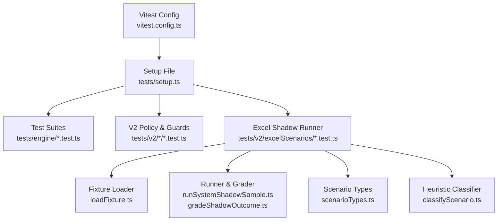
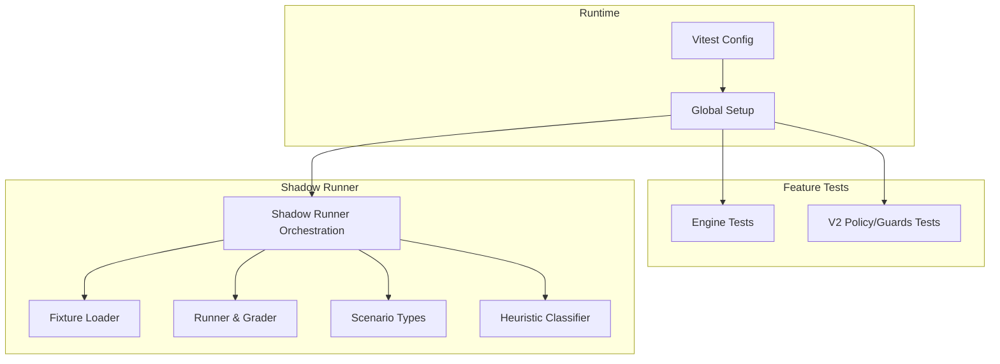
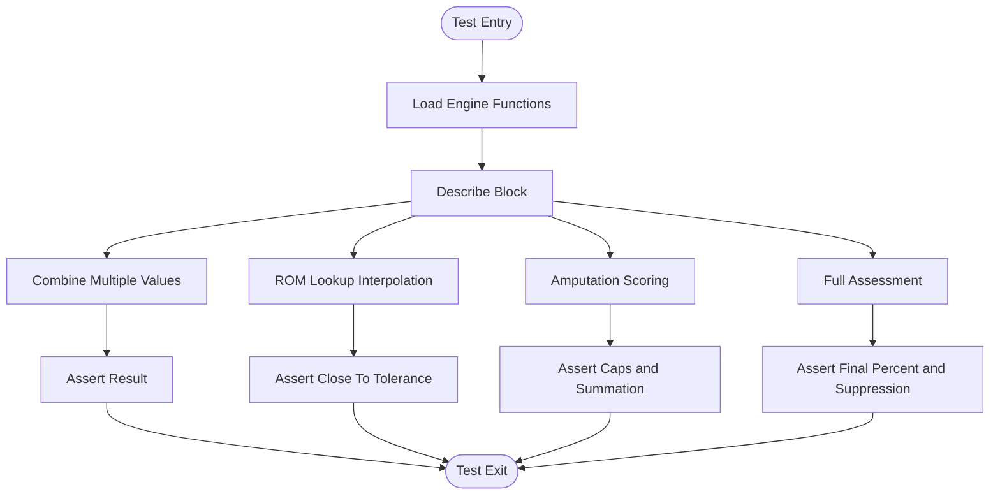
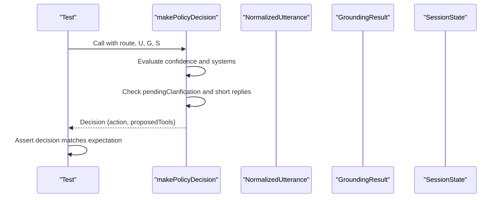
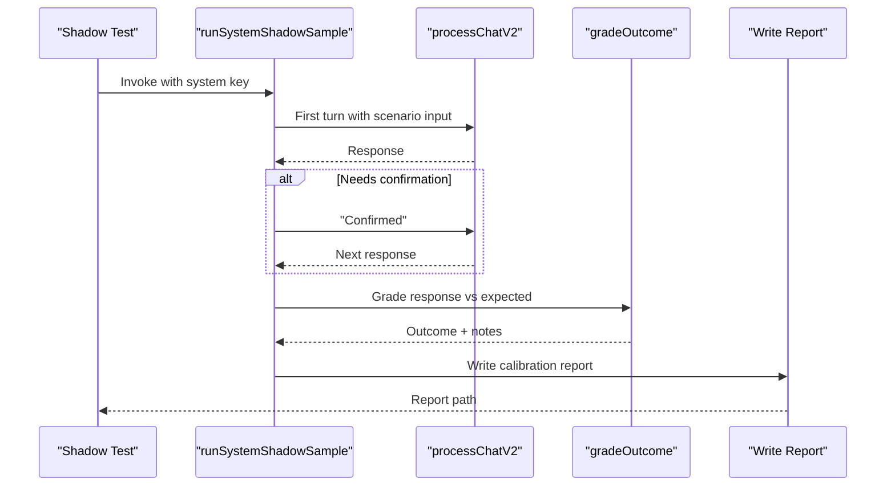
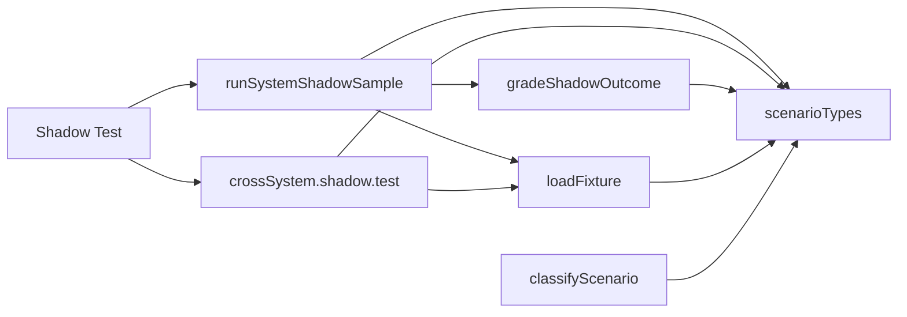

# Unit Testing Framework

<cite>
**Referenced Files in This Document**
- [vitest.config.ts](file://vitest.config.ts)
- [tests/setup.ts](file://tests/setup.ts)
- [tests/engine/upperLimb.test.ts](file://tests/engine/upperLimb.test.ts)
- [tests/v2/upperLimb/guards.test.ts](file://tests/v2/upperLimb/guards.test.ts)
- [tests/v2/policyEngine.test.ts](file://tests/v2/policyEngine.test.ts)
- [tests/v2/excelScenarios/upperLimb.shadow.test.ts](file://tests/v2/excelScenarios/upperLimb.shadow.test.ts)
- [tests/v2/excelScenarios/crossSystem.shadow.test.ts](file://tests/v2/excelScenarios/crossSystem.shadow.test.ts)
- [tests/v2/excelScenarios/loadFixture.ts](file://tests/v2/excelScenarios/loadFixture.ts)
- [tests/v2/excelScenarios/runSystemShadowSample.ts](file://tests/v2/excelScenarios/runSystemShadowSample.ts)
- [tests/v2/excelScenarios/gradeShadowOutcome.ts](file://tests/v2/excelScenarios/gradeShadowOutcome.ts)
- [tests/v2/excelScenarios/classifyScenario.ts](file://tests/v2/excelScenarios/classifyScenario.ts)
- [tests/v2/excelScenarios/scenarioTypes.ts](file://tests/v2/excelScenarios/scenarioTypes.ts)
</cite>

## Table of Contents
1. [Introduction](#introduction)
2. [Project Structure](#project-structure)
3. [Core Components](#core-components)
4. [Architecture Overview](#architecture-overview)
5. [Detailed Component Analysis](#detailed-component-analysis)
6. [Dependency Analysis](#dependency-analysis)
7. [Performance Considerations](#performance-considerations)
8. [Troubleshooting Guide](#troubleshooting-guide)
9. [Conclusion](#conclusion)
10. [Appendices](#appendices)

## Introduction
This document explains the unit testing framework built with Vitest in the GATIOD codebase. It covers configuration, setup, and architecture; demonstrates how to write effective unit tests for TypeScript components; documents mocking strategies, assertion patterns, and test organization; describes the test environment setup and dotenv configuration for API keys; and outlines test isolation techniques. It also includes examples of testing calculation engines, service functions, and utility modules, along with guidelines for naming, test data management, and maintaining test reliability. Common testing patterns used across the codebase are highlighted.

## Project Structure
The testing system is organized around Vitest’s conventions and the repository’s layered architecture:
- Tests are colocated under a dedicated tests directory, grouped by feature area (engine, v2, etc.).
- Vitest configuration defines inclusion patterns and a global setup file.
- The global setup loads environment variables once for all tests, enabling optional integrations that require API keys.
- Specialized shadow runners orchestrate end-to-end scenarios using generated fixtures and write calibration reports.

**Diagram sources**
- [vitest.config.ts:1-12](file://vitest.config.ts#L1-L12)
- [tests/setup.ts:1-8](file://tests/setup.ts#L1-L8)
- [tests/engine/upperLimb.test.ts:1-156](file://tests/engine/upperLimb.test.ts#L1-L156)
- [tests/v2/upperLimb/guards.test.ts:1-71](file://tests/v2/upperLimb/guards.test.ts#L1-L71)
- [tests/v2/policyEngine.test.ts:1-123](file://tests/v2/policyEngine.test.ts#L1-L123)
- [tests/v2/excelScenarios/upperLimb.shadow.test.ts:1-26](file://tests/v2/excelScenarios/upperLimb.shadow.test.ts#L1-L26)
- [tests/v2/excelScenarios/crossSystem.shadow.test.ts:1-267](file://tests/v2/excelScenarios/crossSystem.shadow.test.ts#L1-L267)
- [tests/v2/excelScenarios/loadFixture.ts:1-50](file://tests/v2/excelScenarios/loadFixture.ts#L1-L50)
- [tests/v2/excelScenarios/runSystemShadowSample.ts:1-187](file://tests/v2/excelScenarios/runSystemShadowSample.ts#L1-L187)
- [tests/v2/excelScenarios/gradeShadowOutcome.ts:1-180](file://tests/v2/excelScenarios/gradeShadowOutcome.ts#L1-L180)
- [tests/v2/excelScenarios/classifyScenario.ts:1-291](file://tests/v2/excelScenarios/classifyScenario.ts#L1-L291)
- [tests/v2/excelScenarios/scenarioTypes.ts:1-97](file://tests/v2/excelScenarios/scenarioTypes.ts#L1-L97)

**Section sources**
- [vitest.config.ts:1-12](file://vitest.config.ts#L1-L12)
- [tests/setup.ts:1-8](file://tests/setup.ts#L1-L8)

## Core Components
- Vitest configuration: Defines test inclusion patterns and a setup file for environment loading.
- Global setup: Loads environment variables once before all tests to enable optional integrations requiring API keys.
- Engine tests: Validate calculation logic for body systems (e.g., upper limb).
- V2 policy and guards tests: Verify routing decisions and response validation logic.
- Excel shadow runner suite: Orchestrates multi-turn scenarios, grades outcomes, and enforces ADR-0001 thresholds.

Key responsibilities:
- Configuration and environment: Ensures consistent test runtime and optional external API access.
- Assertion patterns: Uses expect-style assertions with descriptive messages and tolerance checks.
- Test isolation: Uses beforeEach/beforeAll sparingly; relies on pure functions and controlled inputs.
- Data-driven testing: Leverages generated fixtures and deterministic sampling for reproducibility.

**Section sources**
- [vitest.config.ts:1-12](file://vitest.config.ts#L1-L12)
- [tests/setup.ts:1-8](file://tests/setup.ts#L1-L8)
- [tests/engine/upperLimb.test.ts:1-156](file://tests/engine/upperLimb.test.ts#L1-L156)
- [tests/v2/upperLimb/guards.test.ts:1-71](file://tests/v2/upperLimb/guards.test.ts#L1-L71)
- [tests/v2/policyEngine.test.ts:1-123](file://tests/v2/policyEngine.test.ts#L1-L123)
- [tests/v2/excelScenarios/upperLimb.shadow.test.ts:1-26](file://tests/v2/excelScenarios/upperLimb.shadow.test.ts#L1-L26)

## Architecture Overview
The testing architecture separates concerns across layers:
- Layer 1: Vitest runtime and environment setup.
- Layer 2: Feature-specific test suites (engine, v2).
- Layer 3: Shadow runner orchestration, fixture loading, grading, and reporting.
- Layer 4: Scenario classification and outcome typing.

**Diagram sources**
- [vitest.config.ts:1-12](file://vitest.config.ts#L1-L12)
- [tests/setup.ts:1-8](file://tests/setup.ts#L1-L8)
- [tests/engine/upperLimb.test.ts:1-156](file://tests/engine/upperLimb.test.ts#L1-L156)
- [tests/v2/upperLimb/guards.test.ts:1-71](file://tests/v2/upperLimb/guards.test.ts#L1-L71)
- [tests/v2/policyEngine.test.ts:1-123](file://tests/v2/policyEngine.test.ts#L1-L123)
- [tests/v2/excelScenarios/upperLimb.shadow.test.ts:1-26](file://tests/v2/excelScenarios/upperLimb.shadow.test.ts#L1-L26)
- [tests/v2/excelScenarios/crossSystem.shadow.test.ts:1-267](file://tests/v2/excelScenarios/crossSystem.shadow.test.ts#L1-L267)
- [tests/v2/excelScenarios/loadFixture.ts:1-50](file://tests/v2/excelScenarios/loadFixture.ts#L1-L50)
- [tests/v2/excelScenarios/runSystemShadowSample.ts:1-187](file://tests/v2/excelScenarios/runSystemShadowSample.ts#L1-L187)
- [tests/v2/excelScenarios/gradeShadowOutcome.ts:1-180](file://tests/v2/excelScenarios/gradeShadowOutcome.ts#L1-L180)
- [tests/v2/excelScenarios/classifyScenario.ts:1-291](file://tests/v2/excelScenarios/classifyScenario.ts#L1-L291)
- [tests/v2/excelScenarios/scenarioTypes.ts:1-97](file://tests/v2/excelScenarios/scenarioTypes.ts#L1-L97)

## Detailed Component Analysis

### Vitest Configuration and Environment Setup
- Configuration:
  - Includes all test files matching the pattern under tests/.
  - Registers a setup file to initialize environment variables once before all tests.
- Environment setup:
  - Loads .env globally so optional tests can read API keys without repeating dotenv configuration per test.

Best practices:
- Keep setup minimal and deterministic.
- Avoid side effects in setup; rely on environment variables for opt-in integrations.

**Section sources**
- [vitest.config.ts:1-12](file://vitest.config.ts#L1-L12)
- [tests/setup.ts:1-8](file://tests/setup.ts#L1-L8)

### Engine Tests: Upper Limb Calculation
Purpose:
- Validate calculation engine logic for upper limb assessments, including ROM lookup, amputation scoring, and combined values.

Key patterns:
- Pure function tests: Inputs are explicit and deterministic; outputs are asserted with strict equality or tolerance.
- Edge-case coverage: Empty arrays, caps at limits, interpolation behavior.
- Composition checks: Combined calculations and suppression rules (e.g., amputation overrides distal structures).

**Diagram sources**
- [tests/engine/upperLimb.test.ts:1-156](file://tests/engine/upperLimb.test.ts#L1-L156)

**Section sources**
- [tests/engine/upperLimb.test.ts:1-156](file://tests/engine/upperLimb.test.ts#L1-L156)

### V2 Policy and Guards Tests
Purpose:
- Validate routing decisions and response validation logic for the V2 pipeline.

Patterns:
- Construct minimal, typed fixtures for contracts and state machines.
- Assert action selection, tool proposals, and guard conditions.
- Guard tests validate legacy language detection and rendering rules.

**Diagram sources**
- [tests/v2/policyEngine.test.ts:1-123](file://tests/v2/policyEngine.test.ts#L1-L123)

**Section sources**
- [tests/v2/upperLimb/guards.test.ts:1-71](file://tests/v2/upperLimb/guards.test.ts#L1-L71)
- [tests/v2/policyEngine.test.ts:1-123](file://tests/v2/policyEngine.test.ts#L1-L123)

### Excel Shadow Runner Suite
Purpose:
- Drive multi-turn conversations using generated Excel scenarios, grade outcomes, and enforce ADR-0001 thresholds.

Key components:
- Fixture loader: Reads and caches the generated JSON fixture; filters scenarios by system or cross-system.
- Runner: Executes chats, handles confirmation cards and lookup confirmations, captures mismatches, and writes calibration reports.
- Grader: Maps observed outcomes to expected classes and computes pass/fail thresholds.
- Heuristic classifier: Determines expected outcome classes based on workbook content and domain heuristics.
- Scenario types: Strongly typed structures for fixtures and overrides.

**Diagram sources**
- [tests/v2/excelScenarios/upperLimb.shadow.test.ts:1-26](file://tests/v2/excelScenarios/upperLimb.shadow.test.ts#L1-L26)
- [tests/v2/excelScenarios/runSystemShadowSample.ts:1-187](file://tests/v2/excelScenarios/runSystemShadowSample.ts#L1-L187)
- [tests/v2/excelScenarios/gradeShadowOutcome.ts:1-180](file://tests/v2/excelScenarios/gradeShadowOutcome.ts#L1-L180)

**Section sources**
- [tests/v2/excelScenarios/upperLimb.shadow.test.ts:1-26](file://tests/v2/excelScenarios/upperLimb.shadow.test.ts#L1-L26)
- [tests/v2/excelScenarios/crossSystem.shadow.test.ts:1-267](file://tests/v2/excelScenarios/crossSystem.shadow.test.ts#L1-L267)
- [tests/v2/excelScenarios/loadFixture.ts:1-50](file://tests/v2/excelScenarios/loadFixture.ts#L1-L50)
- [tests/v2/excelScenarios/runSystemShadowSample.ts:1-187](file://tests/v2/excelScenarios/runSystemShadowSample.ts#L1-L187)
- [tests/v2/excelScenarios/gradeShadowOutcome.ts:1-180](file://tests/v2/excelScenarios/gradeShadowOutcome.ts#L1-L180)
- [tests/v2/excelScenarios/classifyScenario.ts:1-291](file://tests/v2/excelScenarios/classifyScenario.ts#L1-L291)
- [tests/v2/excelScenarios/scenarioTypes.ts:1-97](file://tests/v2/excelScenarios/scenarioTypes.ts#L1-L97)

### Cross-System Shadow Runner
Purpose:
- Validate Global CVC end-to-end behavior across cross-system scenarios, computing rates for live-only and mixed rows.

Highlights:
- Biased deterministic sampling ensures live-only rows are always included.
- Multi-turn orchestration simulates confirmation cards and “Combine” actions.
- Aggregated metrics and per-row reports are written for auditing.

**Section sources**
- [tests/v2/excelScenarios/crossSystem.shadow.test.ts:1-267](file://tests/v2/excelScenarios/crossSystem.shadow.test.ts#L1-L267)

## Dependency Analysis
The shadow runner suite exhibits tight coupling between modules, which is intentional for end-to-end validation:
- Shadow tests depend on the runner and grader.
- Runner depends on the fixture loader and scenario types.
- Grader depends on scenario types and contracts.
- Heuristic classifier depends on scenario types and system-specific rules.

**Diagram sources**
- [tests/v2/excelScenarios/upperLimb.shadow.test.ts:1-26](file://tests/v2/excelScenarios/upperLimb.shadow.test.ts#L1-L26)
- [tests/v2/excelScenarios/crossSystem.shadow.test.ts:1-267](file://tests/v2/excelScenarios/crossSystem.shadow.test.ts#L1-L267)
- [tests/v2/excelScenarios/loadFixture.ts:1-50](file://tests/v2/excelScenarios/loadFixture.ts#L1-L50)
- [tests/v2/excelScenarios/runSystemShadowSample.ts:1-187](file://tests/v2/excelScenarios/runSystemShadowSample.ts#L1-L187)
- [tests/v2/excelScenarios/gradeShadowOutcome.ts:1-180](file://tests/v2/excelScenarios/gradeShadowOutcome.ts#L1-L180)
- [tests/v2/excelScenarios/classifyScenario.ts:1-291](file://tests/v2/excelScenarios/classifyScenario.ts#L1-L291)
- [tests/v2/excelScenarios/scenarioTypes.ts:1-97](file://tests/v2/excelScenarios/scenarioTypes.ts#L1-L97)

**Section sources**
- [tests/v2/excelScenarios/upperLimb.shadow.test.ts:1-26](file://tests/v2/excelScenarios/upperLimb.shadow.test.ts#L1-L26)
- [tests/v2/excelScenarios/crossSystem.shadow.test.ts:1-267](file://tests/v2/excelScenarios/crossSystem.shadow.test.ts#L1-L267)
- [tests/v2/excelScenarios/loadFixture.ts:1-50](file://tests/v2/excelScenarios/loadFixture.ts#L1-L50)
- [tests/v2/excelScenarios/runSystemShadowSample.ts:1-187](file://tests/v2/excelScenarios/runSystemShadowSample.ts#L1-L187)
- [tests/v2/excelScenarios/gradeShadowOutcome.ts:1-180](file://tests/v2/excelScenarios/gradeShadowOutcome.ts#L1-L180)
- [tests/v2/excelScenarios/classifyScenario.ts:1-291](file://tests/v2/excelScenarios/classifyScenario.ts#L1-L291)
- [tests/v2/excelScenarios/scenarioTypes.ts:1-97](file://tests/v2/excelScenarios/scenarioTypes.ts#L1-L97)

## Performance Considerations
- Shadow runner tests can be slow due to multi-turn conversations and optional external API calls. Use opt-in environment flags to run subsets and avoid unnecessary network calls.
- Deterministic sampling reduces variability and speeds up feedback loops.
- Prefer in-memory databases for ephemeral state during shadow runs to minimize I/O overhead.
- Keep assertion logic concise and targeted to reduce test runtime.

## Troubleshooting Guide
Common issues and resolutions:
- Missing environment variables:
  - Ensure the global setup loads .env and that optional environment flags are set appropriately for opt-in tests.
- Long-running shadow tests:
  - Use EXCEL_SCENARIO_SAMPLE to limit sample size and EXCEL_SCENARIO_FULL to run the entire dataset when needed.
- API-dependent tests:
  - Set GATIOD_RUN_SEMANTIC_SHADOW or related flags to enable optional integrations that require API keys.
- Assertion failures in shadow runner:
  - Review mismatch samples written to calibration reports and adjust expectations or overrides accordingly.
- Cross-system gating:
  - Confirm that live-only rows are prioritized in sampling and that thresholds align with ADR-0001.

**Section sources**
- [tests/setup.ts:1-8](file://tests/setup.ts#L1-L8)
- [tests/v2/excelScenarios/runSystemShadowSample.ts:1-187](file://tests/v2/excelScenarios/runSystemShadowSample.ts#L1-L187)
- [tests/v2/excelScenarios/gradeShadowOutcome.ts:1-180](file://tests/v2/excelScenarios/gradeShadowOutcome.ts#L1-L180)

## Conclusion
The GATIOD unit testing framework leverages Vitest with a focused configuration and global setup to support both isolated unit tests and comprehensive shadow runner validations. By organizing tests by feature, using deterministic fixtures, and enforcing clear assertion patterns, the suite maintains reliability and readability. The shadow runner suite provides strong guarantees for system-wide behavior, while engine and policy tests ensure correctness at the component level.

## Appendices

### Writing Effective Unit Tests
- Naming conventions:
  - Use descriptive test names that state the scenario and expected outcome.
  - Group related tests under describe blocks with clear contexts.
- Assertion patterns:
  - Prefer strict equality for exact values and tolerance checks for floating-point comparisons.
  - Include meaningful messages to aid debugging.
- Test organization:
  - Place tests adjacent to the code they validate.
  - Use helper factories for constructing complex inputs consistently.
- Mocking strategies:
  - Favor pure functions and controlled inputs over heavy mocking.
  - When mocking is necessary, isolate side effects and reset state between tests.
- Test data management:
  - Use fixtures for large datasets; keep them versioned and deterministic.
  - Prefer deterministic sampling for reproducibility.
- Test isolation:
  - Avoid shared mutable state; use lightweight setup per test when needed.
  - Use environment variables to toggle optional integrations.

### Example Patterns from the Codebase
- Engine calculation tests:
  - Validate edge cases and composition rules for combined values and ROM lookup.
- Policy decision tests:
  - Assert routing actions and tool proposals based on confidence and grounding.
- Shadow runner tests:
  - Drive multi-turn flows, capture mismatches, and enforce ADR-0001 thresholds.

[No sources needed since this section summarizes patterns already cited above]