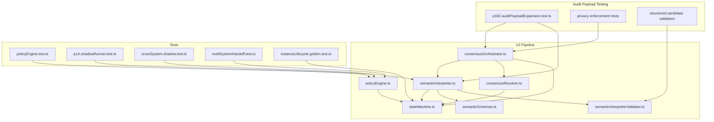
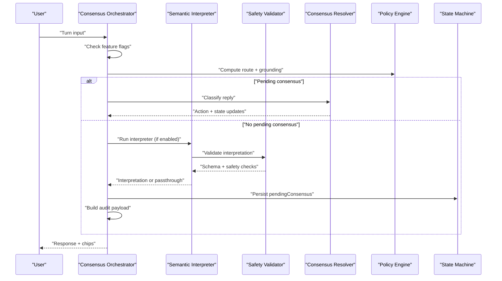
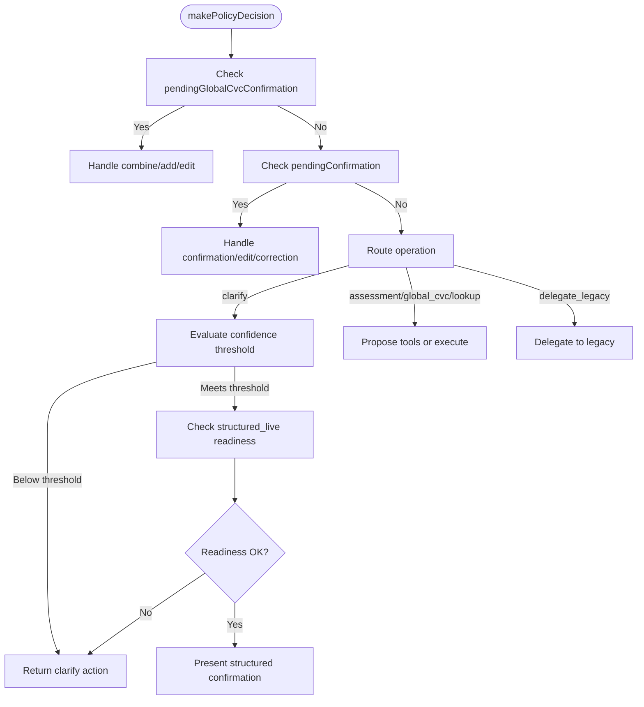
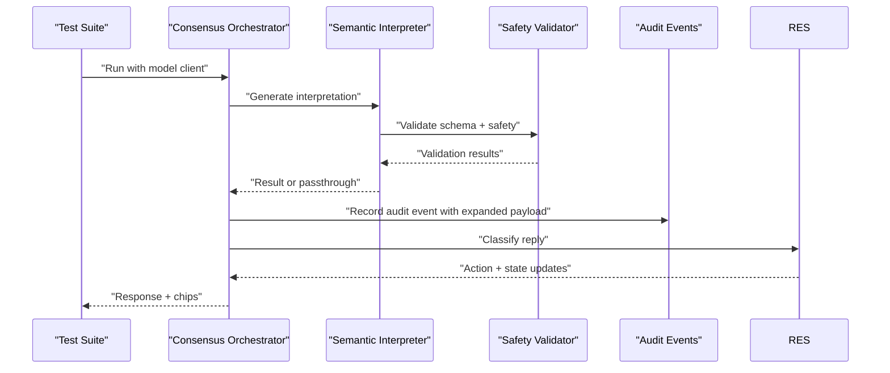
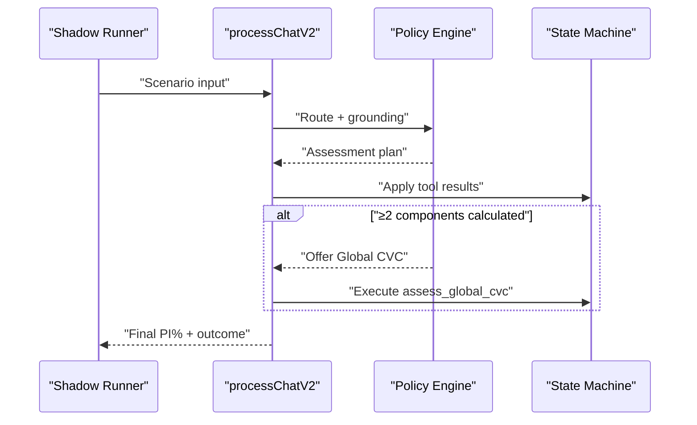
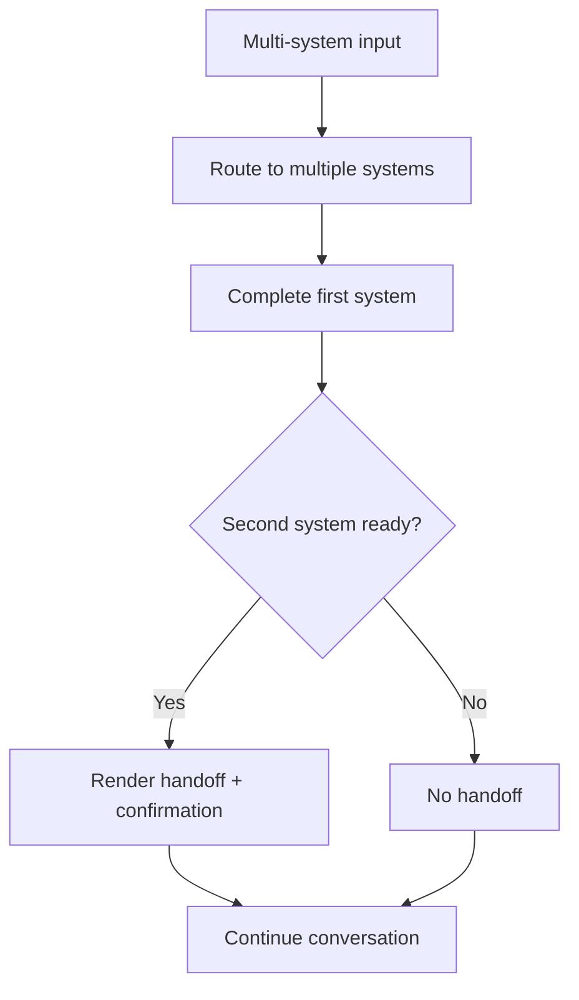
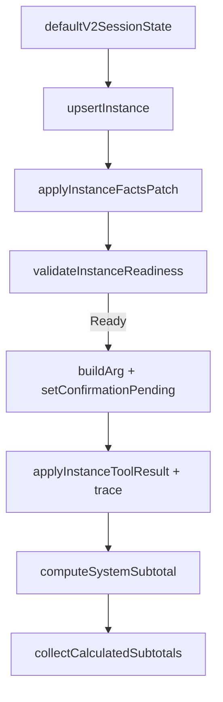
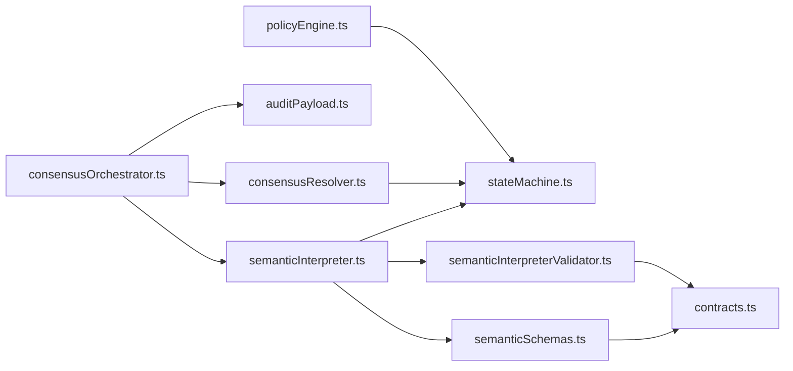

# V2 Pipeline Testing

<cite>
**Referenced Files in This Document**
- [README.md](file://README.md)
- [docs/v2/README.md](file://docs/v2/README.md)
- [gatiod_conversation_policy_data/README.md](file://gatiod_conversation_policy_data/README.md)
- [src/v2/policyEngine.ts](file://src/v2/policyEngine.ts)
- [src/v2/semanticInterpreter.ts](file://src/v2/semanticInterpreter.ts)
- [src/v2/consensusOrchestrator.ts](file://src/v2/consensusOrchestrator.ts)
- [src/v2/consensusResolver.ts](file://src/v2/consensusResolver.ts)
- [src/v2/stateMachine.ts](file://src/v2/stateMachine.ts)
- [src/v2/semanticInterpreterValidator.ts](file://src/v2/semanticInterpreterValidator.ts)
- [src/v2/semanticSchemas.ts](file://src/v2/semanticSchemas.ts)
- [src/v2/contracts.ts](file://src/v2/contracts.ts)
- [tests/v2/policyEngine.test.ts](file://tests/v2/policyEngine.test.ts)
- [tests/v2/semanticShadow/p1A.shadowRunner.test.ts](file://tests/v2/semanticShadow/p1A.shadowRunner.test.ts)
- [tests/v2/excelScenarios/crossSystem.shadow.test.ts](file://tests/v2/excelScenarios/crossSystem.shadow.test.ts)
- [tests/v2/multiSystemHandoff.test.ts](file://tests/v2/multiSystemHandoff.test.ts)
- [tests/v2/instanceLifecycle.golden.test.ts](file://tests/v2/instanceLifecycle.golden.test.ts)
- [tests/v2/p1B2.auditPayloadExpansion.test.ts](file://tests/v2/p1B2.auditPayloadExpansion.test.ts)
</cite>

## Update Summary
**Changes Made**
- Added comprehensive audit payload testing methodology section
- Updated semantic interpretation and consensus testing to include expanded payload validation
- Enhanced privacy enforcement testing documentation
- Added structured candidate systems and findings validation procedures
- Updated security and compliance testing guidelines

## Table of Contents
1. [Introduction](#introduction)
2. [Project Structure](#project-structure)
3. [Core Components](#core-components)
4. [Architecture Overview](#architecture-overview)
5. [Detailed Component Analysis](#detailed-component-analysis)
6. [Audit Payload Testing Methodology](#audit-payload-testing-methodology)
7. [Privacy and Security Testing](#privacy-and-security-testing)
8. [Dependency Analysis](#dependency-analysis)
9. [Performance Considerations](#performance-considerations)
10. [Troubleshooting Guide](#troubleshooting-guide)
11. [Conclusion](#conclusion)
12. [Appendices](#appendices)

## Introduction
This document describes testing methodologies for the V2 pipeline, focusing on advanced semantic interpretation, consensus building, and multi-system coordination. It covers policy engine validation, semantic shadow testing, and end-to-end system integration workflows. The testing framework now includes comprehensive audit payload validation, structured candidate systems testing, privacy enforcement verification, and security compliance validation for the expanded semantic interpretation functionality.

## Project Structure
The V2 pipeline is implemented across modular components that orchestrate semantic interpretation, consensus, policy decisions, and system-level state transitions. Tests validate discrete slices and end-to-end scenarios, including shadow runs against curated datasets, multi-system handoffs, and comprehensive audit payload validation.

**Diagram sources**
- [src/v2/policyEngine.ts:93-564](file://src/v2/policyEngine.ts#L93-L564)
- [src/v2/semanticInterpreter.ts:145-218](file://src/v2/semanticInterpreter.ts#L145-L218)
- [src/v2/consensusOrchestrator.ts:179-424](file://src/v2/consensusOrchestrator.ts#L179-L424)
- [src/v2/consensusResolver.ts:195-444](file://src/v2/consensusResolver.ts#L195-L444)
- [src/v2/stateMachine.ts:59-822](file://src/v2/stateMachine.ts#L59-L822)
- [src/v2/semanticSchemas.ts:1-125](file://src/v2/semanticSchemas.ts#L1-L125)
- [src/v2/semanticInterpreterValidator.ts:150-210](file://src/v2/semanticInterpreterValidator.ts#L150-L210)
- [tests/v2/p1B2.auditPayloadExpansion.test.ts:1-241](file://tests/v2/p1B2.auditPayloadExpansion.test.ts#L1-L241)

**Section sources**
- [README.md:1-77](file://README.md#L1-L77)
- [docs/v2/README.md:1-31](file://docs/v2/README.md#L1-L31)

## Core Components
- Policy Engine: Interprets routing, grounding, and normalized input to decide policy actions (clarify, delegate_legacy, execute_tools, etc.), including structured confirmation and readiness checks for structured_live systems.
- Semantic Interpreter: Runs the LLM-based semantic interpretation with schema and safety validation, controlled by feature flags and pluggable clients. Now includes comprehensive audit payload validation.
- Consensus Orchestrator: Coordinates semantic consensus activities, including gating, interpreter invocation, rendering proposals, and state transitions. Enhanced with expanded audit payload capture.
- Consensus Resolver: Deterministic classification of doctor replies into acceptance modes, edits, legacy fallbacks, and system-first prioritization.
- State Machine: Manages V2 session state, including system-level and instance-level facts, confirmations, tool results, and system subtotals.
- Schema Validation: Enforces strict semantic interpretation schemas with additionalProperties: false and calculationReady constraints.
- Safety Validation: Performs source-span verification and system consistency checks for candidate findings.

**Section sources**
- [src/v2/policyEngine.ts:93-564](file://src/v2/policyEngine.ts#L93-L564)
- [src/v2/semanticInterpreter.ts:145-218](file://src/v2/semanticInterpreter.ts#L145-L218)
- [src/v2/consensusOrchestrator.ts:179-424](file://src/v2/consensusOrchestrator.ts#L179-L424)
- [src/v2/consensusResolver.ts:195-444](file://src/v2/consensusResolver.ts#L195-L444)
- [src/v2/stateMachine.ts:59-822](file://src/v2/stateMachine.ts#L59-L822)
- [src/v2/semanticSchemas.ts:1-125](file://src/v2/semanticSchemas.ts#L1-L125)
- [src/v2/semanticInterpreterValidator.ts:150-210](file://src/v2/semanticInterpreterValidator.ts#L150-L210)

## Architecture Overview
The V2 pipeline integrates semantic interpretation and consensus with deterministic policy decisions and state transitions. The consensus orchestrator gates semantic interpretation and coordinates proposal rendering and resolution. The policy engine enforces structured live readiness and confirmation flows, while the state machine tracks multi-system and instance-level progress. The expanded audit payload functionality ensures comprehensive logging of semantic interpretation processes while maintaining privacy compliance.

**Diagram sources**
- [src/v2/consensusOrchestrator.ts:179-424](file://src/v2/consensusOrchestrator.ts#L179-L424)
- [src/v2/consensusResolver.ts:195-444](file://src/v2/consensusResolver.ts#L195-L444)
- [src/v2/semanticInterpreter.ts:145-218](file://src/v2/semanticInterpreter.ts#L145-L218)
- [src/v2/semanticInterpreterValidator.ts:150-210](file://src/v2/semanticInterpreterValidator.ts#L150-L210)
- [src/v2/policyEngine.ts:93-564](file://src/v2/policyEngine.ts#L93-L564)
- [src/v2/stateMachine.ts:282-290](file://src/v2/stateMachine.ts#L282-L290)

## Detailed Component Analysis

### Policy Engine Validation
Testing validates routing confidence thresholds, structured live readiness, confirmation flows, and global CVC gating. Tests assert:
- Low-confidence routing triggers clarification.
- Global CVC requires at least two completed systems.
- Structured live systems bypass lookup-first for high-confidence ontology matches.
- Explicit system selection after a clarification prompt avoids re-clarification.
- Short follow-up replies continue the active flow rather than restarting.

**Diagram sources**
- [src/v2/policyEngine.ts:93-564](file://src/v2/policyEngine.ts#L93-L564)

**Section sources**
- [tests/v2/policyEngine.test.ts:20-122](file://tests/v2/policyEngine.test.ts#L20-L122)
- [src/v2/policyEngine.ts:93-564](file://src/v2/policyEngine.ts#L93-L564)

### Semantic Interpretation and Consensus
The semantic interpreter runs behind feature flags and validates outputs with schema and safety checks. The consensus orchestrator gates interpretation, persists pending consensus, and coordinates resolution. Tests validate:
- Shadow runner grades curated goldens against the real model.
- Audit events capture interpretation snapshots without plaintext.
- Consensus resolution supports rejection, legacy fallback, skipping systems, accepting system-first, and editing.
- Expanded audit payload includes full structured candidate systems and findings.

**Diagram sources**
- [src/v2/consensusOrchestrator.ts:179-424](file://src/v2/consensusOrchestrator.ts#L179-L424)
- [src/v2/semanticInterpreter.ts:145-218](file://src/v2/semanticInterpreter.ts#L145-L218)
- [src/v2/semanticInterpreterValidator.ts:150-210](file://src/v2/semanticInterpreterValidator.ts#L150-L210)
- [src/v2/consensusResolver.ts:195-444](file://src/v2/consensusResolver.ts#L195-L444)

**Section sources**
- [tests/v2/semanticShadow/p1A.shadowRunner.test.ts:37-92](file://tests/v2/semanticShadow/p1A.shadowRunner.test.ts#L37-L92)
- [src/v2/consensusOrchestrator.ts:369-418](file://src/v2/consensusOrchestrator.ts#L369-L418)
- [src/v2/consensusResolver.ts:195-444](file://src/v2/consensusResolver.ts#L195-L444)

### Multi-System Coordination and Handoff
End-to-end shadow tests validate cross-system Global CVC workflows, ensuring:
- Confirmation cards trigger per-system assessments.
- After two components calculate, the assistant offers Global CVC with high probability.
- Combined PI% matches expected values within tolerance.
- Mixed-row scenarios are tracked for observability.

**Diagram sources**
- [tests/v2/excelScenarios/crossSystem.shadow.test.ts:139-266](file://tests/v2/excelScenarios/crossSystem.shadow.test.ts#L139-L266)
- [src/v2/policyEngine.ts:376-401](file://src/v2/policyEngine.ts#L376-L401)
- [src/v2/stateMachine.ts:320-354](file://src/v2/stateMachine.ts#L320-L354)

**Section sources**
- [tests/v2/excelScenarios/crossSystem.shadow.test.ts:139-266](file://tests/v2/excelScenarios/crossSystem.shadow.test.ts#L139-L266)

### System Handoff Logic
Multi-system handoff tests ensure that after one system completes, the assistant continues to the next system's confirmation without stalling. The tests verify:
- Immediate confirmation presentation for structured_live systems.
- Handoff messaging and chips after confirming the first system.
- Absence of unintended handoffs when only one system is extracted.

**Diagram sources**
- [tests/v2/multiSystemHandoff.test.ts:13-70](file://tests/v2/multiSystemHandoff.test.ts#L13-L70)

**Section sources**
- [tests/v2/multiSystemHandoff.test.ts:13-70](file://tests/v2/multiSystemHandoff.test.ts#L13-L70)

### State Machines and Instance Lifecycle
Golden tests exercise the full instance lifecycle per system rules:
- Instance creation, fact patches, readiness validation, argument building, confirmation pending, tool execution, trace storage, and system subtotal recomputation.
- Scenarios cover additive aggregation (hearing), CVC aggregation (spine, upper limb), and single-instance passthrough (respiratory, renal, CNS).
- Collecting and calculated subtotals are validated across multi-system sessions.

**Diagram sources**
- [tests/v2/instanceLifecycle.golden.test.ts:94-204](file://tests/v2/instanceLifecycle.golden.test.ts#L94-L204)
- [src/v2/stateMachine.ts:596-789](file://src/v2/stateMachine.ts#L596-L789)

**Section sources**
- [tests/v2/instanceLifecycle.golden.test.ts:94-204](file://tests/v2/instanceLifecycle.golden.test.ts#L94-L204)
- [src/v2/stateMachine.ts:596-789](file://src/v2/stateMachine.ts#L596-L789)

## Audit Payload Testing Methodology

### Comprehensive Audit Event Validation
The expanded audit payload functionality introduces comprehensive testing for structured semantic interpretation capture. The audit events now include full candidate systems, findings, unsupported terms, and privacy-compliant source text handling.

**Updated** Added comprehensive test suite coverage for expanded audit payload functionality

#### Candidate Systems Validation
Tests validate that the audit payload captures complete candidate systems with confidence scores, status indicators, evidence lists, and rationale statements. The payload replaces simple system keys with full structured records containing detailed metadata.

#### Candidate Findings Validation
The audit payload includes comprehensive candidate findings with source spans, finding types, proposed mappings, confidence scores, completeness classifications, and missing field tracking. Each finding maintains verbatim source spans for downstream processing.

#### Unsupported Terms and Assumptions Tracking
Tests verify that unsupported terms and model assumptions are captured in the audit payload for transparency and reproducibility. These fields support downstream analysis and quality assurance workflows.

#### Privacy-Compliant Source Text Handling
The audit payload excludes plaintext source text to protect patient privacy while maintaining a SHA-256 hash for input verification. Tests validate that source text remains accessible through the interpretation ID join mechanism.

#### JSON Serialization Compliance
The expanded payload must survive JSON serialization/deserialization cycles without data loss. Tests validate that complex nested structures maintain integrity through the audit logging persistence layer.

**Section sources**
- [tests/v2/p1B2.auditPayloadExpansion.test.ts:1-241](file://tests/v2/p1B2.auditPayloadExpansion.test.ts#L1-L241)
- [src/v2/consensusOrchestrator.ts:371-424](file://src/v2/consensusOrchestrator.ts#L371-L424)

### Structured Candidate Systems Testing
The audit payload expansion includes comprehensive validation of structured candidate systems. Tests ensure that each system record maintains:
- System identification and confidence scoring
- Status classification (structured_supported, structured_shadow, legacy_deferred)
- Evidence-based reasoning with supporting documentation
- Rationale statements explaining clinical significance

**Section sources**
- [tests/v2/p1B2.auditPayloadExpansion.test.ts:80-116](file://tests/v2/p1B2.auditPayloadExpansion.test.ts#L80-L116)
- [src/v2/semanticSchemas.ts:69-77](file://src/v2/semanticSchemas.ts#L69-L77)

### Candidate Findings Validation Procedures
The expanded payload captures detailed candidate findings with comprehensive metadata:
- Source span verification ensuring clinical phrases remain intact
- Finding type categorization for downstream processing
- Proposed mapping validation for extraction workflows
- Completeness assessment supporting calculation readiness
- Missing field tracking for gap analysis

**Section sources**
- [tests/v2/p1B2.auditPayloadExpansion.test.ts:117-146](file://tests/v2/p1B2.auditPayloadExpansion.test.ts#L117-L146)
- [src/v2/semanticSchemas.ts:79-93](file://src/v2/semanticSchemas.ts#L79-L93)
- [src/v2/semanticInterpreterValidator.ts:157-190](file://src/v2/semanticInterpreterValidator.ts#L157-L190)

## Privacy and Security Testing

### Privacy-Compliant Data Handling
The audit payload expansion maintains strict privacy compliance by:
- Excluding plaintext source text from audit logs
- Using SHA-256 hashes for input verification
- Maintaining source text in session state for authorized access
- Implementing secure join mechanisms via interpretation IDs

### Security Validation Procedures
Security testing ensures that:
- Audit payloads cannot be used to reconstruct sensitive patient information
- Source text remains protected through proper access controls
- Hash-based verification maintains data integrity without exposing content
- Downstream pipelines can verify interpretation provenance securely

### Compliance Verification
Tests validate compliance with healthcare data protection standards:
- HIPAA-compliant audit logging practices
- Secure handling of protected health information
- Transparent but privacy-preserving data capture
- Traceable audit trails for quality assurance

**Section sources**
- [tests/v2/p1B2.auditPayloadExpansion.test.ts:173-195](file://tests/v2/p1B2.auditPayloadExpansion.test.ts#L173-L195)
- [src/v2/consensusOrchestrator.ts:376-383](file://src/v2/consensusOrchestrator.ts#L376-L383)

## Dependency Analysis
The V2 pipeline components depend on each other as follows:
- Policy Engine depends on State Machine for session state and on system registries for structured_live capabilities.
- Consensus Orchestrator depends on Semantic Interpreter and Consensus Resolver, and updates State Machine with pending consensus and overrides.
- Semantic Interpreter depends on Schema Validation and Safety Validation for comprehensive output verification.
- Audit Payload functionality depends on expanded semantic interpretation structures and privacy compliance mechanisms.
- Instance-level state transitions depend on system-specific combination rules and engine calculations.

**Diagram sources**
- [src/v2/policyEngine.ts:93-564](file://src/v2/policyEngine.ts#L93-L564)
- [src/v2/consensusOrchestrator.ts:179-424](file://src/v2/consensusOrchestrator.ts#L179-L424)
- [src/v2/consensusResolver.ts:195-444](file://src/v2/consensusResolver.ts#L195-L444)
- [src/v2/semanticInterpreter.ts:145-218](file://src/v2/semanticInterpreter.ts#L145-L218)
- [src/v2/semanticSchemas.ts:1-125](file://src/v2/semanticSchemas.ts#L1-L125)
- [src/v2/semanticInterpreterValidator.ts:150-210](file://src/v2/semanticInterpreterValidator.ts#L150-L210)
- [src/v2/stateMachine.ts:59-822](file://src/v2/stateMachine.ts#L59-L822)
- [src/v2/contracts.ts:1-200](file://src/v2/contracts.ts#L1-L200)

**Section sources**
- [src/v2/policyEngine.ts:93-564](file://src/v2/policyEngine.ts#L93-L564)
- [src/v2/consensusOrchestrator.ts:179-424](file://src/v2/consensusOrchestrator.ts#L179-L424)
- [src/v2/consensusResolver.ts:195-444](file://src/v2/consensusResolver.ts#L195-L444)
- [src/v2/semanticInterpreter.ts:145-218](file://src/v2/semanticInterpreter.ts#L145-L218)
- [src/v2/semanticSchemas.ts:1-125](file://src/v2/semanticSchemas.ts#L1-L125)
- [src/v2/semanticInterpreterValidator.ts:150-210](file://src/v2/semanticInterpreterValidator.ts#L150-L210)
- [src/v2/stateMachine.ts:59-822](file://src/v2/stateMachine.ts#L59-L822)
- [src/v2/contracts.ts:1-200](file://src/v2/contracts.ts#L1-L200)

## Performance Considerations
- Shadow tests use opt-in environment flags to avoid invoking the real model in default CI, reducing latency and cost.
- Cross-system shadow runners sample scenarios to balance coverage and runtime, with configurable sample sizes and full runs.
- Instance lifecycle tests rely on real engine calculations to maintain accuracy while validating state transitions.
- Audit payload expansion adds minimal overhead while providing comprehensive logging capabilities.
- Privacy-compliant data handling maintains security without impacting performance significantly.

[No sources needed since this section provides general guidance]

## Troubleshooting Guide
Common issues and diagnostics:
- Feature flags disabled: The semantic interpreter and consensus orchestrator return passthrough when flags are off. Verify environment variables controlling semantic interpretation and consensus.
- Stale confirmations: When facts change after a confirmation is pending, the system marks confirmations stale. Ensure fact patches invalidate confirmations and rebuild summaries.
- Legacy fallbacks: If structured_live readiness fails, the policy engine surfaces clarification questions or delegates to legacy. Validate readiness validators and candidate answers.
- Global CVC gating: Ensure at least two systems are calculated before offering Global CVC. Validate collected subtotals and tool execution results.
- Audit logging: Consensus orchestrator captures structured audit events for interpretations and resolutions. Review audit payloads for debugging.
- Privacy violations: Verify that plaintext source text is not appearing in audit logs. Check that sourceTextHash is present instead.
- Schema validation failures: Ensure semantic interpretation payloads meet strict Zod schema requirements with additionalProperties: false.
- Safety validation errors: Validate that candidate findings include proper source spans and system consistency.

**Section sources**
- [src/v2/semanticInterpreter.ts:145-218](file://src/v2/semanticInterpreter.ts#L145-L218)
- [src/v2/consensusOrchestrator.ts:369-418](file://src/v2/consensusOrchestrator.ts#L369-L418)
- [src/v2/stateMachine.ts:511-550](file://src/v2/stateMachine.ts#L511-L550)
- [src/v2/policyEngine.ts:376-401](file://src/v2/policyEngine.ts#L376-L401)
- [src/v2/semanticInterpreterValidator.ts:150-210](file://src/v2/semanticInterpreterValidator.ts#L150-L210)

## Conclusion
The V2 pipeline testing framework combines deterministic unit tests, shadow runs against curated datasets, and end-to-end multi-system scenarios. It validates policy decisions, semantic interpretation and consensus, structured confirmations, readiness checks, and system handoffs. The expanded audit payload functionality provides comprehensive logging capabilities while maintaining strict privacy compliance. The approach ensures correctness, observability, and resilience across complex multi-system workflows with enhanced security and data protection measures.

[No sources needed since this section summarizes without analyzing specific files]

## Appendices

### Testing Methodologies and Examples
- Policy Engine: Validate routing confidence thresholds, structured live readiness, and global CVC gating.
- Semantic Shadow: Run curated golden cases against the real model with opt-in flags; assert safety and labeling correctness.
- Cross-System Shadow: Drive multi-turn conversations to validate Global CVC offers and combined PI% accuracy.
- Multi-System Handoff: Ensure seamless progression from one system to the next after completion.
- Instance Lifecycle: Exercise full lifecycle per system rules, including additive and CVC aggregation, and multi-system independence.
- Audit Payload Testing: Validate comprehensive semantic interpretation capture with privacy compliance.
- Privacy Testing: Ensure source text protection and secure data handling practices.
- Security Testing: Validate schema compliance, safety validation, and system consistency checks.

**Section sources**
- [tests/v2/policyEngine.test.ts:20-122](file://tests/v2/policyEngine.test.ts#L20-L122)
- [tests/v2/semanticShadow/p1A.shadowRunner.test.ts:37-92](file://tests/v2/semanticShadow/p1A.shadowRunner.test.ts#L37-L92)
- [tests/v2/excelScenarios/crossSystem.shadow.test.ts:139-266](file://tests/v2/excelScenarios/crossSystem.shadow.test.ts#L139-L266)
- [tests/v2/multiSystemHandoff.test.ts:13-70](file://tests/v2/multiSystemHandoff.test.ts#L13-L70)
- [tests/v2/instanceLifecycle.golden.test.ts:94-204](file://tests/v2/instanceLifecycle.golden.test.ts#L94-L204)
- [tests/v2/p1B2.auditPayloadExpansion.test.ts:1-241](file://tests/v2/p1B2.auditPayloadExpansion.test.ts#L1-L241)

### Audit Payload Validation Checklist
- [ ] Full candidate systems list captured with confidence and status
- [ ] Candidate findings include source spans and completeness data
- [ ] Unsupported terms and assumptions recorded
- [ ] Plaintext source text excluded from audit logs
- [ ] Source text hash present for verification
- [ ] Interpretation ID matches pendingConsensus reference
- [ ] JSON serialization preserves payload structure
- [ ] Privacy compliance verified through hash-based verification

**Section sources**
- [tests/v2/p1B2.auditPayloadExpansion.test.ts:80-241](file://tests/v2/p1B2.auditPayloadExpansion.test.ts#L80-L241)
- [src/v2/consensusOrchestrator.ts:371-424](file://src/v2/consensusOrchestrator.ts#L371-L424)