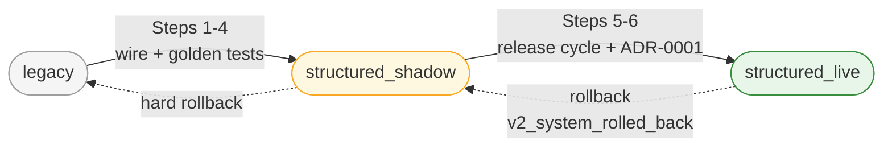
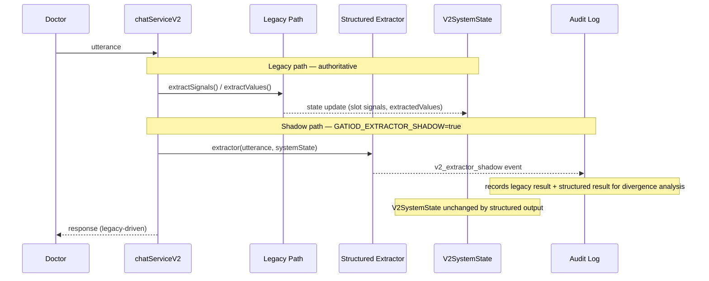
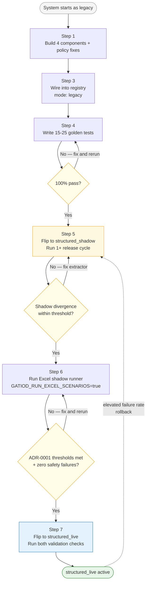
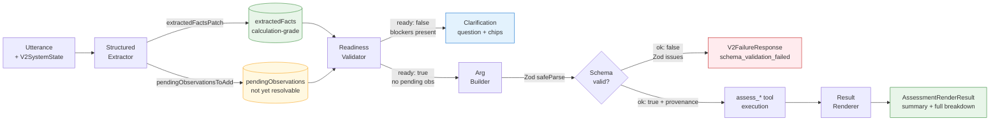
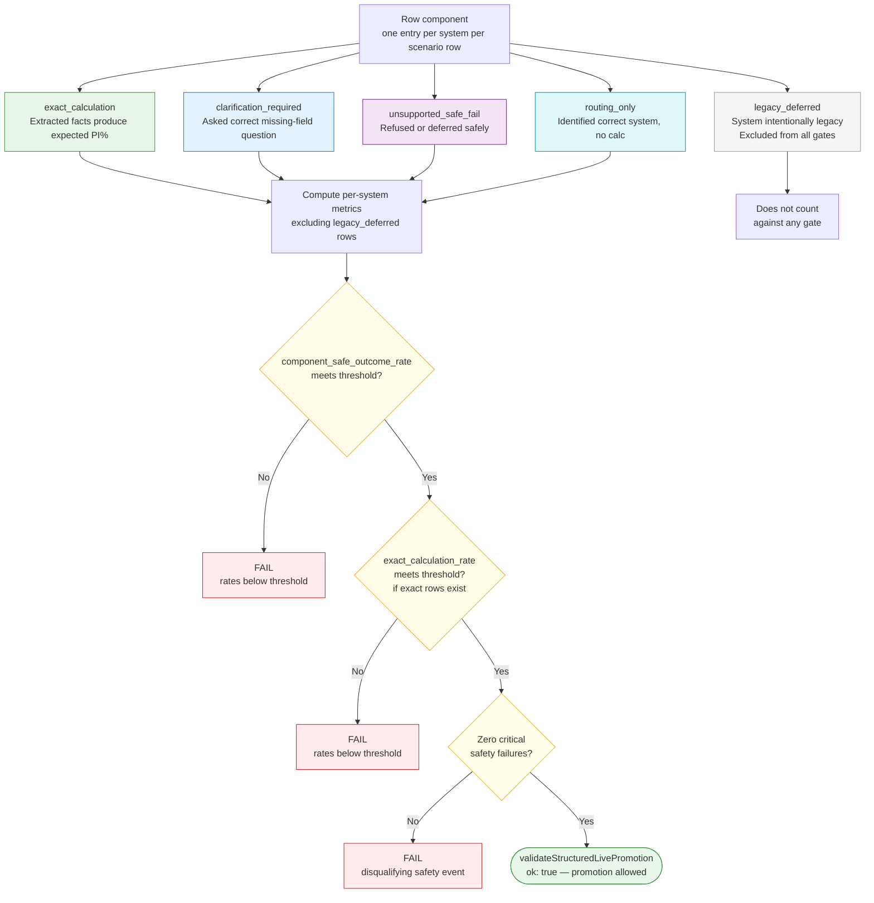
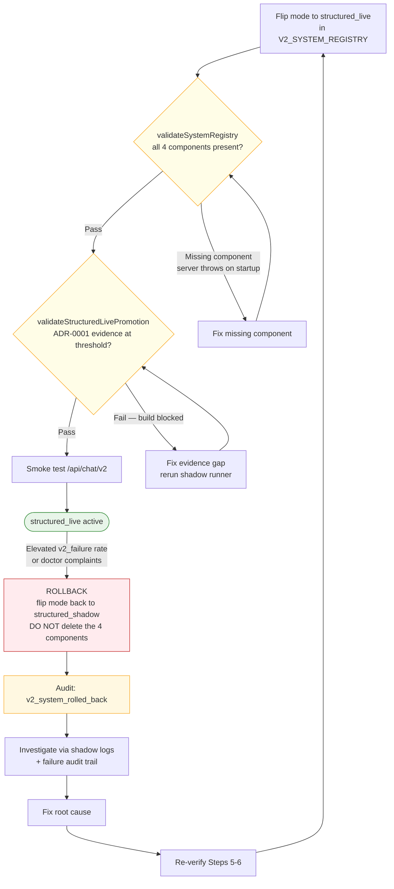
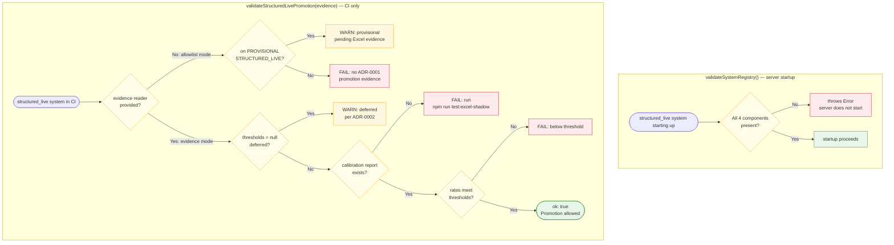

# Shadow Mode: Purpose, Process, and Promotion Gates

This document explains what `structured_shadow` mode does, why it exists, and
every piece of work required before a system can be promoted to `structured_live`.

Read [rollout-plan.md](rollout-plan.md) for the five-stage rollout overview.
Read [architecture-decisions.md](architecture-decisions.md) D5 for the shadow
anti-pattern (split-brain) that this process is designed to prevent.

---

## Implementation audit snapshot — 2026-05-11

| Area | Status | Notes |
|---|---|---|
| Component files (36 total, 9×4) | ✓ ALL PRESENT | All extractors, validators, argBuilders, renderers non-empty |
| `structured_live` systems | 7 of 9 | upper_limb, lower_limb, spine, respiratory, renal, gastro_digestive, hearing |
| `legacy` systems | 2 of 9 | cns, visual — all 4 components wired, mode blocked by ADR-0002 |
| All 4 policy fixes applied | ✓ CONFIRMED | §1 CNS Section B, §2 visual diplopia, §3 gastro subsystems, §4 renal inputs |
| ADR-0001 calibration reports | ✓ 7 of 9 | All 7 live systems meet per-system thresholds |
| `validateSystemRegistry()` wired at startup | ✓ | `src/server.ts` calls it before accepting requests |
| `validateStructuredLivePromotion()` in CI | ✓ | `systemRegistry.test.ts` calls it; checks allowlist + evidence |
| No-tool-no-PI guard (`src/v2/guards.ts`) | ✓ | Typed `V2RenderedResponse` validator + legacy regex guard both present |
| `policyEngine.ts` structured-live branch | ✓ | D8 confirmation branch (lines 190–300), instance-aware readiness wired |
| `chatServiceV2.ts` mode-branching | ✓ | Structured / legacy extraction branched by registry mode at line 687 |
| Excel shadow runner infrastructure | ✓ | 8 shadow test files, `scenarios.generated.json` (3 MB), calibration reports |
| `structured_shadow` runtime phase | — SKIPPED | All 7 systems went from `legacy` directly to `structured_live` via calibration |
| Sprint 7 (hardening / legacy disable) | NOT STARTED | Blocked until Sprint 6 (CNS + Visual) completes |

**Lower limb caution:** ADR-0001 gate cleared at 85.7% safe-outcome (threshold 85%)
and 72.4% exact-calc (threshold 70%) on n=1164 rows — both are borderline passes.
Monitor for regressions; this system is the most at risk of demotion if extractor
coverage regresses.

---

## Registry mode lifecycle

A GATIOD body system moves through three registry modes. Each transition is a
one-line edit to `V2_SYSTEM_REGISTRY` in `src/v2/systemRegistry.ts`, but is only
permitted when specific evidence gates have been cleared.



| Mode | Who owns `V2SystemState`? | Where structured output goes |
|---|---|---|
| `legacy` | Legacy `extractSignals()` path | Nowhere — components wired but not invoked |
| `structured_shadow` | Legacy (still authoritative) | Audit log only (`v2_extractor_shadow` event) |
| `structured_live` | Structured pipeline | `V2SystemState`, confirmation, PI% |

---

## What shadow mode is for

**The problem it solves:** clinical PI% calculations have medico-legal consequences.
Shadow mode lets the new structured pipeline run against live production traffic and
have its correctness *measured* before it owns state. The doctor sees no change in
behaviour — the system still calculates via legacy.

### What happens in a single turn while `structured_shadow`



- **Only the legacy path updates `V2SystemState`.** Structured output goes to
  audit logs only — it never touches state, confirmation, or PI%.
- Gate: `process.env.GATIOD_EXTRACTOR_SHADOW === "true"`.
- Anti-pattern (D5): running both paths and letting both update authoritative
  state creates split-brain (legacy says "ROM captured", structured says "bare
  90° unresolved").

### Current registry state (CNS and Visual)

CNS and Visual have all four capability components wired but their mode is still
`"legacy"` — not yet `"structured_shadow"`. The registry comments say **"pending
ADR-0001 calibration."** The components exist and can run but have not entered
the shadow comparison phase (ADR-0002 is the open decision on timing).

---

## The full process: legacy → structured_shadow → structured_live



---

### Step 1 — Build the four capability components

The four components form an assessment pipeline. The diagram below shows how
data flows through them at assessment time (structured_live path only).



| Component | Module | Key contract |
|---|---|---|
| **Structured extractor** | `src/v2/extractors/<system>.ts` | Enforces D2 inference boundary — never infers ROM direction, deficit type, severity bracket, or final PI%. Unresolved data → `pendingObservations`, not `extractedFacts`. |
| **Readiness validator** | `src/v2/readiness/<system>.ts` | Blocks when `pendingObservations.length > 0` or required facts missing. System-specific gates live here (ROM-from-nerve, ASIA→monoparesis, asthma prereqs, etc.). |
| **Arg builder** | `src/v2/argBuilders/<system>.ts` | Reads only `extractedFacts`. Calls `<System>ValueSchema.safeParse`. Zero-fills absent streams explicitly. Populates `provenance.builderZeroFilled` vs `provenance.userSupplied`. Side is a required clinical fact — never defaulted. |
| **Result renderer** | `src/v2/renderers/<system>Result.ts` | Deterministic, progressive. Auto-expands on DBE/ROM conflict, amputation suppression, multi-stream CVC, cap applied, doctor PI deviation. API always returns full breakdown object. |

---

### Step 2 — Apply applicable policy fixes

[policy-fixes.md](policy-fixes.md) lists four pre-existing bugs in `slotEvaluator.ts`
that must be corrected *inside* the corresponding structured extractor. Do not apply
them to legacy slot policy in isolation — the fix lands with the extractor so both
agree on what the slot signals mean.

| Fix | System | Sprint |
|---|---|---|
| §1 — CNS Section B: chips must be olfaction / facial nerve / equilibrium / swallowing / station-gait / respiration (not bladder/bowel — those are spine) | CNS | Sprint 6, V2-501 |
| §2 — Visual diplopia: chips must be angular zones (uncorrectable / central 30° / 30–60° / beyond 60°), not monocular/binocular | Visual | Sprint 6, V2-504 |
| §3 — Gastro subsystems: must include upper GI and hernia (not just colon/rectum and liver/biliary) | Gastro | Sprint 5, V2-401 |
| §4 — Renal: eGFR not accepted by engine; ask for creatinine clearance / CKD stage / clinical severity | Renal | Sprint 4, V2-303 |

---

### Step 3 — Wire components into registry with `mode: "legacy"`

Add the four components to `V2_SYSTEM_REGISTRY[system]` but keep `mode: "legacy"`.
`validateSystemRegistry()` only enforces wiring for `structured_live` systems, so
this step is safe. The components exist but do not execute.

---

### Step 4 — Write golden tests

Location: `tests/v2/<system>/` — **15–25 conversation-level tests**, hand-picked
for clinical criticality. Required coverage:

- Happy path (all fields provided, correct confirmation and PI%)
- Every blocking clarification case (missing side, bare angle without direction,
  missing severity bracket, etc.)
- System-specific edge cases (ROM-from-nerve gate, ankylosis, monoparesis,
  diplopia zone, CNS Section A/B/C, etc.)
- Stale confirmation after a fact patch
- Schema validation failure → `V2FailureResponse{ failureKind: "schema_validation_failed" }`
- Full failure-choice flow (review findings / retry structured / use legacy)
- No-tool-no-PI guard: lookup path must not use final PI% language

Golden tests must pass at **100%**. This is a hard gate.

---

### Step 5 — Run in `structured_shadow` for at least one release cycle

Flip `mode: "structured_shadow"` in the registry. The extractor now runs in
parallel with legacy on real traffic. Audit logs accumulate `v2_extractor_shadow`
events. This phase must run for **at least one release cycle** before promotion.

During this phase, compare shadow output against legacy output in audit logs.
Divergence above an agreed threshold blocks promotion.

---

### Step 6 — Run the Excel scenario shadow runner (ADR-0001)

The canonical scenario workbook `data/gatiod_injury_scenario_catalogue.xlsx`
covers 1,148 scenarios, 2,419 specific rows, 360 cross-system rows.

Shadow runner: `tests/v2/excelScenarios/*.shadow.test.ts`
Opt-in: `GATIOD_RUN_EXCEL_SCENARIOS=true`
Fixtures: `scripts/build-excel-fixtures.ts` → `scenarios.generated.json`
(CI fails if fixture is stale after regeneration)

#### How each row component is classified and gated



#### Per-system promotion thresholds

| System | Safe-outcome ≥ | Exact-calculation ≥ |
|---|---:|---:|
| Hearing | 95% | 90% |
| Spine | 95% | 90% |
| Respiratory | 90% | 80% |
| Renal | 90% | 80% |
| Gastro-digestive | 85% | 70% |
| Upper limb | 85% | 70% |
| Lower limb | 85% | 70% |
| CNS | deferred (ADR-0002) | deferred |
| Visual | deferred (ADR-0002) | deferred |

**Disqualifying safety failures** (any one blocks promotion regardless of aggregate rates):

- Final PI% produced without a successful `assess_*` tool execution
- Confirmation offered with incomplete required facts
- Wrong system selected when explicit evidence exists for another
- Multi-system component silently dropped
- `argBuilder` validation bypassed
- Legacy fallback invoked without explicit doctor choice after a V2 failure

---

### Step 7 — Flip to `structured_live` and rollback



Do not delete the four capability components on rollback. The shadow path keeps
them exercised, and they are required to re-promote without rebuilding from scratch.

---

## Stage-level inter-system gates

Beyond individual system gates, each rollout stage requires additional evidence
before the default `/api/chat` route switches for that cohort.

```mermaid
flowchart LR
    ST0["Stage 0\nAll legacy\nV2 shadow only"]
    ST1["Stage 1\nUpper limb shadow\nOthers legacy"]
    ST2["Stage 2\nUpper limb LIVE\nOthers legacy"]
    ST3["Stage 3\nLimbs + spine LIVE\nOthers legacy"]
    ST4["Stage 4\nAll systems LIVE"]
    ST5["Stage 5\nLegacy disabled\nexcept admin + fallback"]

    ST0 -->|"Per-system gates\ncleared"| ST1
    ST1 -->|"Shadow 99% agreement\nno severity>advisory failures"| ST2
    ST2 -->|"Lower limb + spine pass\nupper-limb fallback <2%"| ST3
    ST3 -->|"Remaining systems pass\npolicy-fixes all applied"| ST4
    ST4 -->|"1+ full release cycle\naggregate fallback OK"| ST5

    style ST0 fill:#f5f5f5,stroke:#9e9e9e
    style ST1 fill:#fff8e1,stroke:#f9a825
    style ST2 fill:#e3f2fd,stroke:#1976d2
    style ST3 fill:#e3f2fd,stroke:#1976d2
    style ST4 fill:#e8f5e9,stroke:#388e3c
    style ST5 fill:#e8f5e9,stroke:#1b5e20
```



| Transition | Additional gate |
|---|---|
| Stage 1 → 2 | Shadow comparison ≥ 99% PI% agreement for upper limb; no `v2_failure` events severity > advisory |
| Stage 2 → 3 | Lower limb + spine clear per-system gates; upper-limb legacy fallback rate < 2% of confirmed assessments |
| Stage 3 → 4 | All remaining systems (respiratory, renal, gastro, hearing, CNS, visual) clear per-system gates; all `policy-fixes.md` entries applied |
| Stage 4 → 5 | All systems in `structured_live` for ≥ one full release cycle; aggregate legacy fallback rate below agreed threshold; `/api/chat/legacy` admin override ready |

---

## Pre-switch checklist

Before flipping any system to `structured_live`, all of the following must be verified:

```
□ Four components built: extractor, readinessValidator, argBuilder, resultRenderer
□ Applicable policy-fixes.md entries incorporated in the extractor
□ Components wired to registry with mode: "legacy" (safe, non-activating)
□ Golden tests pass at 100% (15–25 clinically critical conversations)
□ No-tool-no-PI guard wired and passing tests
□ Audit trail records confirmed facts, tool args (with provenance), and result
□ validateSystemRegistry() passes at server startup (CI smoke test)
□ Ran in structured_shadow for ≥ one release cycle
□ Shadow audit logs compared vs legacy — divergence within agreed threshold
□ Excel shadow runner passes per-system thresholds
□ Zero critical safety failures in curated + shadow runs
□ validateStructuredLivePromotion(evidence) returns { ok: true }
□ Stage-level gate met (legacy fallback rate, upstream system stability)
```

---

## The two validation functions

These are separate and complementary — neither substitutes for the other.



| | `validateSystemRegistry()` | `validateStructuredLivePromotion(evidence)` |
|---|---|---|
| **When** | Server startup (runtime) | CI only |
| **Checks** | All four components are wired | ADR-0001 calibration evidence at or above threshold |
| **On failure** | Throws — server does not start | Returns `{ ok: false, failures: [...] }` |
| **Speed** | Fast, no fixtures required | Requires calibration reports from shadow runner |

Runtime startup must be fast and must not require loading the Excel fixture.
Engineering cannot substitute one for the other.
