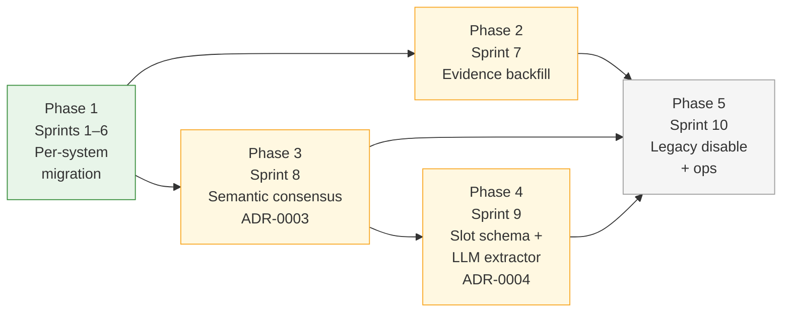

# V2 Sprint Plan

This document is the single source of truth for V2 work. Every sprint here threads to a binding ADR or [architecture decision](architecture-decisions.md); every known-issue [REQ-*](requirements-known-issues.md) item has a sprint home.

Read these in order before picking up a ticket:

1. [architecture-decisions.md](architecture-decisions.md) — D1–D17, binding
2. The relevant ADR ([0001](../adr/0001-structured-live-promotion-gate.md), [0002](../adr/0002-cns-visual-structured-migration.md), [0003](../adr/0003-semantic-consensus-architecture.md), [0004](../adr/0004-llm-slot-extractor-and-slot-schema.md))
3. The sprint section below

---

## Direction

V2 replaces the legacy Gemini-driven flow with a deterministic, structured-fact-based assessment orchestrator. The migration runs in **five phases**:

| Phase | Goal | Sprint | ADR / REQ | Status |
|---|---|---|---|---|
| **1 — Per-system migration** | Move all 9 GATIOD systems from `legacy` to `structured_live` via the four-component pipeline (extractor, readiness, argBuilder, renderer) | Sprints 1–6 | ADR-0001, ADR-0002 | Sprints 1–5 ✓ COMPLETE; Sprint 6 ⬤ FINAL STEP |
| **2 — Evidence & verification backfill** | Stand up the calibration runner, write the missing conversation-level goldens, and remove every system from `PROVISIONAL_STRUCTURED_LIVE` | Sprint 7 | REQ-B1–B4, REQ-C1–C3, REQ-E2 | ◔ PARTIAL (runner missing) |
| **3 — Semantic consensus** | LLM proposal-only front door for dense multi-system narratives (ADR-0003 slices A–H) | Sprint 8 | ADR-0003, D13, D15, D16 | ✓ COMPLETE (all slices shipped; shadow grader wired; V2-809 post-rollout) |
| **4 — Slot schema + LLM extractor** | Replace per-system regex extraction with a schema-validated LLM extractor; centralise `required_when` logic | Sprint 9 | ADR-0004 | ◔ PARTIAL (schema + shadow wired; calibration + rollout pending V2-701) |
| **5 — Legacy disable + operational hardening** | Disconnect `slotEvaluator` from `structured_live` paths, ship the loop guard, dashboard, admin route | Sprint 10 | REQ-D1–D3, REQ-E1, REQ-F1–F2 | NOT STARTED |

Phases 2, 3, 4 are independent and can run in parallel once Phase 1 closes. Phase 5 requires Phases 2 and 3 complete (and 4 if its rollout overlaps the legacy cut-off).

---

## Sprint progress — 2026-05-12

| Sprint | Title | Status | Gate / blocker |
|---|---|---|---|
| Sprint 1 | Upper Limb (+ V2 framework) | ✓ COMPLETE | ADR-0001 cleared (93.6% safe / 80.2% exact, n=1991) |
| Sprint 1–2 backfill | Bilateral limb assessment (REQ-BIL-001) | ✓ COMPLETE | bilateral_mode_choice obs, bilateralQueue, same/separate orchestration |
| Sprint 2 | Lower Limb | ✓ COMPLETE | ADR-0001 cleared (85.7% / 72.4%, n=1164 — borderline) |
| Sprint 3 | Spine | ✓ COMPLETE | ADR-0001 cleared (100% / 96.8%, n=132) |
| Sprint 4 | Respiratory + Renal | ✓ COMPLETE | ADR-0001 cleared (both 100%) |
| Sprint 5 | Gastro + Hearing | ✓ COMPLETE | ADR-0001 cleared (both 100%) |
| Sprint 6 | CNS + Visual | ⬤ FINAL STEP | All components wired and golden-tested; awaits V2-508 (ADR-0002 close) and V2-507 (mode flip + Excel shadow run) |
| Sprint 7 | Evidence & Verification Backfill | NOT STARTED | Independent of Sprint 6; can start now |
| Sprint 8 | Semantic Consensus | ✓ COMPLETE | All slices A–H shipped; shadow grader wired (V2-805 ✓); V2-809 post-rollout follow-up |
| Sprint 9 | Slot Schema + LLM Extractor | ◔ PARTIAL | V2-901/902/903 ✓; V2-904 calibration blocked on V2-701 (Sprint 7) |
| Sprint 10 | Legacy Disable + Ops | NOT STARTED | Blocked on Sprints 6, 7 (and Sprint 8 if rollout overlaps) |

All 4 [policy-fixes.md](policy-fixes.md) entries are applied in the extractors. All 7 live systems have calibration reports in `tests/v2/excelScenarios/`. The runtime `structured_shadow` phase was skipped for all 7 live systems — promotion was evidenced via Excel calibration only.

---

# Phase 1 — Per-system migration

The pattern is the same per system: build the four capability components (extractor, readiness validator, arg builder, result renderer), wire them into the registry, write 15–25 conversation-level golden tests, run Excel calibration, then flip the registry mode. See [shadow-to-live.md](shadow-to-live.md) for the canonical 7-step process and [rollout-plan.md](rollout-plan.md) for stage gates.

## Sprint 1 — Foundations + Upper Limb — ✓ COMPLETE

**Goal:** Make V2 authoritative for upper-limb ROM-only and ROM+nerve-gate cases. Also adds the V2 framework reused by every subsequent sprint.

### Tickets

| Ticket | Output |
|---|---|
| **V2-001** | Add `extractedFacts`, `pendingObservations`, `confirmation` to `V2SystemState`. Update `V2SessionState`. Migration-safe loader for old sessions. |
| **V2-002** | Build `src/v2/systemRegistry.ts` with `SystemMigrationMode`, `V2SystemCapability`, `isStructuredLiveSystem`, `requireStructuredCapability`, `validateSystemRegistry`. All systems start as `"legacy"`. Wire into server startup. |
| **V2-003** | Upper-limb structured extractor (`src/v2/extractors/upperLimb.ts`). Output `StructuredExtractionResult`. Slot signals derived from extraction output, not regex-derived independently. |
| **V2-004** | Upper-limb fact-patch logic. Side correction, ROM correction, nerve negation, "no other findings", `rom_from_nerve` gate. Edits set `confirmation.status = "stale"` and clear `piPercent`. |
| **V2-005** | `validateUpperLimbReadiness(systemState)`. ROM-from-nerve gate when both ROM and neurological facts present. |
| **V2-006** | `buildUpperLimbArgs(facts)`. Explicit zero-fills, `UpperLimbValueSchema.safeParse`, provenance. Refuses on missing side or schema failure. |
| **V2-007** | Wire pre-policy guards in `chatServiceV2.ts`: pending-observation resolver before grounding/route; extraction-skip when `confirmationReply && pendingConfirmation`. Branch extraction by registry mode. |
| **V2-008** | Modify `policyEngine.ts` confirmation branch (D8). For `structured_live`: run readiness, factsHash check, arg builder, return `execute_tools`. For unmigrated: `delegate_legacy`. |
| **V2-009** | Deterministic upper-limb result renderer. Progressive per D9. |
| **V2-010** | No-tool-no-PI guard (D10). Typed `V2RenderedResponse` validator + regex guard for legacy text. |
| **V2-011** | V2 failure path (D11). `V2FailureResponse`, `renderV2Failure()`, 4 audit events. Fallback prompt includes confirmed V2 summary. |
| **V2-012** | 20+ upper-limb golden tests. ROM-only, ROM+correction, ROM+nerve gate, side swap, "no other findings", bare-angle clarification, stale confirmation, schema-validation failure, full failure flow. |
| **V2-013** | Hide debug payload unless `GATIOD_DEBUG_RESPONSES === "true"`. |
| **V2-014** | Flip `upper_limb` mode to `"structured_live"`. Verify `validateSystemRegistry()` passes. |

## Sprint 2 — Lower Limb — ✓ COMPLETE

| Ticket | Output |
|---|---|
| **V2-101** | Lower-limb structured extractor. Joint coverage (hip/knee/ankle/subtalar/great toe), ROM, ankylosis, shortening (cm), nerve, amputation, DBE. |
| **V2-102** | Lower-limb readiness validator. ROM-from-nerve gate, shortening-cm inclusion threshold. |
| **V2-103** | `buildLowerLimbArgs`. `LowerLimbValueSchema.safeParse`, provenance. |
| **V2-104** | Lower-limb result renderer (progressive). |
| **V2-105** | 20+ lower-limb golden tests. |
| **V2-106** | Flip `lower_limb` to `"structured_live"`. |

## Sprint 3 — Spine — ✓ COMPLETE

| Ticket | Output |
|---|---|
| **V2-201** | Spine structured extractor. Region, diagnosis category, severity bracket, ASIA grade, monoparesis flag, fracture height-loss, spine-specific neurological (bladder/bowel/sexual/spasms/pressure sores — correct for spine, unlike CNS Section B). |
| **V2-202** | Spine readiness validator. ASIA→monoparesis gate, severity-key requirement per diagnosis category. |
| **V2-203** | `buildSpineArgs`. |
| **V2-204** | Spine result renderer. |
| **V2-205** | 20+ spine golden tests including cauda equina, monoparesis, fracture height-loss thresholds. |
| **V2-206** | Flip `spine` to `"structured_live"`. |

## Sprint 4 — Respiratory + Renal — ✓ COMPLETE

| Ticket | Output |
|---|---|
| **V2-301** | Respiratory structured extractor (FEV1, FVC, severity class). |
| **V2-302** | Respiratory readiness + arg builder + renderer. |
| **V2-303** | Renal structured extractor. **[policy-fixes.md](policy-fixes.md) §4** applied — serumCreatinine / creatinineClearance / ckdStage / clinicalSeverity, **not** eGFR. |
| **V2-304** | Renal readiness + arg builder + renderer. `RenalValueSchema` validation. |
| **V2-305** | Golden tests (15+ each). |
| **V2-306** | Flip respiratory and renal to `"structured_live"`. |

## Sprint 5 — Gastro-digestive + Hearing — ✓ COMPLETE

| Ticket | Output |
|---|---|
| **V2-401** | Gastro structured extractor. **[policy-fixes.md](policy-fixes.md) §3** applied — subsystem chips: upper GI, colon/rectum/anus, liver/biliary, hernia. |
| **V2-402** | Gastro readiness + arg builder + renderer. |
| **V2-403** | Hearing structured extractor (audiogram values per ear, frequencies, hearing aids). |
| **V2-404** | Hearing readiness + arg builder + renderer. |
| **V2-405** | Golden tests (15+ each). Include hernia routing. |
| **V2-406** | Flip both to `"structured_live"`. |

## Sprint 6 — CNS + Visual — ⬤ FINAL STEP

**Goal:** Migrate CNS and Visual. These are the systems with the largest pre-existing slot-policy mismatches; scheduled last because the fixes are the most disruptive.

**Current state (2026-05-12):** All four components are fully wired for both CNS and Visual (extractor, readiness, arg builder, renderer all present and non-empty). Mode remains `"legacy"` pending ADR-0002 resolution. Policy fixes §1 (CNS Section B) and §2 (visual diplopia zones) are confirmed applied in the extractors. Golden suites: 71 CNS cases, 58 Visual cases.

**Blocking item:** [ADR-0002](../adr/0002-cns-visual-structured-migration.md) — formally close the open questions (now tracked in V2-508), then run the Excel shadow runner and flip the mode.

### Tickets

| Ticket | Output | Status |
|---|---|---|
| **V2-501** | CNS structured extractor. **[policy-fixes.md](policy-fixes.md) §1** applied (correct Section B components: olfaction / facial nerve / equilibrium / swallowing / station-gait / respiration). | ✓ DONE |
| **V2-502** | CNS Section A (epilepsy/dementia/psychiatric) and Section C (paralysis brackets) extractors. | ✓ DONE |
| **V2-503** | CNS readiness + arg builder + renderer. | ✓ DONE |
| **V2-504** | Visual structured extractor. **[policy-fixes.md](policy-fixes.md) §2** applied (correct diplopia zones: uncorrectable / central 30° / 30–60° / beyond 60° / none). | ✓ DONE |
| **V2-505** | Visual readiness + arg builder + renderer. Visual acuity per eye, visual field, diplopia zone. | ✓ DONE |
| **V2-506** | Golden tests for both. | ✓ DONE (71 CNS cases, 58 Visual cases) |
| **V2-507** | Run Excel shadow runner for CNS and Visual; verify ADR-0001 thresholds; flip `cns` and `visual` to `"structured_live"`. | ✗ BLOCKED on V2-508 |
| **V2-508** | Resolve [ADR-0002](../adr/0002-cns-visual-structured-migration.md) open questions and close the ADR. (1) Migration order: both moving together — Visual-first is moot. (2) CNS curated golden set: signed off via V2-506 (71 cases). (3) Visual curated golden set: signed off via V2-506 (58 cases). (4) `legacy_deferred` cross-system counting: already resolved by [ADR-0001](../adr/0001-structured-live-promotion-gate.md) — excluded from `cross_system_end_to_end_rate`. Update ADR-0002 status to Superseded; remove the blocking note on V2-507. | ✗ NOT STARTED |

**Maps to:** REQ-A1 through REQ-A6 in [requirements-known-issues.md](requirements-known-issues.md).

**End of Sprint 6:** Reaches Stage 4 in [rollout-plan.md](rollout-plan.md) — V2 default for all systems.

---

# Phase 2 — Evidence & Verification Backfill

## Sprint 7 — Evidence & Verification Backfill — NOT STARTED

**Goal:** Stand up the calibration runner as a CI gate. Close every per-system golden-test shortfall. Remove every system from `PROVISIONAL_STRUCTURED_LIVE` and replace allowlist promotion with evidence-mode promotion. Wire end-to-end failure audit events.

**Why now:** Today, `validateStructuredLivePromotion()` runs in allowlist mode because no evidence reader exists. The ADR-0001 thresholds at `systemRegistry.ts:234–244` are defined but never enforced at CI time. The 7 live systems are technically running on trust.

**Independent of Sprint 6** — can start in parallel.

### Track A — Calibration infrastructure (REQ-B)

| Ticket | Output |
|---|---|
| **V2-701** | Excel shadow runner / calibration runner. `scripts/calibration/run.ts` reads `.xlsx` workbook, runs extraction → readiness → argBuilder → mocked tool chain per row, emits `SystemCalibrationReport` JSON. Runnable locally; `FileCalibrationEvidenceReader` implements `PromotionEvidence`. (REQ-B1) |
| **V2-702** | Spine extractor phrasing improvements. Address fracture height-loss thresholds, cord-injury ASIA narrative, spondylolisthesis grade phrasings flagged by calibration. Spine must reach ≥ 95% safe / ≥ 90% exact (currently 86.7% / 86.7% on 30-row sample). Remove `"spine"` from `PROVISIONAL_STRUCTURED_LIVE`. (REQ-B2) |
| **V2-703** | Hearing curated golden suite (20+ conversation-level scenarios) + calibration. NID path with bilateral AHL + age, age-clarification path, presbycusis deduction, injury path, tinnitus inclusion, chip vs free-text input. Remove `"hearing"` from `PROVISIONAL_STRUCTURED_LIVE`. (REQ-B3) |
| **V2-704** | Calibration passes for the remaining 5 provisional systems (upper_limb, lower_limb, respiratory, renal, gastro_digestive). Each must reach its ADR-0001 threshold. Remove from `PROVISIONAL_STRUCTURED_LIVE`. Gastro safe-outcome check verifies the bracket offered; exact-calc N/A for gastro. (REQ-B4) |

### Track B — Golden-test shortfalls (REQ-C)

| Ticket | Output |
|---|---|
| **V2-705** | Lower-limb conversation-level golden suite (15+). ROM-only, shortening, ankylosis, nerve gate, amputation level, bilateral. (REQ-C1) |
| **V2-706** | Respiratory conversation-level golden suite (15+). PFT-only, occupational asthma (all 3 prereqs), asbestosis/silicosis with profusion bands, VO2max path. (REQ-C1) |
| **V2-707** | Renal conversation-level golden suite (15+). Serum-creatinine path, creatinine-clearance path, CKD-stage-only, clinical-severity-only, solitary kidney, eGFR disambiguation (→ pending observation, not a fact). (REQ-C1) |
| **V2-708** | Gastro conversation-level golden suite (15+). Each of 4 subsystems, bracket selection, upper-GI weight-loss modifier. (REQ-C1) |
| **V2-709** | Spine golden-suite expansion to 25+. Cauda equina, monoparesis halving, fracture height-loss thresholds, multi-region guard. (REQ-C1) |
| **V2-710** | No-tool-no-PI guard integration tests across all 9 systems (REQ-C2) + V2 failure path tests per `structured_live` system covering `readiness_failed`, `schema_validation_failed`, `stale_confirmation` (REQ-C3). |

### Track C — Audit-event wiring (REQ-E2)

| Ticket | Output |
|---|---|
| **V2-711** | `tests/v2/failureAuditEvents.test.ts`: assert end-to-end emission of `v2_failure`, `v2_failure_user_choice`, `v2_legacy_fallback_requested`, `v2_legacy_fallback_result`. `auditRef` UUID correlates the failure with the user-choice event. (REQ-E2) |

**Exit criterion:** `PROVISIONAL_STRUCTURED_LIVE` is empty. `validateStructuredLivePromotion(new FileCalibrationEvidenceReader())` runs in CI on every PR touching `src/v2/extractors/`, `readiness/`, `argBuilders/`, `systemRegistry.ts`.

---

# Phase 3 — Semantic Consensus

## Sprint 8 — Semantic Consensus (ADR-0003) — ✓ COMPLETE

**Goal:** Ship the LLM proposal-only front door for dense multi-system narratives. Sits before the deterministic V2 pipeline; runs only when `shouldRunSemanticConsensus()` (deterministic preflight) returns true; never executes tools.

**Why:** Today V2's router scores systems by keyword/synonym/ontology and picks one — silently dropping the other systems in a doctor's "common peroneal nerve lesion; complete anosmia" narrative. Semantic consensus proposes an interpretation, the doctor confirms, and the pipeline extracts against the accepted interpretation.

**Read first:** [ADR-0003](../adr/0003-semantic-consensus-architecture.md) and [gatiod_holistic_prd.md §25](../gatiod_holistic_prd.md). Eight ordered slices A–H. Critical ordering: D and B before F (otherwise the app creates `pendingConsensus` it cannot resolve, or accepts systems that vanish from the claim plan).

### Tickets — one per slice

| Ticket | Slice | Output | Status |
|---|---|---|---|
| **V2-801** | A — Contracts and hydration | Types: `PendingConsensus`, `ClaimComponentOverride`, `GlobalCvcExclusion`, `ExtractionContext`, `SemanticInterpretation`, `SemanticCandidateSystem`, `SemanticCandidateFinding`, `ConsensusResolutionResult`. Extend `V2SessionState`. Update `coerceV2State()`. Optional 4th `extractionContext` param on `StructuredExtractor`. `getCalculatedSystems()` filters `globalCvcExclusions`. No DB migration, no version bump. Zero behaviour change. | ✓ DONE (D13–D16 reference these as built) |
| **V2-802** | B — Unified claim plan | `deriveClaimAssessmentComponents()`, `buildNextClaimStep()` returning typed `ClaimStep`. Wrap `buildNextSystemHandoff()` first; replace once tests pass. (D13) | ✓ DONE |
| **V2-803** | C — Semantic gate | `shouldRunSemanticConsensus()` deterministic preflight (no LLM). Wired into `chatServiceV2.ts` after pending-observation gate, before grounding/routing. Feature-flagged off initially. | ✓ DONE (file `semanticConsensusGate.ts` exists) |
| **V2-804** | D — Deterministic consensus resolver | `tryResolvePendingConsensus()` covering all six branches (`accepted_all`, `accepted_system_first`, `edit_requested`, `rejected`, `legacy_requested`, `skipped_system`). Reuses `detectExplicitSystemSelection` constrained to `pendingConsensus.candidateSystems`. Mocked `pendingConsensus` fixtures in tests; no real LLM. | ✓ DONE (file `consensusResolver.ts` exists) |
| **V2-805** | E — Semantic interpreter in shadow | `semanticSystemTaxonomy.ts` (registry-backed clinical signal taxonomy), `semanticInterpreterPrompt.ts`, `SemanticInterpretationSchema` (Zod), `validateSemanticInterpretation` (safety + source-span verification), `renderSemanticConsensus`. Schema-constrained structured output; fallback to instructed JSON only if model provider doesn't support it. Opt-in flag; audit-only vs router. | ✓ DONE (`gradeSemanticCase` wired in `chatServiceV2` behind `GATIOD_RUN_SEMANTIC_SHADOW`; `semanticShadowGoldens.ts` seeded from PRD GS-001/GS-002 scenarios; `freshInterpreterResult` on `ConsensusOrchestratorRespondSignal`) |
| **V2-806** | F — User-visible semantic consensus | Fix the four code contradictions listed in ADR-0003 §Consequences before enabling the flag. Then: (1) Create `src/v2/spineScope.ts` with shared spine-scope utilities. (2) Update `renderSemanticConsensus()` to classify proposals via `SemanticProposalKind` and emit proposal-kind-specific messages and chips (single_system / single_legacy / multi_scope_spine / mixed_structured_legacy / multi_system). Multi-region spine proposals must never include a generic "Proceed" chip. (3) Update `consensusResolver.ts` `accepted_system_first` branch: apply `detected` overrides for non-target accepted structured systems and `legacy_deferred` for accepted legacy systems; return `targetSystem` and `selectedScope` in `ConsensusResolutionResult`. (4) Add `ConsensusOrchestratorSubstituteSignal.targetSystem`. (5) Update `chatServiceV2.ts` to use `forcedExtractionTarget` from substitute signal instead of router output for semantic turns. (6) Set `SEMANTIC_CONSENSUS_ENABLED=true` as default. (7) Edit-cycle cap: `MAX_SEMANTIC_EDIT_ATTEMPTS = 2`; full reset (Option C) on re-interpretation; `PendingConsensus` gains `revision`, `editAttemptCount`, `parentInterpretationId`, `lastEditInstruction`. (8) When writing `detected` overrides on acceptance, populate `sourceText`, `interpretationId`, `sourceHash`, `acceptedFindings` filtered to the system. (9) In `chatServiceV2`, when routing to a `detected` + `source:semantic_consensus` system, use `override.sourceText` as the effective extraction source only when `looksLikeWorkflowContinuation()` returns true; clinical content wins. | ✓ DONE |
| **V2-807** | G — Extraction context and selected scope | Depends on V2-806 (spineScope.ts). (1) Upgrade `selectedScope.sourceSpans` from `string[]` to `Array<{text,startOffset,endOffset}>` with `coerceSourceSpan()` hydration helper. (2) Implement `buildScopedNormalizedUtterance(utterance, context, system)` in `spineScope.ts`. (3) Update `extractSpine()` to call `buildScopedNormalizedUtterance` when `extractionContext.selectedScope.system === "spine"`; multi-region hard guard still runs against the scoped text. (4) Other extractors accept (but ignore) the 4th `extractionContext` param. (5) Semantic findings (`acceptedFindings`) must not write `extractedFacts` directly in any extractor. (6) For deferred-extraction turns: `chatServiceV2` calls `buildExtractionContextFromSemanticOverride(override, system, state)` to reconstruct the context from `ClaimComponentOverride`; `buildNextClaimStep` is the routing mechanism. | ✓ DONE |
| **V2-808** | H — Semantic-attributed pending observations | (1) Extend `PendingObservation` with `semanticAttribution?: PendingObservationSemanticAttribution`. (2) Add `PendingObservationSemanticAttribution` type: `{interpretationId, sourceSpan, proposedMapping, findingType, confidence, failureKind: SemanticMappingFailureKind}`. (3) Add `SemanticMappingFailureKind` enum: `missing_calculation_field | unmapped_canonical_term | ambiguous_mapping | unsupported_in_structured_v2 | extractor_no_match`. (4) Two-tier gap detection: extractors may explicitly emit `type:"semantic_mapping_gap"` obs; chatServiceV2 synthesizes one as fallback when `extractionContext` present and extraction produced neither facts nor useful obs. Normal missing-field observations must NOT carry `semanticAttribution`. (5) Emit `semantic_to_structured_extraction_failed` audit event immediately on gap creation (not at abandonment). Emit separate `semantic_gap_abandoned_by_user` event on later abandonment. (6) Dedup key: `consensusId:system:sourceSpan:proposedMapping`; store in `obs.parsed.semanticGapKey`. | ✓ DONE |
| **V2-809** | Phase X — Excel semantic reporting | Add semantic outcome classes (`semantic_proposal_correct | partial | unsafe | failed`). Track recall, fallback, semantic correction rate against curated golden set and Excel-derived scenarios. `GATIOD_RUN_SEMANTIC_SHADOW=true`. | NOT STARTED (post-rollout) |

**Exit criterion:** Slices A–H all in production. Default `SEMANTIC_CONSENSUS_ENABLED=true`. Semantic shadow grader running in CI with stable outcome-class rates.

---

# Phase 4 — Slot Schema + LLM Extractor

## Sprint 9 — Slot Schema + LLM Slot Extractor (ADR-0004) — ◔ PARTIAL (V2-901/902/903 ✓; V2-904–906 pending calibration)

**Goal:** Replace per-system regex extractors with a schema-validated LLM extractor. Slot schema becomes a required `V2SystemCapability` component, validated at startup. `required_when` logic moves from imperative per-system code to declarative `SlotCondition<TKey>` typed by fact keys.

**Why:** The nine regex extractors (~25–34 KB each) miss novel phrasings, which become unnecessary `PendingObservation`s that interrupt the doctor. Calibration evidence clusters extraction misses around word-form variants and idioms — not schema violations. A schema-constrained LLM closes that gap without weakening D2 (no silent inference of clinical fields).

**Read first:** [ADR-0004](../adr/0004-llm-slot-extractor-and-slot-schema.md). Six ordered implementation steps in the Consequences section.

### Tickets

| Ticket | Output | Status |
|---|---|---|
| **V2-901** | `SlotDefinition` type + `SlotCondition<TKey>` (compile-time parameterised by fact keys, no OR/NOT in first pass). Pilot schema at `src/v2/slotSchemas/upperLimb.ts`. Add `slotSchema?` field to `V2SystemCapability`. `validateSystemRegistry()` enforces presence for `structured_live` systems. Rename `SlotSignals` → `PresenceSignals`. | ✓ DONE (all 9 schemas drafted; `types.ts`, `deriveReadinessValidator.ts` exist) |
| **V2-902** | `deriveReadinessValidator<TKey>(defs, facts)` shared function. Pilot wire-up for upper_limb: replace imperative readiness with derived readiness; keep legacy validator behind a feature flag for shadow comparison. | ✓ DONE (shadow comparison wired in `policyEngine.ts` behind `GATIOD_READINESS_SHADOW`; `ShadowAuditEvent` exported; 6 new tests in `tests/v2/upperLimb/readinessShadow.test.ts`; promotion to primary gated on V2-904 calibration) |
| **V2-903** | LLM slot extractor (Approach A — raw text → slots). Input: raw utterance + `SlotDefinition[]`. Output: same `StructuredExtractionResult` shape. No tool/function-calling access. Run in `structured_shadow` for upper_limb first, gated on `GATIOD_EXTRACTOR_SHADOW=true`. | ✓ DONE (all 9 system `shadowExtractor` entries wired in registry; `chatServiceV2` runs shadow concurrently and feeds `extractorComparison.ts`; comparison UI gated on `LLM_EXTRACTOR_COMPARISON_ENABLED`) |
| **V2-904** | Calibration run for upper_limb LLM extractor vs regex baseline on the Excel workbook. Must match or exceed regex safe-outcome and exact-calc rates. Latency p95 captured and reported. | NOT STARTED |
| **V2-905** | Roll out LLM extractor to remaining systems in order: respiratory, renal (simplest condition sets) → gastro, hearing → lower_limb, spine → cns, visual (most complex). Each system runs in shadow first, then promotes via calibration. | NOT STARTED |
| **V2-906** | Delete regex extractors once LLM extractor is `structured_live` for all systems and one release cycle has passed without rollback. Keep slot schema as canonical. | NOT STARTED |

**Migration rule:** A slot with `clinicalInferenceAllowed: false` and no `clarification` is a startup-blocking schema validation error. The `clarification` field becomes the single definition consumed by extractors (build `PendingObservation`), readiness (generate question), and the generic resolver (match answer).

**Exit criterion:** All 9 systems extract via the LLM slot extractor. Regex extractors deleted. `required_when` lives only in the slot schema.

---

# Phase 5 — Legacy Disable + Operational Hardening

## Sprint 10 — Legacy Disable + Operational Hardening — NOT STARTED

**Goal:** Reach Stage 5 in [rollout-plan.md](rollout-plan.md). Disconnect `slotEvaluator` from `structured_live` paths. Ship the loop guard, audit dashboard, admin route, and CI watchlist.

**Prerequisite:** Sprints 6 (CNS+Visual flipped) and 7 (evidence backfill complete) must close. Sprint 8 should be at slice F or later if production traffic is mixed.

### Track A — Legacy decoupling (REQ-D)

| Ticket | Output |
|---|---|
| **V2-601** | Audit dashboard for `v2_failure` and `v2_legacy_fallback_requested` events. Group by system and `failureKind`; flag systems exceeding configurable threshold (default 5% legacy-fallback rate). (REQ-F1) |
| **V2-602** | Admin override route `POST /api/chat/legacy`. Requires `x-gatiod-admin: true` header; requires `reason` in body; emits `legacy_admin_route_invoked` audit event. Not reachable from doctor frontend. (REQ-D2) |
| **V2-603** | Disable `delegate_legacy` in `policyEngine.ts` for `structured_live` systems. Unmigrated paths only for systems still marked `legacy` (which should be empty by Sprint 10). |
| **V2-604** | Remove `extractSignals()` / `extractValues()` calls from `chatServiceV2.ts`. Gate prerequisite: `V2_SYSTEM_REGISTRY.cns.mode === "structured_live"` AND `V2_SYSTEM_REGISTRY.visual.mode === "structured_live"`. Keep functions exported for one release cycle for any straggler callers, then delete. CI lint rule enforces zero imports of `slotEvaluator.ts` from `chatServiceV2.ts`. (REQ-D1, REQ-D3) |
| **V2-605** | Final regression suite: 100+ end-to-end conversations covering every system. |

### Track B — Loop guard + CI watchlist (REQ-E1, REQ-F2)

| Ticket | Output |
|---|---|
| **V2-1001** | D17 per-turn loop guard. `detectNoProgress(stateBefore, stateAfter, gate)` hashing `pendingObservations`, `extractedFacts`, `pendingConfirmation`, `pendingConsensus`, `claimComponentOverrides`. Each gate declares whether it is expected to mutate state. Fires `V2FailureResponse{ failureKind: "no_progress_detected" }` with diagnostic naming the gate. (REQ-E1) |
| **V2-1002** | `structured_live` watchlist in CI. Runs `validateStructuredLivePromotion(new FileCalibrationEvidenceReader())` against latest calibration report on every PR touching `src/v2/extractors/`, `readiness/`, `argBuilders/`, `systemRegistry.ts`. Non-blocking warning for stale evidence (> 14 days); blocking failure for fresh evidence below threshold. (REQ-F2) |

**Exit criterion:** `/api/chat` is V2-only. Legacy reachable only via `/api/chat/legacy` (admin) or explicit doctor fallback after a V2 failure (D11). Aggregate legacy-fallback rate below agreed threshold for one full release cycle.

---

# Pattern for any new system migration

When migrating system `X` after Sprint 1 (and before LLM extractor takes over per Sprint 9):

1. Build extractor (`src/v2/extractors/X.ts`) — enforces D2 inference boundary.
2. Build readiness validator (`src/v2/readiness/X.ts`).
3. Build arg builder (`src/v2/argBuilders/X.ts`) — uses engine's Zod schema.
4. Build result renderer (`src/v2/renderers/XResult.ts`) — progressive per D9.
5. Apply any [policy-fixes.md](policy-fixes.md) entries for that system.
6. Add 15–25 conversation-level golden tests in `tests/v2/X/`.
7. Update `V2_SYSTEM_REGISTRY[X]` to wire the four components, mode stays `"legacy"`.
8. Run in `"structured_shadow"` mode for at least one release cycle (or skip and rely on Excel calibration per the 7 systems' precedent).
9. Run Excel shadow runner; verify ADR-0001 thresholds.
10. Flip mode to `"structured_live"`. Verify `validateSystemRegistry()` passes at startup.
11. Update [rollout-plan.md](rollout-plan.md) stage if appropriate.

Under [ADR-0004](../adr/0004-llm-slot-extractor-and-slot-schema.md), once the LLM slot extractor is `structured_live` for that system, steps 1 and 2 collapse to "author the slot schema" — `deriveReadinessValidator` handles step 2 from the schema.

---

# REQ-* → sprint cross-reference

| REQ | Sprint | Ticket |
|---|---|---|
| REQ-A1 — CNS extractor | 6 | V2-501 ✓ |
| REQ-A2 — CNS readiness/arg/renderer | 6 | V2-503 ✓ |
| REQ-A3 — CNS goldens + flip | 6 | V2-506 ✓, V2-507 |
| REQ-A4 — Visual extractor | 6 | V2-504 ✓ |
| REQ-A5 — Visual readiness/arg/renderer | 6 | V2-505 ✓ |
| REQ-A6 — Visual goldens + flip | 6 | V2-506 ✓, V2-507 |
| REQ-B1 — Calibration runner | 7 | V2-701 |
| REQ-B2 — Spine phrasing | 7 | V2-702 |
| REQ-B3 — Hearing goldens + calibration | 7 | V2-703 |
| REQ-B4 — Remaining provisional calibration | 7 | V2-704 |
| REQ-C1 — Conversation goldens | 7 | V2-705, V2-706, V2-707, V2-708, V2-709 |
| REQ-C2 — Guard integration tests | 7 | V2-710 |
| REQ-C3 — Failure path per system | 7 | V2-710 |
| REQ-D1 — Remove slotEvaluator from structured_live | 10 | V2-604 |
| REQ-D2 — Admin legacy route | 10 | V2-602 |
| REQ-D3 — Remove extractSignals/Values | 10 | V2-604 |
| REQ-E1 — Loop guard | 10 | V2-1001 |
| REQ-E2 — Failure audit events end-to-end | 7 | V2-711 |
| REQ-F1 — Audit dashboard | 10 | V2-601 |
| REQ-F2 — CI watchlist | 10 | V2-1002 |
| REQ-BIL-001 — Bilateral limb assessment | 1–2 (backfill) | — |
